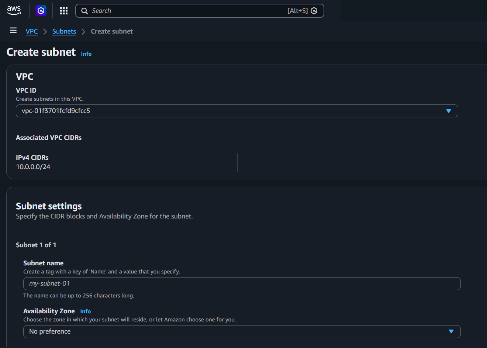
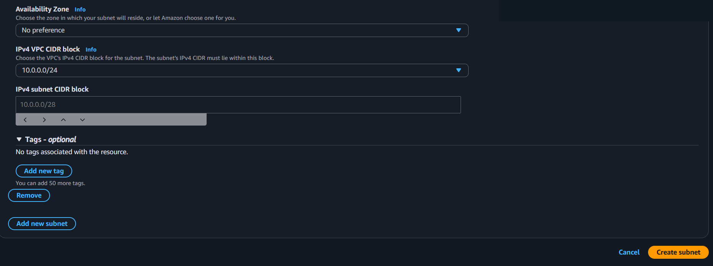

---
tags:
  - aws
  - infrastructure
  - networking
created_at: 2026-03-13T00:00:00
updated_at: 2026-04-17T14:18:47
recent_editor: CLAUDE
---

↑ [Overview](./00_aws_overview.md)

# Subnet

## What It Is
A **Subnet** is a range of IP addresses within a VPC. Each subnet exists in exactly one Availability Zone.

## How It Works

A subnet is defined by a CIDR block within its parent VPC and is locked to one AZ. Whether a subnet is public or private depends entirely on its route table: a route to an Internet Gateway makes it public; no such route makes it private. AWS reserves the first four IPs and the last IP in every subnet.

## Console Access
**VPC Console → Subnets**
- Direct link: https://console.aws.amazon.com/vpc/home#subnets

## Console Options

### Subnet List View
- View all subnets in current Region
- Filter by VPC, AZ, or CIDR block
- See available IP count for each subnet

### Create Subnet

1. **Select VPC** - Choose which VPC
2. **Subnet name** - Give it a name
3. **Availability Zone** - Choose AZ (cannot change later)
4. **CIDR block** - IP range (e.g., 10.0.1.0/24) - must be within VPC CIDR, cannot change later

### Subnet Settings (Actions → Edit subnet settings)
- **Auto-assign public IPv4 address** - Enable/disable automatic public IP for new instances
- **Auto-assign IPv6 address** - Enable/disable IPv6 (if VPC has IPv6 enabled)

### Subnet Details
- **CIDR block** - IP address range
- **Available IPs** - How many IPs are unused
- **Route table** - Which route table is associated
- **Network ACL** - Which ACL controls traffic
- **VPC** - Which VPC it belongs to
- **Availability Zone** - Which AZ it's in

### Modify Subnet
- **Change route table association** - Actions → Edit route table association
- **Change network ACL** - Actions → Edit network ACL association
- **Add tags** - For organization

## Key Concepts

### CIDR (Classless Inter-Domain Routing)
**See [Networking Basics - Addressing](../../../networking/02_addressing.md#cidr-classless-inter-domain-routing) for detailed explanation.**

### Public vs Private Subnet
**No "public" or "private" flag on subnet itself.**

- **Public subnet** = Route table has route to Internet Gateway (0.0.0.0/0 → IGW)
- **Private subnet** = No direct route to Internet Gateway

### Auto-Assign Public IP
**See [Networking Basics - Addressing](../../../networking/02_addressing.md#ip-addressing) for IPv4/IPv6 fundamentals.**

Controls whether EC2 instances automatically get public IPv4 addresses.

**To enable:**
1. Select subnet → Actions → Edit subnet settings
2. Check "Enable auto-assign public IPv4 address"

**For internet access, you also need:**
- Internet Gateway attached to VPC
- Route table with route: 0.0.0.0/0 → IGW

### IPv4 vs IPv6
**See [Networking Basics - Addressing](../../../networking/02_addressing.md#ip-addressing) for detailed explanation.**

- Auto-assign settings are **independent** for IPv4 and IPv6
- IPv6 must be enabled on VPC first

### EIP (Elastic IP) vs Auto-Assign Public IP
- **Auto-assign** - Dynamic public IP, changes when instance stops/starts, free
- **EIP** - Static public IP, doesn't change, costs money when not attached to running instance
- EIP doesn't require auto-assign setting enabled

### NACL vs Security Group
**See [Networking Basics - Protocols](../../../networking/01_protocols.md) for protocol/port fundamentals.**

Both are firewalls but work differently:

| Aspect | NACL (Network ACL) | Security Group (SG) |
|--------|-------------------|---------------------|
| **Level** | Subnet level | Instance/ENI level |
| **Applies to** | All resources in subnet | Specific instances |
| **Rules** | Allow AND Deny rules | Allow rules only |
| **Stateful/Stateless** | Stateless (must allow both inbound + outbound) | Stateful (return traffic auto-allowed) |
| **Rule order** | Rules processed in number order | All rules evaluated |
| **Default** | Default NACL allows all traffic | Default SG denies all inbound |

**Example:**
- NACL on subnet blocks port 22 → ALL instances in subnet blocked
- SG on instance blocks port 22 → Only that instance blocked

**Common use:**
- **SG** - Primary security control (most common)
- **NACL** - Additional subnet-level protection (less common)

## Precautions

### MAIN PRECAUTION: AWS Reserves 5 IPs Per Subnet
- First 4 IPs and last 1 IP are reserved by AWS
- 10.0.1.0/24 = 256 IPs, but only **251 usable**
- Don't make subnets too small

### 1. Cannot Change CIDR or AZ After Creation
- CIDR block is permanent
- Availability Zone is permanent
- Must delete and recreate to change

### 2. Plan Subnet Size Carefully
- Too small = run out of IPs
- Too large = waste IP space
- Common sizes: /24 (251 IPs), /20 (4,091 IPs)

### 3. Public Subnet Needs IGW + Route Table
- Auto-assign public IP alone is not enough
- Need Internet Gateway attached to VPC
- Need route table with 0.0.0.0/0 → IGW

### 4. Each Subnet = One AZ Only
- Cannot span multiple AZs
- For multi-AZ architecture, create multiple subnets

### 5. Cannot Delete Subnet With Resources
- Must delete all instances, ENIs, and resources first
- Lambda in VPC creates ENIs (can take time to delete)

### 6. Overlapping CIDR Not Allowed
- Subnets in same VPC cannot overlap
- 10.0.1.0/24 and 10.0.1.0/25 would conflict

### 7. Route Table Required
- Every subnet must have a route table
- Uses VPC's main route table by default
- Explicit association recommended for clarity

### 8. Always Use Tags
- **Tag every subnet** with at least a Name tag
- Without tags, hard to identify resources later
- Common tags: Name, Environment (prod/dev), Project, Owner
- Tags help with cost tracking and automation

## Example

A VPC (`10.0.0.0/16`) has four subnets: two public (`10.0.1.0/24`, `10.0.2.0/24`) in different AZs for web servers behind an ALB,
and two private (`10.0.3.0/24`, `10.0.4.0/24`) for RDS Multi-AZ.
The public subnets route `0.0.0.0/0` to an IGW; the private subnets route it to a NAT Gateway.

## Why It Matters

Subnets are the building blocks of network segmentation in a VPC.
Proper public/private separation keeps databases and internal services off the internet while letting web servers accept traffic.

## Official Documentation
- [VPC Subnets](https://docs.aws.amazon.com/vpc/latest/userguide/configure-subnets.html)

---
← Previous: [Availability Zone](02_availability_zone.md) | [Overview](./00_aws_overview.md) | Next: [Points of Presence](27_pop.md) →
