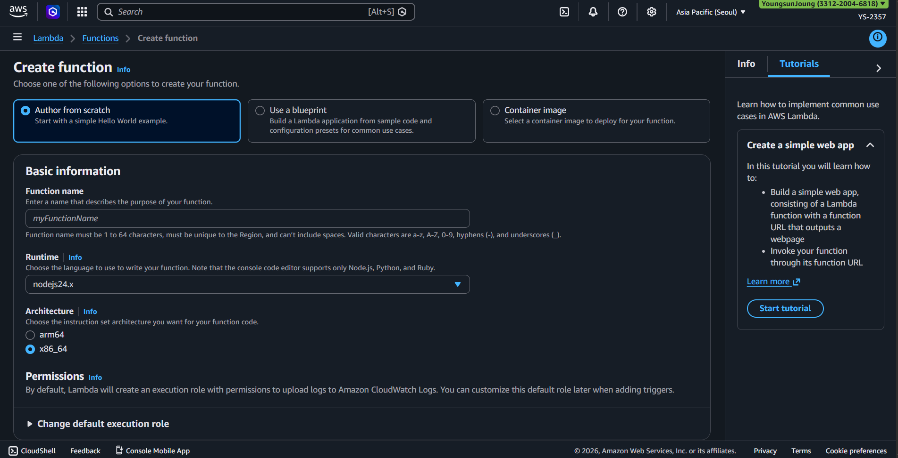
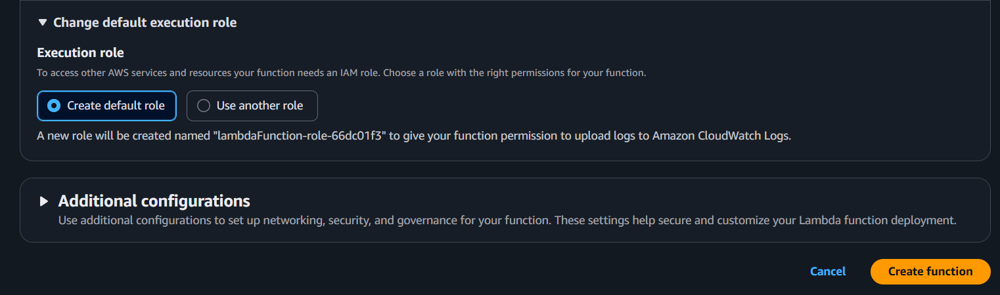

---
tags:
  - aws
  - serverless
  - computing
created_at: 2026-03-13T00:00:00
updated_at: 2026-04-17T14:18:47
recent_editor: CLAUDE
---

↑ [Overview](./00_overview.md)

# AWS Lambda

## What It Is
**AWS Lambda** is a serverless compute service that runs your code in response to events without provisioning or managing servers. You pay only for the compute time you consume.

**Serverless** = No servers to manage, AWS handles infrastructure, automatic scaling, high availability

## How It Works

An event (S3 upload, API Gateway request, EventBridge schedule, etc.) triggers the Lambda function. AWS provisions a secure execution environment, runs your handler function with the event payload, and returns the result. You pay only for the duration and memory consumed. Environments are reused for subsequent invocations (warm start) unless idle, which causes a cold start on the next invocation.

### Invocation Styles

Lambda can be invoked in three ways:

| Invocation style | What happens | Common examples |
|---|---|---|
| Direct synchronous invoke | Caller waits for the result | API Gateway, function URL, SDK call |
| Direct asynchronous invoke | Lambda queues the event and processes it later | EventBridge, SNS |
| Event source mapping | Lambda polls a queue or stream and invokes your function with batches | SQS, Kinesis, DynamoDB Streams |

> **Tip:** Design Lambda handlers to be stateless and idempotent. Event source mappings can deliver records more than once, so duplicate processing is a normal possibility.

## Console Access
**Lambda Console → Functions**
- Direct link: https://console.aws.amazon.com/lambda/home#/functions

## Console Options - Create Function



### Creation Options

**3 ways to create a function:**

1. **Author from scratch** (Selected by default)
   - Start with a simple Hello World example
   - Write your own code
   - Most common for custom logic

2. **Use a blueprint**
   - Build a Lambda application from sample code and configuration presets for common use cases
   - Pre-built templates (API Gateway, S3 processing, etc.)

3. **Container image**
   - Select a container image to deploy for your function
   - Use Docker containers (up to 10 GB)
   - For complex dependencies or custom runtimes

### Basic Information

**Function name:**
- Text input: "myFunctionName"
- Must be 1 to 64 characters
- Must be unique to the Region
- Can't include spaces
- Valid characters: a-z, A-Z, 0-9, hyphens (-), underscores (_)

**Naming tip:** Use pattern like `[service]-[action]-[environment]`
- Examples: `api-processOrder-prod`, `s3-resizeImage-dev`, `dynamodb-updateUser-staging`

**Runtime:**
- Dropdown: "nodejs24.x" (default shown)
- Choose the language to use to write your function
- Console code editor supports only Node.js, Python, and Ruby

**Available runtimes (as of 2024):**
- **Node.js:** 18.x, 20.x, 22.x, 24.x
- **Python:** 3.9, 3.10, 3.11, 3.12, 3.13
- **Java:** 8, 11, 17, 21
- **Ruby:** 3.2, 3.3
- **.NET:** 6, 8
- **Go:** 1.x (custom runtime)
- **Rust:** (custom runtime)
- **Custom runtime:** Bring your own

**Architecture:**
- Radio buttons: arm64 or x86_64 (selected)
- Choose the instruction set architecture you want for your function code

**See [Computing Basics - Architecture](../../../computing/01_architecture.md) for x86 vs ARM explanation.**

**Architecture choice:**
- **x86_64** - Standard, widest compatibility
- **arm64** - AWS Graviton2, 20% better price/performance, 19% lower cost

**Tip:** Use arm64 (Graviton2) for cost savings unless specific x86 dependencies

### Permissions



**Execution role:**
"By default, Lambda will create an execution role with permissions to upload logs to Amazon CloudWatch Logs. You can customize this default role later when adding triggers."

**Change default execution role** (expandable section):

**Execution role options:**

1. **Create default role** (Selected by default)
   - A new role will be created named "lambdaFunction-role-66dc01f3" to give your function permission to upload logs to Amazon CloudWatch Logs
   - Minimal permissions (CloudWatch Logs only)
   - Good for simple functions

2. **Use another role**
   - Choose existing IAM role
   - For functions needing specific permissions (S3, DynamoDB, etc.)

**Tip:** Start with default role, add permissions later as needed (least privilege principle)

### Execution Role이란?

Lambda 함수가 다른 AWS 서비스에 접근할 때 사용하는 **IAM Role**이다.

사람이 AWS 콘솔에 로그인할 때 IAM User로 권한을 받는 것처럼, Lambda 함수도 실행될 때 "나는 누구인가?"에 해당하는 신분이 필요하다. 그게 Execution Role이다.

```
Lambda 함수 실행
  → "나는 이 Role이다" (Execution Role)
  → 이 Role에 붙어있는 Policy가 허용하는 것만 할 수 있음
```

**기본 Role (Create default role):**
- CloudWatch Logs에 로그 쓰기 권한만 있음
- 함수가 실행되면 로그가 CloudWatch에 기록됨 → 이 권한이 없으면 로그도 못 남김

**추가 권한이 필요한 경우:**
| Lambda가 하려는 일 | Execution Role에 추가할 Policy |
|-------------------|-------------------------------|
| S3에서 파일 읽기 | `AmazonS3ReadOnlyAccess` |
| DynamoDB에 데이터 쓰기 | `AmazonDynamoDBFullAccess` |
| SQS 메시지 읽기 | `AWSLambdaSQSQueueExecutionRole` |
| VPC 내부 리소스 접근 | `AWSLambdaVPCAccessExecutionRole` |

**핵심 정리:**
- Execution Role = Lambda 함수의 신분증 + 권한 목록
- Role이 없으면 Lambda는 아무것도 못 함 (다른 서비스 호출 불가, 로그도 못 남김)
- 최소 권한 원칙: 필요한 권한만 추가 (처음부터 FullAccess 주지 말 것)

### Additional Configurations

**Additional configurations** (expandable section):
"Use additional configurations to set up networking, security, and governance for your function. These settings help secure and customize your Lambda function deployment."

**Common additional settings:**
- **VPC** - Connect function to VPC (access private resources)
- **Environment variables** - Pass configuration to function
- **Tags** - Organize and track costs
- **Memory** - Allocate memory (128 MB to 10,240 MB)
- **Timeout** - Maximum execution time (up to 15 minutes)
- **Concurrency** - Limit concurrent executions

**Action buttons:**
- **Cancel** - Discard
- **Create function** - Create the Lambda function


## Function Detail Page (After Creation)


After creating a function, you see the function detail page. This is where you manage triggers, destinations, code, and configuration.

### Function overview (top section)
- **Diagram / Template** toggle — visual diagram of the function's event flow
- **Function name** — "Mytest" in this example
- **Layers (0)** — shared libraries attached to this function (none here)
- **+ Add trigger** — connect an event source that invokes this function (S3 upload, API Gateway, DynamoDB stream, CloudWatch Events, SQS, etc.)
- **+ Add destination** — where to send the result after execution (SQS, SNS, Lambda, EventBridge). Separate destinations for success and failure.
- **Description** — optional text describing the function
- **Function ARN** — unique identifier for this function (used in IAM policies, other services)
- **Function URL** — HTTPS endpoint for direct HTTP invocation (not configured here)

### Action buttons (top right)
- **Throttle** — set reserved concurrency to 0, effectively disabling the function
- **Copy ARN** — copy the function ARN to clipboard
- **Actions** — dropdown with: export, delete, publish version, create alias, etc.

### Tabs (bottom section)
- **Code** — inline code editor (Python, Node.js, Ruby) or upload zip/container. Includes "Open in Visual Studio Code" and "Upload from" options.
- **Test** — create and run test events to invoke the function manually
- **Monitor** — CloudWatch metrics (invocations, duration, errors, throttles) and logs
- **Configuration** — Memory, Timeout, Environment variables, VPC, Concurrency, Permissions, and other runtime settings
- **Aliases** — named pointers to specific function versions (e.g. "prod" → version 5)
- **Versions** — immutable snapshots of function code + configuration

**Note:** Triggers, Destinations, Memory, Timeout, Environment variables, and Concurrency are all configured here — NOT in the creation form.


## Key Concepts

### Serverless Computing

**Traditional (EC2):**
- Provision servers
- Manage OS, patches, scaling
- Pay for running servers (even if idle)
- You handle availability

**Serverless (Lambda):**
- No servers to manage
- AWS handles infrastructure
- Pay only when code runs
- Automatic scaling and availability

**Analogy:** 
- **EC2** = Owning a car (you maintain it, pay for parking even when not driving)
- **Lambda** = Uber (pay only for rides, no maintenance)

### How Lambda Works

**Event-driven execution:**

```
Event (trigger) → Lambda function executes → Returns response
```

**Example flow:**
1. User uploads image to S3
2. S3 triggers Lambda function
3. Lambda resizes image
4. Lambda saves thumbnail to S3
5. Lambda execution ends

**Execution time:** Milliseconds to 15 minutes maximum

### Lambda Function Components

**Function code:**
- Your application logic
- Written in supported runtime (Node.js, Python, Java, etc.)
- Entry point: Handler function

**Handler:**
- Function that Lambda calls to start execution
- Format: `filename.functionname`
- Example: `index.handler` means `handler` function in `index.js` file

**Example (Node.js):**
```javascript
exports.handler = async (event) => {
    console.log('Event:', JSON.stringify(event));
    return {
        statusCode: 200,
        body: JSON.stringify('Hello from Lambda!')
    };
};
```

**Event:**
- JSON data passed to function
- Contains information about trigger (S3 object, API request, etc.)

**Context:**
- Runtime information (request ID, remaining time, etc.)

### Execution Role (IAM Role)

**What it is:** IAM role that grants Lambda permission to access AWS services

**Default role permissions:**
- CloudWatch Logs (write logs)

**Common additional permissions:**
- S3 (read/write objects)
- DynamoDB (read/write data)
- SES (send emails)
- SNS (send notifications)

**Tip:** Follow least privilege - only grant permissions function actually needs

### Triggers (Event Sources)

**What triggers Lambda:**
- **API Gateway** - HTTP requests (build REST APIs)
- **S3** - Object uploads/deletes
- **DynamoDB** - Table changes (streams)
- **EventBridge** - Scheduled events (cron jobs)
- **SNS** - Messages
- **SQS** - Queue messages
- **Kinesis** - Streaming data
- **CloudWatch Logs** - Log events
- **ALB** - Application Load Balancer requests

**Example use cases:**
- API Gateway → Lambda → Process API request
- S3 upload → Lambda → Resize image
- EventBridge schedule → Lambda → Daily report generation
- DynamoDB change → Lambda → Send notification

### Memory and CPU

**Memory allocation:** 128 MB to 10,240 MB (10 GB)

**Important:** CPU power scales with memory
- 128 MB = 0.08 vCPU
- 1,792 MB = 1 vCPU
- 10,240 MB = 6 vCPUs

**Pricing:** Based on memory allocated and execution time

**Example:**
- 512 MB, 1 second execution = 0.5 GB-seconds
- 1024 MB, 0.5 second execution = 0.5 GB-seconds (same cost)

**Tip:** Start with 512 MB, monitor performance, adjust as needed

### Timeout

**Default:** 3 seconds
**Maximum:** 15 minutes (900 seconds)

**What happens on timeout:**
- Function execution stops
- Error returned
- You're charged for full timeout duration

**Tip:** Set timeout slightly higher than expected execution time, but not too high (avoid paying for hung functions)

### Cold Start vs Warm Start

**Cold start:**
- First invocation or after idle period
- AWS provisions execution environment
- Loads code, initializes runtime
- Latency: 100ms - 1000ms+ (depends on runtime, code size)

**Warm start:**
- Subsequent invocations (environment reused)
- Much faster
- Latency: 1ms - 10ms

**Reducing cold starts:**
- Use Provisioned Concurrency (keep functions warm, extra cost)
- Smaller deployment packages
- Use arm64 (faster cold starts)
- Avoid VPC if possible (adds cold start time)

### Concurrency

**Concurrency** = Number of function instances running simultaneously

**Default limit:** 1,000 concurrent executions per region (can request increase)

**Reserved concurrency:**
- Guarantee capacity for critical functions
- Prevents other functions from using that capacity

**Provisioned concurrency:**
- Keep functions initialized and warm
- Eliminates cold starts
- Extra cost (pay for provisioned capacity)

**Example:**
- 1,000 requests/second, 100ms execution time = 100 concurrent executions needed

### Layers

**What they are:** Reusable code packages (libraries, dependencies)

**Why use layers:**
- Share code across multiple functions
- Reduce deployment package size
- Separate dependencies from function code

**Example:**
- Layer 1: AWS SDK
- Layer 2: Image processing library
- Function code: Just business logic

**Limit:** Up to 5 layers per function, 250 MB total unzipped

### Environment Variables

**What they are:** Key-value pairs passed to function at runtime

**Use cases:**
- Configuration (database connection strings)
- API keys (encrypted at rest)
- Feature flags
- Environment-specific settings (dev/staging/prod)

**Example:**
```
DB_HOST=mydb.us-east-1.rds.amazonaws.com
API_KEY=encrypted_key_here
ENVIRONMENT=production
```

**Tip:** Use AWS Secrets Manager for sensitive data, not environment variables


## Pricing

**Source:** [AWS Lambda Pricing](https://aws.amazon.com/lambda/pricing/)

**Free tier (per month):**
- 1 million requests
- 400,000 GB-seconds of compute time

**After free tier:**
- **Requests:** $0.20 per 1 million requests
- **Duration:** $0.0000166667 per GB-second

**GB-second** = Memory (GB) × Duration (seconds)

**Example calculation:**
- Function: 512 MB (0.5 GB), runs 200ms (0.2 seconds)
- Per execution: 0.5 GB × 0.2 sec = 0.1 GB-seconds
- Cost per execution: 0.1 × $0.0000166667 = $0.00000166667
- 1 million executions: $1.67 + $0.20 (requests) = $1.87

**Comparison with EC2:**
- **Lambda:** Pay per execution (cost-effective for sporadic workloads)
- **EC2:** Pay per hour (cost-effective for sustained workloads)

**Break-even point:** ~30% utilization
- <30% utilization: Lambda cheaper
- >30% utilization: EC2 cheaper

**Tip:** Use Lambda for event-driven, sporadic workloads; EC2 for sustained workloads


## Common Use Cases

### 1. API Backend (with API Gateway)
- Build REST APIs without servers
- Auto-scales with traffic
- Pay per request

**Example:** Mobile app backend, microservices

### 2. Data Processing
- Process files uploaded to S3
- Transform data in real-time
- ETL (Extract, Transform, Load)

**Example:** Image resizing, video transcoding, log processing

### 3. Scheduled Tasks (with EventBridge)
- Cron jobs without servers
- Daily reports, cleanup tasks
- Automated backups

**Example:** Daily database backup, weekly report generation

### 4. Real-time Stream Processing
- Process streaming data (Kinesis, DynamoDB Streams)
- Real-time analytics
- Event-driven workflows

**Example:** IoT data processing, clickstream analysis

### 5. Webhooks
- Respond to external events
- GitHub webhooks, Stripe payments
- Third-party integrations

**Example:** Slack bot, payment processing notifications

### 6. Automation
- AWS resource management
- Auto-remediation
- Infrastructure as code

**Example:** Auto-stop idle EC2 instances, security compliance checks


## Precautions

### MAIN PRECAUTION: Monitor Costs with Runaway Functions
- Infinite loops or recursive calls can generate millions of invocations
- Set concurrency limits to prevent runaway costs
- Use CloudWatch alarms for invocation count and cost
- Test thoroughly before production

### 1. Timeout Configuration
- **Too low:** Function fails before completing
- **Too high:** Pay for hung functions
- **Recommendation:** Set 20% higher than expected execution time
- **Monitor:** CloudWatch metrics for actual duration

### 2. Memory Allocation
- **Too low:** Function slow or fails (out of memory)
- **Too high:** Unnecessary cost
- **Recommendation:** Start with 512 MB, monitor, adjust
- **Remember:** CPU scales with memory

### 3. Cold Start Impact
- First invocation slow (100ms - 1000ms+)
- Affects user-facing applications
- **Solutions:** Provisioned Concurrency (extra cost), keep functions warm with scheduled pings
- **Tip:** Acceptable for background jobs, problematic for APIs

### 4. Execution Time Limit
- Maximum 15 minutes
- Not suitable for long-running tasks
- **Alternatives:** EC2, ECS, Batch for long tasks
- **Workaround:** Chain multiple Lambda functions (Step Functions)

### 5. VPC Cold Start Penalty
- Lambda in VPC has longer cold starts (10-30 seconds historically)
- AWS improved this (now <1 second with Hyperplane ENIs)
- **Recommendation:** Avoid VPC unless needed (private RDS, ElastiCache)

### 6. Deployment Package Size
- **Limit:** 50 MB (zipped), 250 MB (unzipped)
- **With layers:** 250 MB total
- **Large packages:** Slower cold starts
- **Solution:** Use layers, minimize dependencies, use S3 for large files

### 7. Concurrency Limits
- **Default:** 1,000 per region (shared across all functions)
- **Risk:** One function can consume all capacity
- **Solution:** Set reserved concurrency for critical functions
- **Request increase:** If needed (AWS support)

### 8. Error Handling
- **Unhandled errors:** Function fails, retries (for async invocations)
- **Retry behavior:** 2 retries for async, none for sync
- **Solution:** Implement try-catch, use Dead Letter Queue (DLQ) for failed events
- **Monitor:** CloudWatch Logs, error metrics

### 9. Security
- **Execution role:** Follow least privilege (only needed permissions)
- **Environment variables:** Don't store secrets (use Secrets Manager)
- **VPC:** Use for private resource access, adds complexity
- **Code:** Validate input, sanitize output, avoid injection attacks

### 10. Monitoring and Logging
- **CloudWatch Logs:** Enabled by default (costs apply)
- **Metrics:** Invocations, duration, errors, throttles
- **Alarms:** Set for errors, throttles, high costs
- **X-Ray:** Enable for distributed tracing (extra cost)

### 11. Versioning and Aliases
- **Versions:** Immutable snapshots of function code
- **Aliases:** Pointers to versions (e.g., "prod", "dev")
- **Blue/Green deployments:** Use aliases to switch traffic
- **Rollback:** Easy with versions

### 12. Testing
- **Local testing:** Use SAM CLI, LocalStack
- **Unit tests:** Test handler function logic
- **Integration tests:** Test with actual AWS services (dev environment)
- **Load testing:** Verify concurrency and performance


## Lambda vs EC2 vs Fargate

| Feature | Lambda | EC2 | Fargate |
|---------|--------|-----|---------|
| **Management** | Serverless (no servers) | Manage servers | Serverless containers |
| **Scaling** | Automatic, instant | Manual or Auto Scaling | Automatic |
| **Pricing** | Per request + duration | Per hour | Per vCPU/memory/hour |
| **Cold start** | Yes (100ms-1s) | No | Yes (~30s) |
| **Max duration** | 15 minutes | Unlimited | Unlimited |
| **Use case** | Event-driven, short tasks | Sustained workloads | Containerized apps |
| **Cost (low usage)** | Cheapest | Most expensive | Middle |
| **Cost (high usage)** | Most expensive | Cheapest | Middle |

**Tip:**
- **Lambda:** Event-driven, sporadic, <15 min tasks
- **EC2:** Sustained workloads, >30% utilization, custom requirements
- **Fargate:** Containerized apps, don't want to manage servers


## Summary

**Key points:**
- **Serverless** - No servers to manage, pay per execution
- **Event-driven** - Triggered by AWS services or HTTP requests
- **Auto-scaling** - Handles 1 to millions of requests automatically
- **15-minute limit** - Not for long-running tasks
- **Cold starts** - First invocation slower
- **Cost-effective** - For sporadic workloads (<30% utilization)

**Cross-reference:**
- See [IAM Roles](15_amazon_iam.md) for execution role configuration
- See [API Gateway](../service/) for building APIs with Lambda (when created)
- See [EventBridge](../service/) for scheduled Lambda functions (when created)

## Example

An image-processing pipeline triggers a Lambda function whenever a photo is uploaded to an S3 bucket.
The function generates a thumbnail, writes it to a different S3 prefix, and records metadata in DynamoDB.
The entire flow runs without any servers to manage and costs fractions of a cent per invocation.

## Why It Matters

Lambda eliminates server management for event-driven workloads.
It scales from zero to thousands of concurrent executions automatically, making it ideal for unpredictable or bursty traffic.

## Q&A

### Q: Can Lambda run languages not natively supported?

Yes. Lambda supports **Custom Runtimes** beyond its native languages (Python, Node.js, Java, C#, Go, Ruby, PowerShell).

- **Custom Runtime**: Implement the Lambda Runtime API with a `bootstrap` executable. Any language works (Rust, C++, PHP, COBOL, etc.)
- **Container Image**: Package any runtime as a container image and deploy to Lambda
- **Lambda Layers**: Bundle runtime binaries as a Layer for reuse across functions

Custom runtimes offer language freedom but require you to maintain the runtime yourself, and cold starts may increase.

### Q: How is CPU allocated in Lambda?

Lambda does not allow direct CPU configuration. **CPU is allocated proportionally to memory**.

- **Memory range**: 128 MB to 10,240 MB (1 MB increments)
- **CPU proportional allocation**:
  - 1,769 MB → 1 vCPU equivalent
  - 10,240 MB → ~6 vCPUs

You cannot increase CPU without also increasing memory, which may raise costs.

### Q: Is the 1,000 concurrent execution limit per account or per function?

Per **account, per region**. All Lambda functions in the account share this pool.

- **Default limit**: 1,000 concurrent executions per account per region
- **New accounts**: May have a lower initial limit
- **Increase**: Request via AWS Service Quotas (no additional cost)
- **Reserved Concurrency**: Guarantee a portion of the pool for a specific function (free)
- **Provisioned Concurrency**: Pre-warm execution environments to eliminate cold starts (additional cost)

### Q: Can you migrate EC2 workloads to Lambda?

Yes, but Lambda has constraints to check first:

- **Max execution time**: 900 seconds (15 minutes)
- **Max memory**: 10,240 MB (~10 GB)
- **Package size**: 250 MB uncompressed
- **Temp storage**: Up to 10 GB

**Good candidates**: API backends, event processing, batch jobs under 15 min, scheduled tasks
**Poor candidates**: Long-running processes, stateful apps, high-performance computing

Alternative serverless options for heavier workloads:

| Service | Characteristics | Best For |
|---------|----------------|----------|
| Lambda | Event-driven, max 15 min | APIs, event processing, lightweight batch |
| [Fargate](26_aws_fargate.md) (ECS/EKS) | Container-based serverless | Long-running, microservices, complex apps |
| App Runner | Auto-deploy from container/source | Web apps, API services |
| Step Functions | Workflow orchestration | Complex business logic, long workflows |

## Official Documentation
- [What is AWS Lambda](https://docs.aws.amazon.com/lambda/latest/dg/welcome.html)

---
← Previous: [Auto Scaling](06_auto_scaling.md) | [Overview](./00_overview.md) | Next: [AWS Fargate](26_aws_fargate.md) →
