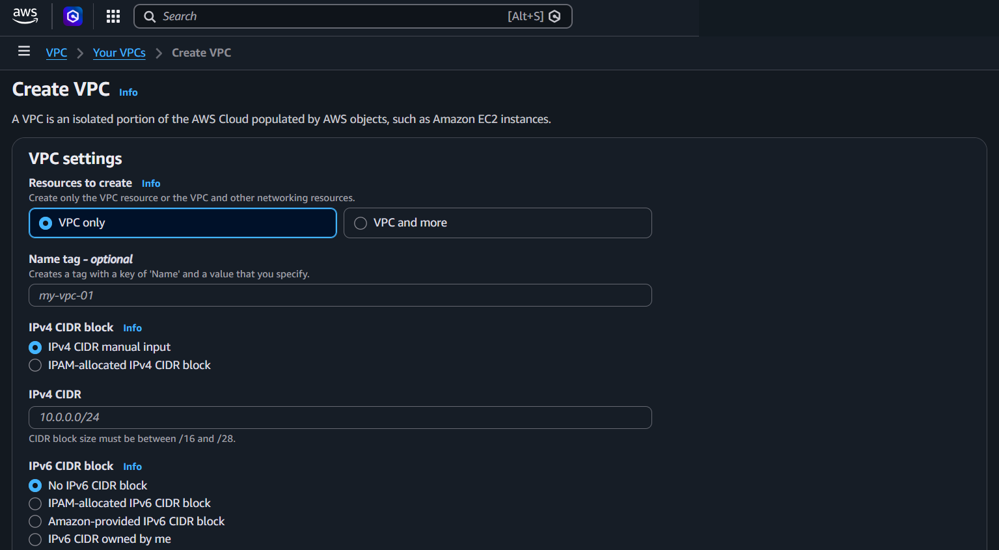
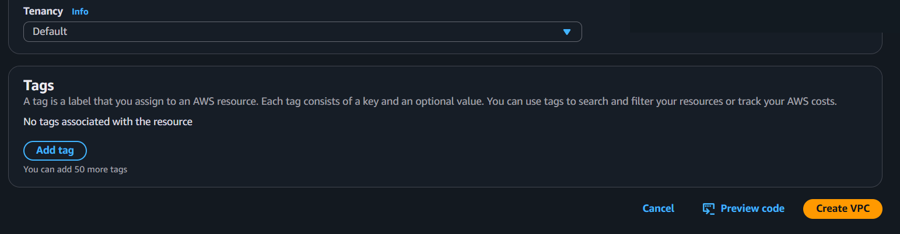

# Amazon VPC

## What It Is
**VPC (Virtual Private Cloud)** is a logically isolated virtual network where you launch AWS resources with complete control over IP addressing, subnets, routing, and security.

## Typical VPC Setup Flow
1. **Create VPC** - Define CIDR block (e.g., 10.0.0.0/16)
2. **Create Subnets** - Public and private subnets in different AZs
3. **Create Internet Gateway (IGW)** - Attach to VPC for internet access
4. **Create Route Tables** - One for public subnets, one for private subnets
5. **Configure Routes** - Public route table: 0.0.0.0/0 → IGW
6. **Create NAT Gateway** - In public subnet for private subnet internet access
7. **Update Private Route Table** - 0.0.0.0/0 → NAT Gateway
8. **Launch Resources** - EC2 in subnets, configure Security Groups

**Note:** "Public/Private route table" is just terminology - refers to which subnets use it. One route table can be shared by multiple subnets.

## Console Access
**VPC Console → Your VPCs**
- Direct link: https://console.aws.amazon.com/vpc/home#vpcs

## Console Options



### VPC List View
- View all VPCs in current Region
- See CIDR blocks, DNS settings, default VPC indicator
- Filter and search by VPC ID, name, or CIDR

### Create VPC
**Resources to create:**
- **VPC only** - Just the VPC, you create subnets/IGW manually
- **VPC and more** - Wizard creates VPC + subnets + IGW + route tables automatically

**VPC Settings:**
1. **Name** - Give VPC a descriptive name
2. **IPv4 CIDR block** - Choose allocation method:
   - **IPv4 CIDR manual input** - You specify CIDR (e.g., 10.0.0.0/16) - Most common
   - **IPAM-allocated IPv4 CIDR block** - AWS IPAM assigns from pool automatically
3. **IPv6 CIDR block** - Optional, can add later:
   - **No IPv6 CIDR block** - Don't use IPv6 (most common)
   - **IPAM-allocated IPv6 CIDR block** - AWS IPAM assigns from pool
   - **Amazon-provided IPv6 CIDR block** - AWS gives you /56 block for free (most common if using IPv6)
   - **IPv6 CIDR owned by me** - Bring your own IPv6 (BYOIP - rare, for organizations that own IPv6 addresses)
4. **Tenancy** - Determines whether instances run on shared or dedicated hardware:



   - **Default (Shared Tenancy)** - Instances run on shared physical servers with other AWS customers (much cheaper, most common)
   - **Dedicated (Dedicated Tenancy)** - Instances run on physical servers dedicated only to your account (significantly more expensive ~2x, for compliance/licensing)

**When to use Dedicated Tenancy:**
- Compliance regulations require physical isolation
- Software licensing tied to physical cores/sockets
- Security policies mandate dedicated hardware
- Regulatory requirements (government, healthcare)

**For MSP:** Almost always use Default unless client has specific compliance/licensing requirements.

**Important:** Can change Default → Dedicated, but cannot change Dedicated → Default.

**Operational differences:**
- **Cost:** Dedicated ~2x more expensive
- **Capacity:** Dedicated has limited capacity, may get "insufficient capacity" errors
- **Instance types:** Some newer types may not support dedicated
- **Performance:** No performance difference (hypervisor isolation is efficient)
- **Management:** Same operations, difference is invisible in day-to-day work

**Historical context:**
- Term "tenancy" from real estate (single vs multi-tenant building)
- Introduced in 2011 for compliance/licensing requirements
- Before cloud, companies owned physical servers (single-tenant)
- Dedicated tenancy = physical isolation while staying in cloud
- Today: Shared tenancy is proven secure and standard

### IPAM (IP Address Manager)
AWS service for automated IP address allocation.

**Manual input vs IPAM:**
- **Manual** - You type CIDR, full control, most common for MSP/client work
- **IPAM** - AWS assigns from pool, prevents overlaps, good for large single organizations

**Why manual is preferred for MSP:**
- Client-specific requirements and on-premises network considerations
- Full control and visibility
- Easier documentation and client approval
- No IPAM setup overhead
- Works across multiple client accounts

### IPv6 Considerations
**When to use IPv6:**
- Client applications/users require IPv6 support
- Compliance requirements mandate IPv6
- IoT devices needing many IPs
- Future-proofing (IPv4 addresses running out globally)

**Most MSP clients don't need IPv6 yet** - IPv4 is still standard.

**IPv6 options explained:**
- **Amazon-provided** - FREE, AWS assigns /56 block, most common if using IPv6
- **Owned by me (BYOIP)** - You already own IPv6 from RIR, bring to AWS, rare
- **No IPv6** - Most common choice

**Key differences from IPv4:**
- IPv4: You choose CIDR (10.0.0.0/16)
- IPv6: AWS assigns it (you don't choose specific range)
- IPv6 is always /56 block (4.7 quintillion addresses!)

### VPC Settings (Actions → Edit VPC settings)
- **DNS resolution** - Enable DNS resolution in VPC (usually enabled)
- **DNS hostnames** - Enable DNS hostnames for instances (enable for public instances)

### VPC Details
- **CIDR blocks** - IPv4 and IPv6 ranges
- **DHCP options set** - DNS and domain name settings
- **Route tables** - Associated route tables
- **Network ACLs** - Associated NACLs
- **Internet Gateway** - Attached IGW (if any)

### Modify VPC
- **Add/remove CIDR blocks** - Can add secondary CIDRs (primary cannot change)
- **Edit DNS settings** - Enable/disable DNS resolution and hostnames
- **Add tags** - For organization

## Key Concepts

### Default VPC vs Custom VPC
**Default VPC:**
- AWS creates automatically in each Region
- CIDR: 172.31.0.0/16
- Has default subnets (one per AZ)
- Has IGW attached
- Good for testing, not recommended for production

**Custom VPC:**
- You create with your own CIDR
- Full control over subnets, routing, security
- Recommended for production workloads

### VPC Components
- **Subnets** - IP ranges within VPC, one per AZ
- **Route Tables** - Control traffic routing
- **Internet Gateway (IGW)** - Connects VPC to internet
- **NAT Gateway** - Allows private subnets to access internet
- **Security Groups** - Instance-level firewall
- **Network ACLs** - Subnet-level firewall
- **VPC Endpoints** - Private connection to AWS services (S3, DynamoDB) without internet

### Traffic Flow: Private Instance to Internet
**Example: Private instance (10.0.2.5) accessing internet (8.8.8.8)**

1. Private instance sends packet to 8.8.8.8
2. **Private route table** checks: 8.8.8.8 matches 0.0.0.0/0 → send to **NAT Gateway**
3. Packet arrives at NAT Gateway (in public subnet)
4. NAT Gateway changes source IP from 10.0.2.5 to NAT Gateway's public IP
5. **Public route table** checks: 8.8.8.8 matches 0.0.0.0/0 → send to **IGW**
6. IGW sends packet to internet

**Flow:** Private instance → NAT Gateway → IGW → Internet

**Note:** The "0.0.0.0/0" appears in both route tables but with different destinations:
- Private route table: 0.0.0.0/0 → NAT Gateway
- Public route table: 0.0.0.0/0 → IGW

### Route Tables Don't Interact Directly
- Public and private route tables are independent
- They route traffic separately based on their own rules
- NAT Gateway is the bridge between private and public subnets
- Local routes (VPC CIDR) exist in all route tables automatically

### DNS Settings
**See [Networking Basics - DNS](../../../networking/04_dns.md) for complete DNS explanation.**

**DNS (Domain Name System)** translates domain names ↔ IP addresses.

**In AWS VPC:**

**DNS resolution:**
- Enables DNS resolution within VPC
- AWS DNS server is at VPC CIDR +2 (e.g., 10.0.0.2 for 10.0.0.0/16)
- Usually keep enabled

**DNS hostnames:**
- Instances get public DNS names (e.g., ec2-54-123-45-67.compute-1.amazonaws.com)
- **Must enable for instances with public IPs to get DNS names**
- Required for many AWS services
- Easier to remember names than IPs

### VPC Peering and Transit Gateway

### VPC Peering
- VPCs are isolated by default — no traffic flows between them
- VPC Peering creates a direct one-to-one connection between two VPCs
- Peered VPCs cannot have overlapping CIDRs
- Traffic stays on AWS private network (does not go over the internet)
- Works across accounts and Regions
- **Not transitive** — if VPC A peers with B, and B peers with C, A cannot reach C through B

### Transit Gateway
- A central hub that connects multiple VPCs, VPN connections, and on-premises networks
- **Solves the scaling problem** — without it, connecting N VPCs requires N×(N-1)/2 peering connections
- **Supports transitive routing** — VPC A → Transit Gateway → VPC B, unlike peering
- Works across accounts and Regions (inter-Region peering supported)

**When to use which:**

| | VPC Peering | Transit Gateway |
|---|---|---|
| **Best for** | 2-3 VPCs | Many VPCs or hybrid networks |
| **Transitive routing** | No | Yes |
| **Cost** | Data transfer only | Hourly + data transfer |
| **Complexity** | Simple | More setup, but scales better |
| **On-premises** | No | Yes (VPN/Direct Connect) |

**Example:** An MSP managing 10 client VPCs that share a central services VPC (logging, monitoring) — Transit Gateway is the right choice. For two VPCs that need to talk, peering is simpler and cheaper.

## Precautions

### ⚠️ MAIN PRECAUTION: Plan CIDR Carefully - Cannot Change Primary CIDR
- Primary CIDR block is permanent after VPC creation
- Must delete and recreate VPC to change primary CIDR
- Plan for growth and avoid overlaps with on-premises networks

### 1. CIDR Planning
- **Avoid overlap with on-premises networks** - Can't connect via VPN/Direct Connect if overlapping
- **Size appropriately** - Too small = run out of IPs, too large = waste space
- **Common sizes:** /16 (65,536 IPs), /20 (4,096 IPs), /24 (256 IPs)
- **Private IP ranges:** 10.0.0.0/8, 172.16.0.0/12, 192.168.0.0/16

### 2. Default VPC Considerations
- Default VPC exists in every Region
- Not recommended for production (predictable CIDR, public subnets)
- Can delete default VPC if not needed
- Can recreate default VPC if accidentally deleted

### 3. DNS Hostnames Must Be Enabled
- Required for instances with public IPs to get DNS names
- Many AWS services require this
- Enable when creating VPC or edit later

### 4. Cannot Move Resources Between VPCs
- Resources are locked to their VPC
- Must recreate resources in different VPC
- Plan VPC design carefully from start

### 5. VPC Peering and Transit Gateway
- VPCs are isolated by default
- Use VPC Peering or Transit Gateway to connect VPCs
- Peered VPCs cannot have overlapping CIDRs
- Transit Gateway is preferred when connecting more than 2-3 VPCs
- Transit Gateway supports transitive routing; peering does not

### 6. Secondary CIDR Blocks
- Can add secondary CIDRs after creation
- Cannot remove primary CIDR
- Secondary CIDRs must not overlap with existing routes

### 7. Tenancy Cannot Change from Dedicated to Default
- Can change Default → Dedicated
- Cannot change Dedicated → Default
- Dedicated tenancy costs significantly more

### 8. VPC Limits
- Default limit: 5 VPCs per Region (can request increase)
- Max 5 CIDR blocks per VPC
- Plan for limits in multi-VPC architectures

### 9. Always Use Tags
- **Tag every VPC** with at least Name, Environment, Project
- Critical for managing multiple VPCs
- Helps with cost tracking and automation
- Tags: Name, Environment (prod/dev), Project, Owner, CostCenter

### 10. Internet Gateway Required for Public Access
- VPC alone doesn't provide internet access
- Must create and attach IGW
- Must configure route table with 0.0.0.0/0 → IGW

### 11. NAT Gateway for Private Subnet Internet
- Private subnets need NAT Gateway for outbound internet
- NAT Gateway must be in public subnet
- Costs per hour + data transfer charges

### 12. Security Groups and NACLs

### How They Apply — ENI vs Subnet

```
VPC (building)
├── Subnet A (floor 1)          ← NACL guards this entire floor
│   ├── EC2 instance 1 [ENI]   ← SG guards this specific door
│   ├── EC2 instance 2 [ENI]   ← SG guards this specific door
│   └── RDS instance [ENI]     ← SG guards this specific door
├── Subnet B (floor 2)          ← different NACL guards this floor
│   └── EC2 instance 3 [ENI]   ← SG guards this specific door
```

- **ENI (Elastic Network Interface)** = virtual network card attached to each instance (EC2, RDS, Lambda-in-VPC, etc.). It holds the IP address.
- **Security Group** attaches to each ENI individually — instances on the same subnet can have different SG rules
- **NACL** attaches to the subnet — all instances in that subnet share the same NACL, no exceptions

Traffic must pass **both** checks: NACL first (subnet boundary), then SG (instance boundary).

### Comparison

| | Security Group (SG) | Network ACL (NACL) |
|---|---|---|
| **Applies to** | ENI (instance level) | Subnet (all instances in it) |
| **State** | Stateful (response traffic auto-allowed) | Stateless (must explicitly allow inbound AND outbound) |
| **Rules** | Allow only | Allow + Deny |
| **Evaluation** | All rules evaluated together | Rules evaluated in number order (first match wins) |
| **Default** | Deny all inbound, allow all outbound | Allow all traffic (default NACL) |

### Example: Web Server + DB on Same Subnet

```
Subnet A (NACL: allow 443 inbound from internet)
├── Web server  (SG: allow 443 from 0.0.0.0/0)     [OK] web traffic reaches it
├── DB server   (SG: allow 3306 from web-server-SG)  [OK] only web server can talk to DB
```

- NACL lets port 443 into the subnet (floor-level)
- DB's SG blocks 443 — only allows 3306 from web server's SG (door-level)
- SG is the primary tool (per-instance granularity), NACL is the secondary defense layer (subnet-wide blanket rule)

### Same-Subnet Traffic: NACL Doesn't Apply

NACL only cares about traffic **crossing the subnet boundary**. Traffic between instances inside the same subnet is not filtered by NACL.

```
Subnet A (NACL: allow 443 inbound)
├── Web server (SG: allow 443)  ──3306──►  DB server (SG: allow 3306 from Web SG)
                                           [OK] SG allows it, NACL is irrelevant
```

- Internet → Web on 443: NACL checks (crossing boundary) + SG checks
- Web → DB on 3306 (same subnet): only SG checks — NACL doesn't filter inside-to-inside

This is why putting web and DB in the **same subnet is bad design** — NACL can't help protect the DB. Better:
- Web in public subnet (NACL + SG)
- DB in private subnet (separate NACL + SG = two layers of defense)

Rule of thumb:
- Same subnet inside-to-inside → think SG only
- Crossing subnet boundary → think NACL + SG

### Why SG Is Used More Than NACL

| Reason | SG | NACL |
|--------|-----|------|
| **Granularity** | Per instance/ENI | Per subnet (all instances affected) |
| **Stateful** | yes — return traffic automatic | no — must allow both directions manually |
| **SG-to-SG reference** | yes — `allow 3306 from web-SG` | no — must use IP ranges |
| **Intent** | Expresses app-role relationships | Thinks in subnet/IP boundaries |

Example: "Only web server can reach DB on 3306"
- SG: `allow 3306 from web-SG` — done
- NACL: need inbound rule for 3306 from web subnet IP range + outbound rule for ephemeral ports back — awkward

Practical rule: SG as main access control, NACL as extra subnet-level guardrail.

### NACL Stateless — What It Means in Practice

Stateless = NACL does not remember that a connection was already allowed. You must allow both directions explicitly, including **ephemeral ports** for responses.

Example: Internet user accesses web server on 443:
```
Inbound to subnet:   source=client IP, dest port=443        → need inbound allow 443
Response out:         source port=443, dest port=1024-65535  → need outbound allow ephemeral ports
```

With SG (stateful): allow inbound 443 → return traffic is automatic.
With NACL (stateless): must explicitly allow both inbound 443 AND outbound ephemeral ports.

### Which AWS Services Use ENI (and Therefore SG)?

**Has ENI → SG applies:**
- EC2, RDS, Aurora, Neptune
- Lambda (when VPC-attached)
- ECS tasks (awsvpc mode), EKS worker nodes/pods
- NAT Gateway, Load Balancers, VPC Endpoints

**No ENI → SG does not apply (uses IAM/resource policies instead):**
- S3, DynamoDB, SQS, SNS
- IAM, Route 53, CloudFront, WAF, Shield
- AWS Organizations

Rule: if a service gets network connectivity inside your VPC via ENI, SG applies. If it's a regional/global managed endpoint service, access is controlled by IAM/resource policies instead.

> Note: VPC Endpoints create ENIs, so the endpoint ENI can have an SG — but that's the endpoint's SG, not the service itself.

## Example

An MSP creates a VPC (`10.10.0.0/16`) for a client's production environment with public subnets for ALBs,
private subnets for application servers, and isolated subnets for RDS.
A separate VPC (`10.20.0.0/16`) hosts shared logging and monitoring services, connected via VPC Peering.

## Why It Matters

VPC is the network foundation for almost every AWS resource.
A well-planned VPC with proper CIDR allocation, subnet layout, and routing prevents costly redesigns later.

## Official Documentation
- [What is Amazon VPC](https://docs.aws.amazon.com/vpc/latest/userguide/what-is-amazon-vpc.html)

---
← Previous: [Points of Presence](27_pop.md) | [Overview](00_overview.md) | Next: [Security Group](14_security_group.md) →
