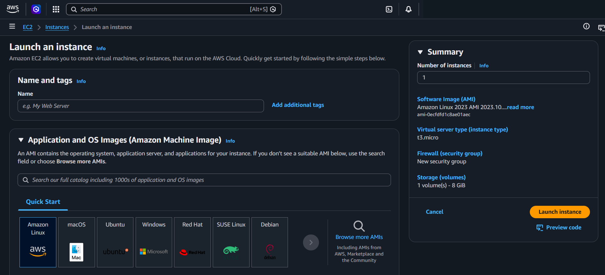
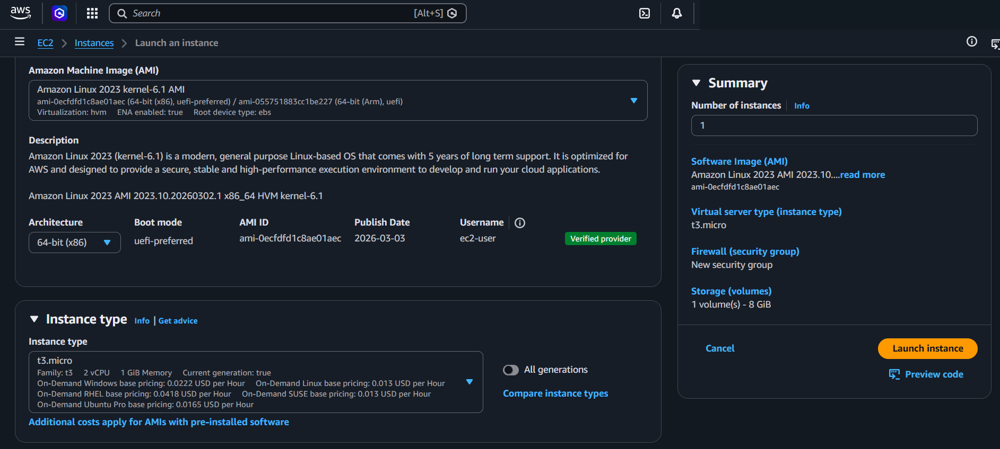
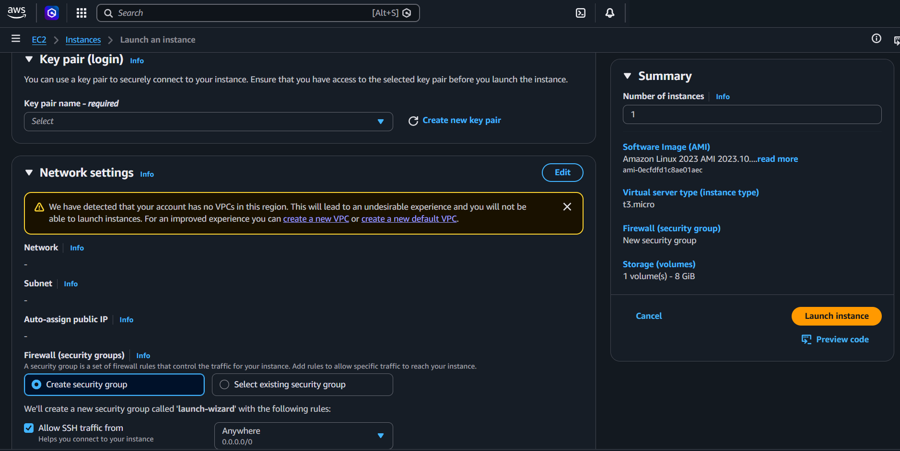
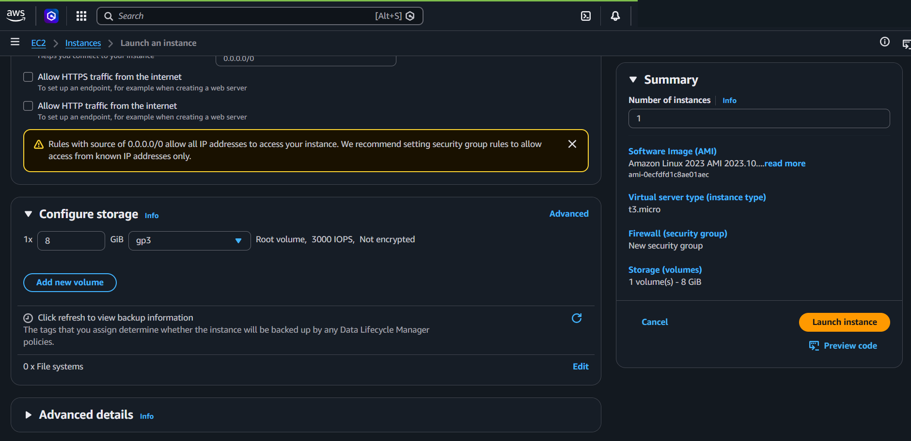
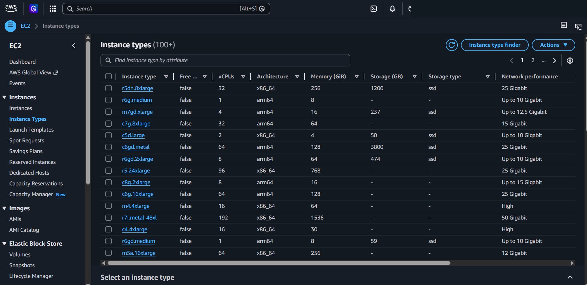
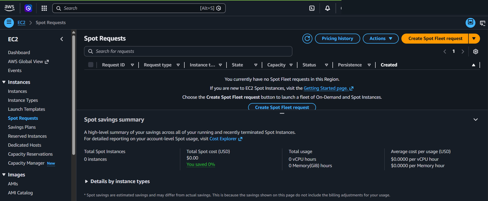
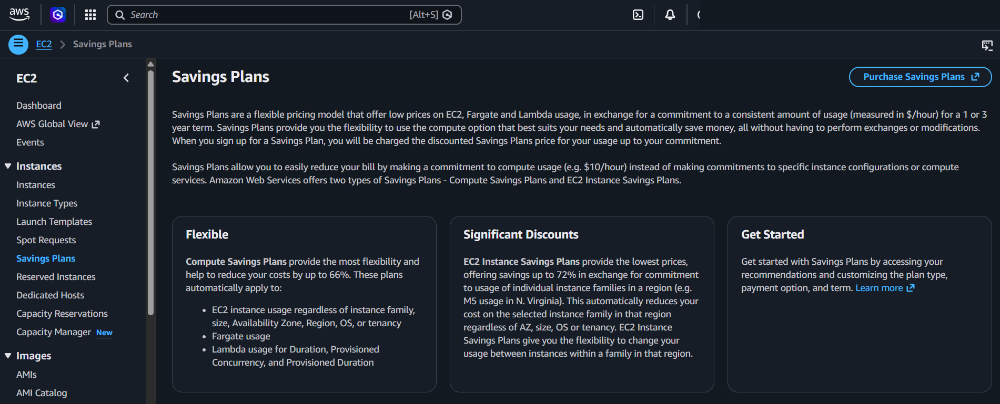
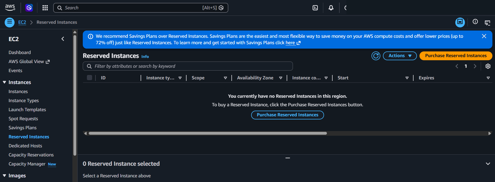
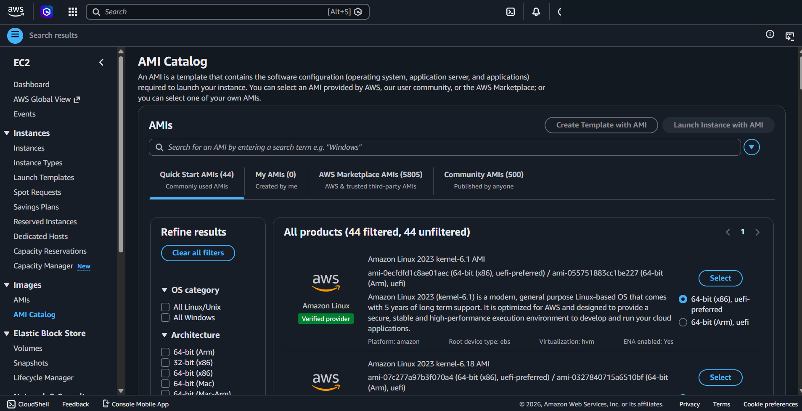

# Amazon EC2

## What It Is
**EC2 (Elastic Compute Cloud)** is a web service that provides resizable compute capacity (virtual servers) in the cloud. You can launch instances with various operating systems, configure networking, storage, and security.

## Console Access
**EC2 Console → Instances**
- Direct link: https://console.aws.amazon.com/ec2/home#Instances

## Console Options - Launch Instance Flow



### Step 1: Name and tags

**Name:**
- Text input field (e.g., "My Web Server")
- Creates a tag with key 'Name' and your specified value
- **Naming tip:** Use pattern like `[Environment]-[Purpose]-[Number]` (e.g., `Prod-WebServer-01`, `Dev-Database-01`)

**Add additional tags:**
- Click to add more tags (up to 50)
- **Tip:** Always tag with `Environment`, `Client`, `CostCenter` for billing and management

### Step 2: Application and OS Images (AMI)

**AMI (Amazon Machine Image)** - Template containing OS, application server, and applications

**Quick Start options:**
- **Amazon Linux** - AWS-optimized Linux (free tier eligible, recommended for AWS workloads)
- **macOS** - For iOS/macOS development
- **Ubuntu** - Popular Linux distribution
- **Windows** - Windows Server
- **Red Hat** - Enterprise Linux
- **SUSE Linux** - Enterprise Linux
- **Debian** - Stable Linux distribution

**Browse more AMIs:**
- AWS Marketplace AMIs (pre-configured software)
- Community AMIs (shared by other AWS users)
- My AMIs (your custom images)

**AMI details shown:**
- **Architecture:** 64-bit (x86) or 64-bit (Arm)
- **Boot mode:** uefi-preferred or legacy-bios
- **AMI ID:** Unique identifier
- **Publish Date:** When AMI was released
- **Username:** Default SSH username (e.g., ec2-user)
- **Verified provider:** AWS-verified AMI

**Tip:** Use Amazon Linux 2023 for most workloads (5 years support, optimized for AWS, free)



### Step 3: Instance type

**Instance type** determines CPU, memory, storage, and network capacity

**Format:** `[Family].[Size]`
- Example: `t3.micro` = T3 family, micro size

**Common families:**
- **t3/t2** - Burstable performance (general purpose, cost-effective)
- **m5/m6** - Balanced compute, memory, network (general purpose)
- **c5/c6** - Compute optimized (CPU-intensive workloads)
- **r5/r6** - Memory optimized (memory-intensive workloads)
- **i3/i4** - Storage optimized (high I/O workloads)

**Common sizes (smallest to largest):**
- `nano` → `micro` → `small` → `medium` → `large` → `xlarge` → `2xlarge` → `4xlarge` → ...

**Example: t3.micro**
- Family: t3 (burstable performance)
- 2 vCPU
- 1 GiB Memory
- Current generation: true
- Pricing shown per hour for different OS

**All generations toggle:**
- Show only current generation (recommended)
- Show all generations (includes older types)

**Compare instance types link:**
- Compare specs side-by-side

**Tip:** Start with t3.micro (free tier) or t3.small for testing, scale up based on actual usage



### Step 4: Key pair (login)

**Key pair** - Used to securely connect to your instance via SSH (Linux) or RDP (Windows)

**Key pair name:** Dropdown to select existing or "Create new key pair"

**Important:** You MUST have the private key file (.pem or .ppk) to connect to the instance. If you lose it, you cannot recover it.

**Tip:** 
- Create key pairs per client/environment: `ClientA-Prod`, `ClientA-Dev`
- Store private keys securely (password manager, encrypted storage)
- Never commit keys to git repositories

### Step 5: Network settings

**Warning shown:** "We have detected that your account has no VPCs in this region. This will lead to an undesirable experience and you will not be able to launch instances."
- **Action:** Create a VPC first (see [Amazon VPC](04_amazon_vpc.md))

**Network:**
- Select VPC (dropdown)
- Shows "-" if no VPC exists

**Subnet:**
- Select subnet within chosen VPC
- Shows "-" if no subnet exists

**Auto-assign public IP:**
- Enable/Disable automatic public IP assignment
- **Enable:** Instance gets public IP (can access internet if in public subnet)
- **Disable:** Instance has only private IP (cannot be accessed from internet)

**Firewall (security groups):**

Two options:
1. **Create security group** (Default, selected)
   - Creates new security group called 'launch-wizard' with specified rules
   
2. **Select existing security group**
   - Choose from existing security groups

**Default rules when creating new:**
- `[x]` **Allow SSH traffic from** - Dropdown: "Anywhere" (0.0.0.0/0)
  - "Helps you connect to your instance"
  - **Warning:** "Rules with source of 0.0.0.0/0 allow all IP addresses to access your instance. We recommend setting security group rules to allow access from known IP addresses only."

- `[ ]` **Allow HTTPS traffic from the internet**
  - "To set up an endpoint, for example when creating a web server"

- `[ ]` **Allow HTTP traffic from the internet**
  - "To set up an endpoint, for example when creating a web server"

**Tip:** NEVER use 0.0.0.0/0 for SSH in production. Use specific office IP or VPN IP only.



### Step 6: Configure storage

**Root volume:**
- **1x** - Number of volumes
- **8 GiB** - Size (can increase)
- **gp3** - Volume type (General Purpose SSD)
  - gp3 = Latest generation, better performance/cost
  - gp2 = Previous generation
  - io1/io2 = Provisioned IOPS (high performance, expensive)
  - st1/sc1 = HDD (throughput optimized, cheaper)
- **Root volume, 3000 IOPS, Not encrypted**

**Add new volume button:**
- Attach additional EBS volumes

**Backup information:**
- "Click refresh to view backup information"
- "The tags that you assign determine whether the instance will be backed up by any Data Lifecycle Manager policies."

**File systems:**
- "0 x File systems"
- Can attach EFS (Elastic File System) for shared storage

### Step 7: Advanced details (collapsed)

**Common advanced options:**
- **IAM instance profile** - Attach IAM role to instance (recommended over access keys)
- **User data** - Script to run on first launch (install software, configure settings)
- **Termination protection** - Prevent accidental deletion
- **Detailed monitoring** - CloudWatch metrics every 1 minute (extra cost)
- **Tenancy** - Shared (default) or Dedicated hardware

**Tip:** Always attach IAM role instead of storing access keys on instance

### Summary Panel (Right side)

Shows configuration summary:
- **Number of instances:** 1
- **Software Image (AMI):** Amazon Linux 2023 AMI 2023.10...
- **Virtual server type (instance type):** t3.micro
- **Firewall (security group):** New security group
- **Storage (volumes):** 1 volume(s) - 8 GiB

**Action buttons:**
- **Cancel** - Discard
- **Launch instance** - Create the EC2 instance
- **Preview code** - See CloudFormation/CLI equivalent


## EC2 Pricing Models

### Instance Types Overview



**EC2 Console → Instance Types** shows 100+ instance types with specifications:
- **Instance type** - Name (e.g., r5dn.8xlarge, r6g.medium)
- **Free tier eligible** - true/false
- **vCPUs** - Number of virtual CPUs
- **Architecture** - x86_64 or arm64
- **Memory (GiB)** - RAM size
- **Storage (GB)** - Instance store size (if available)
- **Storage type** - ssd or "-" (EBS only)
- **Network performance** - Bandwidth (e.g., 25 Gigabit, Up to 10 Gigabit)

**Instance type finder** button - Tool to find instance type based on requirements

**Sidebar navigation:**
- **Instances** → Instances, Instance Types, Launch Templates
- **Spot Requests** - Request spot instances
- **Savings Plans** - Commit to usage for discounts
- **Reserved Instances** - Purchase reserved capacity
- **Dedicated Hosts** - Physical servers for compliance
- **Capacity Reservations** - Reserve capacity in specific AZ

### Spot Instances



**EC2 Console → Spot Requests**

**What are Spot Instances:**
- Unused EC2 capacity at up to 90% discount
- AWS can interrupt with 2-minute warning when capacity needed
- Price fluctuates based on supply/demand

**Spot savings summary:**
- Total Spot Instances: 0 instances
- Total Spot cost (USD): $0.00
- You saved 0%
- Total usage: 0 vCPU hours, 0 Memory(GiB) hours
- Average cost per usage (USD): $0.0000 per vCPU hour, $0.0000 per Memory hour

**Create Spot Fleet request** button - Launch fleet of spot and on-demand instances

**When to use Spot:**
- Batch processing jobs
- Data analysis
- CI/CD builds
- Stateless web servers
- Fault-tolerant workloads

**When NOT to use Spot:**
- Databases (can be interrupted)
- Critical production workloads
- Long-running processes that can't be interrupted

**Tip:** Use Spot for dev/test environments, batch jobs, auto-scaling groups with mixed instances

### Savings Plans



**EC2 Console → Savings Plans**

**What are Savings Plans:**
- Flexible pricing model with discounts in exchange for usage commitment ($/hour) for 1 or 3 years
- Automatically applies to EC2, Fargate, and Lambda usage
- No need to specify instance types upfront

**Two types:**

1. **Flexible - Compute Savings Plans**
   - Up to 66% savings
   - Automatically applies to:
     - EC2 instance usage regardless of instance family, size, AZ, Region, OS, or tenancy
     - Fargate usage
     - Lambda usage for Duration, Provisioned Concurrency, and Provisioned Duration

2. **Significant Discounts - EC2 Instance Savings Plans**
   - Up to 72% savings
   - Commitment to usage of individual instance families in a region (e.g., M5 usage in N. Virginia)
   - Automatically reduces cost on selected instance family in that region regardless of AZ, size, OS, or tenancy
   - Flexibility to change usage between instances within that family in that region

**Get Started** section - Access recommendations and customize plan type, payment option, and term

**Tip:** Use Compute Savings Plans for flexibility across services, EC2 Instance Savings Plans for predictable workloads

### Reserved Instances



**EC2 Console → Reserved Instances**

**Banner:** "We recommend Savings Plans over Reserved Instances. Savings Plans are the easiest and most flexible way to save money on your AWS compute costs and offer lower prices (up to 72% off) just like Reserved Instances."

**What are Reserved Instances:**
- Purchase reserved capacity for 1 or 3 years
- Up to 72% discount vs On-Demand
- Commitment to specific instance type, region, AZ (less flexible than Savings Plans)

**Table columns:**
- **ID** - Reservation ID
- **Instance type** - Specific type (e.g., t3.micro)
- **Scope** - Regional or Zonal
- **Availability Zone** - Specific AZ (if zonal)
- **Instance count** - Number of instances
- **Start** - Start date
- **Expires** - End date

**Purchase Reserved Instances** button

**When to use Reserved Instances:**
- Legacy option, AWS recommends Savings Plans instead
- Only if you need zonal capacity reservation

**Tip:** Use Savings Plans instead - more flexible, easier to manage, same or better discounts


## Pricing Model Comparison

| Model | Discount | Commitment | Flexibility | Use Case |
|-------|----------|------------|-------------|----------|
| **On-Demand** | 0% | None | Full | Variable workloads, testing |
| **Spot** | Up to 90% | None | Can be interrupted | Fault-tolerant, batch jobs |
| **Savings Plans** | Up to 72% | 1-3 years ($/hour) | High (any instance/region) | Steady workloads, multiple services |
| **Reserved Instances** | Up to 72% | 1-3 years (specific instance) | Low (locked to instance type) | Legacy, specific capacity needs |

**Tip:**
1. **Savings Plans** - Best for most production workloads (flexible, easy)
2. **Spot** - Dev/test, batch processing, auto-scaling
3. **On-Demand** - Variable workloads, short-term needs
4. **Reserved Instances** - Only if Savings Plans don't fit (rare)


## Key Concepts

### Instance Lifecycle
1. **Pending** - Instance is launching
2. **Running** - Instance is running (you're charged)
3. **Stopping** - Instance is shutting down
4. **Stopped** - Instance is stopped (no compute charges, still charged for EBS storage)
5. **Terminated** - Instance is deleted (cannot be recovered)

**Important:** 
- **Stop** = Pause (can restart later, keeps data)
- **Terminate** = Delete (permanent, loses data unless EBS volume set to persist)

### Instance States and Billing
- **Running:** Charged for compute + storage
- **Stopped:** Charged for storage only (EBS volumes)
- **Terminated:** No charges (unless EBS volumes set to persist)

**Tip:** Stop instances during non-business hours to save costs (dev/test environments)

### Public vs Private IP
- **Public IP:** Changes when instance stops/starts (unless using Elastic IP)
- **Private IP:** Stays same throughout instance lifetime
- **Elastic IP (EIP):** Static public IP that doesn't change

**Elastic IP pricing (as of February 2024):**
- **$0.005 per hour** for all EIPs (whether attached or not) - ~$3.60/month
- **Additional $0.005 per hour** if NOT attached to running instance - total ~$7.20/month
- See [AWS EC2 Pricing - Elastic IP Addresses](https://aws.amazon.com/ec2/pricing/on-demand/#Elastic_IP_Addresses) for current rates

**Why use EIP:**
- DNS records pointing to specific IP
- Firewall whitelist requirements
- Need consistent IP address

**Alternatives to reduce costs:**
- Use Load Balancer with DNS name (no IP changes)
- Update DNS dynamically when public IP changes
- Use IPv6 (free, no address exhaustion)

**Tip:** Only use EIP when absolutely necessary due to ongoing costs. Release unused EIPs immediately.

### Instance Metadata
- Special URL accessible from instance: http://169.254.169.254/latest/meta-data/
- Get instance info: instance-id, public-ip, iam/security-credentials, etc.
- Used by applications to discover their environment

### AMI (Amazon Machine Image)



**EC2 Console → Images → AMI Catalog**

**What is an AMI:**
"An AMI is a template that contains the software configuration (operating system, application server, and applications) required to launch your instance. You can select an AMI provided by AWS, our user community, or the AWS Marketplace; or you can select one of your own AMIs."

**AMI Catalog tabs:**

1. **Quick Start AMIs (44)** - Commonly used AMIs
   - Amazon Linux, Ubuntu, Windows, Red Hat, SUSE, Debian, macOS
   - Most have "Verified provider" badge

2. **My AMIs (0)** - Created by me
   - Your custom AMIs created from instances

3. **AWS Marketplace AMIs (5805)** - AWS & trusted third-party AMIs
   - Commercial software with licensing
   - Pre-configured applications (WordPress, databases, etc.)

4. **Community AMIs (500)** - Published by anyone
   - Shared by other AWS users
   - Use with caution (not verified)

**Search bar:** "Search for an AMI by entering a search term e.g. 'Windows'"

**Refine results filters:**
- **OS category:** All Linux/Unix, All Windows
- **Architecture:** 64-bit (Arm), 32-bit (x86), 64-bit (x86), 64-bit (Mac), 64-bit (Mac-Arm)

**AMI details shown:**
- **Name:** Amazon Linux 2023 kernel-6.1 AMI
- **AMI ID:** ami-0ecfdfd1c8ae01aec (64-bit (x86), uefi-preferred) / ami-055751883cc1be227 (64-bit (Arm), uefi)
- **Description:** Full description of OS and features
- **Platform:** amazon
- **Root device type:** ebs
- **Virtualization:** hvm
- **ENA enabled:** Yes
- **Architecture options:** Radio buttons for 64-bit (x86) uefi-preferred or 64-bit (Arm) uefi

**See [Computing Basics - Architecture](../../../computing/01_architecture.md) for explanation of 32-bit vs 64-bit, x86 vs ARM, boot modes, and virtualization types.**

**Action buttons:**
- **Create Template with AMI** - Create launch template
- **Launch Instance with AMI** - Launch instance directly
- **Select** - Select this AMI for launch

**Tip:**
- **Use Quick Start AMIs** - Verified, maintained by AWS
- **Avoid Community AMIs** - Unless from trusted source
- **Create custom AMIs** - After configuring instances for clients
- **Tag AMIs** - With client name, purpose, date for easy management

**AMI types:**
- **Public AMIs:** Provided by AWS or community
- **AWS Marketplace AMIs:** Commercial software (extra charges)
- **Custom AMIs:** You create from your instances (snapshot of configured instance)

**Tip:** Create custom AMI after configuring instance, use for launching identical instances

### Instance Types - Naming Convention

**Source:** [AWS EC2 Instance Types](https://aws.amazon.com/ec2/instance-types/)

**Format:** `[Family][Generation].[Size]`
- Example: `t3.micro`
  - `t` = Family (burstable performance)
  - `3` = Generation (3rd generation)
  - `micro` = Size

**Instance Families (Official AWS Categories):**

**General Purpose:**
- **T** - Burstable performance (T2, T3, T4g)
- **M** - Balanced compute, memory, networking (M5, M6i, M6g, M7i, M7g)
- **Mac** - macOS on Apple hardware (mac1, mac2)

**Compute Optimized:**
- **C** - High-performance processors (C5, C6i, C6g, C7i, C7g)
- **Hpc** - High performance computing (Hpc6a, Hpc7a, Hpc7g)

**Memory Optimized:**
- **R** - Memory intensive applications (R5, R6i, R6g, R7i, R7g)
- **X** - Lowest price per GiB of memory (X1, X2idn, X2iedn, X2iezn)
- **High Memory** - Up to 24 TB RAM (u-6tb1, u-9tb1, u-12tb1, u-18tb1, u-24tb1)
- **Z** - High frequency and memory (z1d)

**Storage Optimized:**
- **I** - High random I/O, NVMe SSD (I3, I3en, I4i, I4g)
- **D** - Dense HDD storage (D2, D3, D3en)
- **H** - High disk throughput (H1)

**Accelerated Computing:**
- **P** - GPU for ML training and HPC (P3, P4, P5)
- **G** - GPU for graphics and ML inference (G4dn, G5, G6)
- **Inf** - AWS Inferentia for ML inference (Inf1, Inf2)
- **Trn** - AWS Trainium for ML training (Trn1, Trn1n)
- **DL** - Deep learning AMI (DL1, DL2q)
- **VT** - Video transcoding (VT1)
- **F** - FPGA for custom hardware acceleration (F1)

**See [Computing Basics - Workload Types](../../../computing/05_workload_types.md) for detailed explanation of all instance families and use cases.**

**Processor Suffixes:**
- **g** - AWS Graviton (ARM) processors (e.g., m6g, c7g)
- **a** - AMD processors (e.g., m5a, c5a)
- **i** - Intel processors (e.g., m6i, c6i)
- **n** - Enhanced networking (e.g., m5n, c5n)
- **d** - Instance store (NVMe SSD) (e.g., m5d, c5d)
- **e** - Extra storage or memory (e.g., r5e, i3en)
- **z** - High frequency (e.g., m5zn)

**Generations:** Higher number = newer, better performance/cost
- Example: m7i (7th gen) > m6i (6th gen) > m5 (5th gen)

**Size progression (smallest to largest):**
- nano → micro → small → medium → large → xlarge → 2xlarge → 4xlarge → 8xlarge → 12xlarge → 16xlarge → 24xlarge → 32xlarge → 48xlarge → 56xlarge → 112xlarge

**See [Computing Basics - GPU](../../../computing/04_gpu.md) for detailed GPU instance information.**

### Burstable Performance (T3/T2)
- Baseline CPU performance (e.g., 10% of 1 vCPU)
- Earns CPU credits when below baseline
- Spends credits when bursting above baseline
- Good for workloads with variable CPU usage
- **Unlimited mode:** Can burst beyond credits (extra charges)

**When to use:**
- Web servers with variable traffic
- Development/test environments
- Small databases
- Microservices

**When NOT to use:**
- Sustained high CPU workloads (use C family)
- Predictable high performance needs (use M family)

### Connection Methods
**Linux instances:**
- **SSH** - Port 22, requires key pair (.pem file)
- **EC2 Instance Connect** - Browser-based SSH (no key file needed)
- **Session Manager** - AWS Systems Manager (no SSH port needed, more secure)

**Windows instances:**
- **RDP** - Port 3389, requires key pair to decrypt password
- **Session Manager** - AWS Systems Manager

**Tip:** Use Session Manager (no open SSH/RDP ports, audit trail, no key management)

### User Data Script
- Script that runs on first launch only
- Common uses:
  - Install software packages
  - Download application code
  - Configure settings
  - Register with configuration management

**Example (Linux):**
```bash
#!/bin/bash
yum update -y
yum install -y httpd
systemctl start httpd
systemctl enable httpd
echo "Hello World" > /var/www/html/index.html
```

**Tip:** Keep user data scripts in version control, test thoroughly


## Precautions

### MAIN PRECAUTION: Never Use 0.0.0.0/0 for SSH/RDP in Production
- Allows anyone on internet to attempt connection
- Common target for brute force attacks
- Use specific IP addresses (office IP, VPN IP) only
- Better: Use Session Manager (no open ports)

### 1. Key Pair Management
- **Download private key immediately** - You cannot download it again
- **Store securely** - Password manager, encrypted storage, never in git
- **One key pair per environment** - Don't reuse production keys for dev
- **Lost key = Lost access** - Cannot recover, must create new instance from AMI

### 2. Security Group Rules
- **Principle of least privilege** - Only open ports you need
- **Source restrictions** - Limit to known IPs, not 0.0.0.0/0
- **Regular audits** - Review and remove unused rules
- **Document rules** - Use descriptions to explain why rule exists

### 3. IAM Roles vs Access Keys
- **Always use IAM roles** - Attach to instance, credentials auto-rotate
- **Never hardcode access keys** - Can be compromised, difficult to rotate
- **No keys in user data** - Scripts are visible in console/API

### 4. Instance Termination Protection
- Enable for production instances
- Prevents accidental deletion
- Must disable before terminating
- **Tip:** Enable for all client production instances

### 5. EBS Volume Deletion
- **Default:** Root volume deleted when instance terminates
- **Change:** Set "Delete on Termination" to No for important data
- **Better:** Use separate data volumes, set to persist
- **Best:** Regular snapshots for backup

### 6. Cost Management
- **Stop unused instances** - Dev/test during off-hours
- **Right-size instances** - Don't over-provision
- **Use Reserved Instances** - 1-3 year commitment for 30-70% savings (production workloads)
- **Spot Instances** - Up to 90% savings for fault-tolerant workloads
- **Monitor with CloudWatch** - Set billing alarms

### 7. Monitoring and Logging
- **Enable detailed monitoring** - For production (1-minute metrics)
- **CloudWatch Logs** - Collect application and system logs
- **CloudTrail** - Audit all API calls (who launched/terminated instances)
- **Set alarms** - CPU, disk, network, status checks

### 8. Backups
- **AMI snapshots** - Regular backups of entire instance
- **EBS snapshots** - Incremental backups of volumes
- **Automate with AWS Backup** - Scheduled backups with retention policies
- **Test restores** - Verify backups work before you need them

### 9. Patching and Updates
- **Regular updates** - Security patches, OS updates
- **Test first** - Apply to dev/staging before production
- **Use Systems Manager Patch Manager** - Automate patching
- **Maintenance windows** - Schedule updates during low-traffic periods

### 10. Network Configuration
- **Private subnets for databases** - No direct internet access
- **Public subnets for web servers** - With load balancer
- **NAT Gateway for private instances** - Outbound internet access only
- **VPC Flow Logs** - Monitor network traffic for security

### 11. Instance Metadata Security
- **IMDSv2** - Require session tokens (more secure)
- **Hop limit** - Prevent containers from accessing host metadata
- **Disable if not needed** - Reduce attack surface

### 12. Tagging Strategy
- **Mandatory tags:** Environment, Owner, CostCenter, Client
- **Enforce with policies** - Prevent untagged resources
- **Use for automation** - Start/stop based on tags
- **Cost allocation** - Track spending by tag


## Common Patterns

### Web Server (Public)
- **Subnet:** Public subnet
- **Security Group:** Allow HTTP (80), HTTPS (443) from 0.0.0.0/0, SSH from office IP
- **Auto-assign public IP:** Enabled
- **IAM Role:** S3 read access (for static assets)

### Application Server (Private)
- **Subnet:** Private subnet
- **Security Group:** Allow traffic from web server security group only
- **Auto-assign public IP:** Disabled
- **IAM Role:** Access to required AWS services (RDS, S3, etc.)

### Database Server (Private)
- **Subnet:** Private subnet
- **Security Group:** Allow database port from application server security group only
- **Auto-assign public IP:** Disabled
- **IAM Role:** Minimal (CloudWatch logs only)
- **EBS:** Encrypted, separate data volume

### Bastion Host (Jump Server)
- **Subnet:** Public subnet
- **Security Group:** SSH from office IP only
- **Auto-assign public IP:** Enabled
- **Purpose:** SSH into private instances
- **Better alternative:** Use Session Manager instead

## Example

A startup launches a `t3.small` instance running Ubuntu with Nginx in a public subnet.
They attach an IAM role for S3 read access, configure a security group allowing HTTP/HTTPS from anywhere
and SSH from the office IP only, and use a user data script to install and start Nginx on first boot.

## Why It Matters

EC2 is the most fundamental compute service on AWS — understanding instance types, pricing models,
and security configuration is essential for nearly every AWS workload.

## Q&A

### Q: Which instance types are best for AI inference and training?

AWS offers dedicated EC2 instance families for AI/ML workloads:

| Family | Chip | Use Case |
|--------|------|----------|
| P series (P4d, P5) | NVIDIA A100/H100 GPU | Large-scale deep learning training |
| Inf series (Inf2) | AWS Inferentia2 | Inference — best cost-performance ratio |
| DL series (DL1, DL2q) | Gaudi/Qualcomm | Deep learning training |
| G series (G5, G6) | NVIDIA GPU | Graphics rendering + ML inference |
| Trn series (Trn1) | AWS Trainium | Training — cost savings vs P series |

AWS custom chips (Inferentia, Trainium) reduce cost but require framework compatibility checks. NVIDIA GPUs offer broader compatibility.

### Q: Do burstable instances charge extra when credits run out?

T3, T3a, and T4g instances default to **Unlimited mode** (T2 defaults to Standard).

- **Standard mode**: CPU is capped at baseline when credits are exhausted. No extra charge.
- **Unlimited mode (T3/T3a/T4g default)**: Bursting continues after credits run out, and **surplus credits are charged per vCPU-hour**.

To avoid surprise charges on T3/T3a/T4g, explicitly switch to Standard mode. T2 defaults to Standard, so no extra charge occurs without configuration.

> **Tip:** Check your instance's credit mode in the EC2 console under Credit Specification.

### Q: When should you use M-series (e.g., M5) instances?

M-series (M5, M6i, M7i) are general-purpose instances with balanced vCPU and memory.

- **Best for**: Web/app servers, small-to-mid databases, dev/test environments, enterprise applications
- **Dev environment recommendation**:

| Scenario | Recommended | Reason |
|----------|-------------|--------|
| Intermittent use (dev/test) | T3, T3a | Burstable, cost-effective when CPU usage is low |
| Sustained CPU use | M6i, M7i | Stable performance, balanced vCPU/memory |
| Cost-first | T3a (AMD) | ~10% cheaper than T3 |

Changing instance type requires stopping the instance (downtime occurs). Live resizing is not supported.

### Q: Can you use previous-generation instance types?

Yes. Previous-generation instances remain available as long as the region supports them.

- Latest generations offer up to 40% better price-performance and enhanced security features (Nitro System)
- Some older instances lack EBS optimization or Nitro support
- Switching generations requires an instance stop (downtime)

### Q: How much notice do you get before a Spot instance is interrupted?

AWS provides a **2-minute interruption notice** before reclaiming a Spot instance.

- **Delivery**: EC2 instance metadata + Amazon EventBridge event
- **Recommended polling**: Every 5 seconds on the metadata endpoint
- **Hibernation**: The 2-minute notice is sent for all interruption behaviors including hibernation. Hibernation transitions to a sleep state instead of termination.
- **Rebalance Recommendation**: An earlier warning signal that arrives before the interruption notice, giving more preparation time

The 2-minute window is fixed and cannot be extended. Mitigation strategies:
1. Auto Scaling with mixed instance policies (auto-replace with On-Demand)
2. EventBridge + Lambda for automated job save/migration
3. Periodic checkpointing to external storage
4. Spot Fleet across multiple instance types/AZs

**Data preservation on Spot termination:**
- Instance store data is lost
- EBS: Set `DeleteOnTermination=false` to keep volumes
- EFS: Shared file storage persists across instance replacements
- S3: Use for checkpoint data

### Q: What is the difference between Reserved Instances and Savings Plans?

Both offer 1-year or 3-year commitments with up to 72% discount, but differ in **flexibility**.

| Attribute | Standard RI | Convertible RI | EC2 Instance SP | Compute SP |
|-----------|-------------|----------------|-----------------|------------|
| Max discount | 72% | 66% | 72% | 66% |
| Instance change | No | Exchange for equal or greater value | Free within family | Fully flexible |
| Region change | No | Yes | No | Yes |
| Services covered | EC2 only | EC2 only | EC2 only | EC2 + Lambda + Fargate |

AWS recommends Savings Plans for new commitments, though RI has not been officially deprecated.

## Official Documentation
- [What is Amazon EC2](https://docs.aws.amazon.com/AWSEC2/latest/UserGuide/concepts.html)

---
← Previous: [Amazon CloudFront](21_amazon_cloudfront.md) | [Overview](00_overview.md) | Next: [Auto Scaling](06_auto_scaling.md) →
