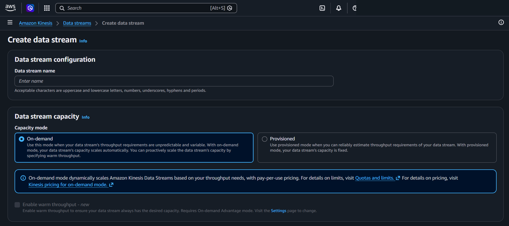
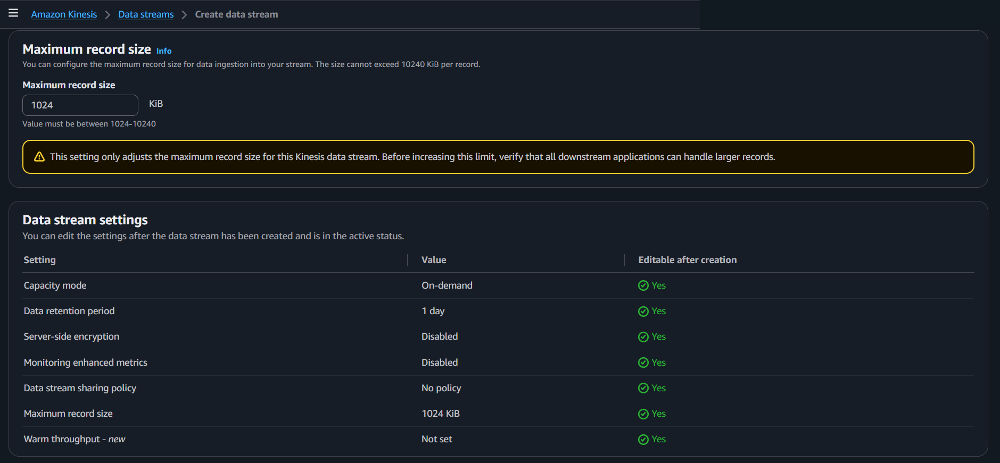
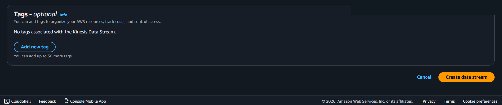
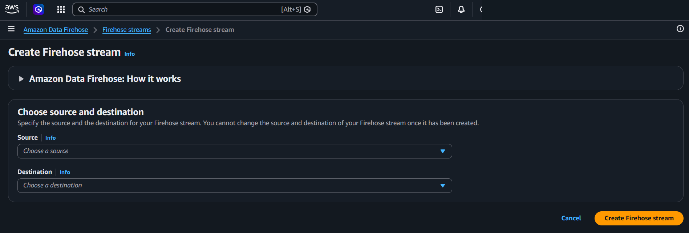

---
tags:
  - aws
  - networking
created_at: 2026-03-18
updated_at: 2026-04-17
---
# Amazon Kinesis

## What It Is
Amazon Kinesis is a platform for real-time streaming data. It collects, processes, and delivers data continuously — think of it as a conveyor belt for data.

Two main sub-services covered here:
- **Kinesis Data Streams** — Raw streaming pipe. You build custom consumers to read and process data.
- **Amazon Data Firehose** — Fully managed delivery. Pick source → destination, AWS handles the rest.

**In short:**
- Data Streams = **custom** (you build consumer logic, you manage shards)
- Data Firehose = **serverless** (pick source → destination, AWS does the rest)

## How It Works

**Kinesis Data Streams:** Producers write records to a stream divided into shards. Each shard handles 1 MB/s input and 2 MB/s output. Consumers read records in order per shard. Records are retained for 1–365 days.

**Data Firehose:** You pick a source (e.g., Direct PUT or a Kinesis Data Stream) and a destination (S3, Redshift, OpenSearch, etc.). Firehose buffers incoming records by size or time interval, optionally transforms them via Lambda, then delivers in batches automatically.

## Console Access
- Search "Kinesis" in AWS Console
- **Data Streams:** Amazon Kinesis > Data streams
- **Data Firehose:** Amazon Data Firehose > Firehose streams (separate console page)

## Create Data Stream - Console Flow

### Data stream configuration
- **Data stream name** — free text
  - Acceptable characters: uppercase/lowercase letters, numbers, underscores, hyphens, periods

### Data stream capacity
**Capacity mode (2 options):**

1. **On-demand** (selected by default)
   - Auto-scales based on throughput needs
   - Pay-per-use pricing
   - Use when throughput is unpredictable/variable
   - Can proactively scale by specifying warm throughput

2. **Provisioned**
   - Fixed capacity, you set shard count manually
   - Use when you can reliably estimate throughput

- **Enable warm throughput** checkbox (new) — ensures stream always has desired capacity, requires On-demand Advantage mode

### Maximum record size
- Default: 1024 KiB (Kibibytes)
- Range: 1024–10240 KiB
- "Before increasing this limit, verify that all downstream applications can handle larger records"

### Data stream settings summary
All settings are editable after creation yes

| Setting | Default Value |
|---|---|
| Capacity mode | On-demand |
| Data retention period | 1 day |
| Server-side encryption | Disabled |
| Monitoring enhanced metrics | Disabled |
| Data stream sharing policy | No policy |
| Maximum record size | 1024 KiB |
| Warm throughput | Not set |

### Tags - optional
- Up to 50 tags
- **Add new tag** button

**Action buttons:** Cancel / **Create data stream**

## Create Firehose Stream - Console Flow

### Choose source and destination
- **Source** dropdown — choose a source (e.g., Direct PUT, Kinesis Data Stream)
- **Destination** dropdown — choose a destination (e.g., Amazon S3, Amazon Redshift, Amazon OpenSearch, Splunk, HTTP endpoint)
- **You cannot change the source and destination once the Firehose stream has been created**

**Action buttons:** Cancel / **Create Firehose stream**

## Key Concepts

### Data Streams
- **Shard** — Base throughput unit of a data stream
  - 1 shard = 1 MB/sec input, 2 MB/sec output
  - On-demand mode manages shards automatically
  - Provisioned mode: you choose shard count
- **Producer** — Sends data into the stream (your app, IoT device, CloudWatch, etc.)
- **Consumer** — Reads data from the stream (your app, Lambda, Kinesis Data Analytics)
- **Record** — Unit of data stored in a stream (data blob + partition key + sequence number)
- **Retention period** — How long data stays in the stream (default 1 day, max 365 days)
- **Partition key** — Determines which shard a record goes to

### Data Firehose
- **Fully managed** — No shards, no consumers to build
- **Buffering** — Firehose buffers incoming data before delivering (by size or time interval)
- **Transformation** — Can transform data with Lambda before delivery (optional)
- **Source → Destination** — One-way delivery, set at creation, cannot change after

### Data Streams vs Data Firehose

| | Data Streams | Data Firehose |
|---|---|---|
| Management | You manage shards/consumers | Fully managed |
| Latency | Real-time (~200ms) | Near real-time (60sec+ buffer) |
| Consumers | Custom (your code, Lambda) | Built-in delivery to destination |
| Use case | Custom processing, fan-out | Log delivery, archival |
| Pricing | Per shard-hour | Per GB delivered |

### Common MSP Use Cases
- **Firehose:** Ship logs to S3 for archival, send to OpenSearch for dashboards
- **Data Streams:** Real-time processing where you need sub-second latency, custom fan-out to multiple consumers

## Precautions

### MAIN PRECAUTION: Firehose Source/Destination Cannot Be Changed After Creation
- Choose carefully — you must delete and recreate the stream to change source or destination
- Plan your data flow architecture before creating

### 1. Understand On-demand vs Provisioned Costs
- On-demand is easier but can get expensive at high throughput
- Provisioned is cheaper if you can predict traffic
- Monitor usage and switch mode if needed (editable after creation)

### 2. Data Retention Costs Money
- Default 1 day is free-tier friendly
- Extending retention (up to 365 days) increases cost
- Don't extend retention "just in case" — use S3 for long-term storage

### 3. Enable Server-side Encryption
- Disabled by default
- Enable for any stream carrying sensitive data
- Uses AWS KMS (Key Management Service) keys

### 4. Maximum Record Size Affects Downstream
- Increasing from default 1024 KiB can break consumers that expect smaller records
- Verify all downstream applications before changing

### 5. Shard Limits (Data Streams - Provisioned)
- Each shard has fixed throughput limits
- Too few shards = throttling, too many = wasted cost
- Use On-demand mode if unsure

### 6. Always Use Tags
- Tag streams with environment, project, team, cost center
- Up to 50 tags per stream
- Essential for MSP cost tracking across multiple clients

## Example

A gaming company uses Kinesis Data Streams to ingest player-action events in real time.
A Lambda consumer processes the stream to detect cheating patterns within seconds.
Separately, a Firehose delivery stream sends the same events to S3 for long-term analytics.

## Why It Matters

Kinesis enables real-time data processing at scale — critical for use cases like live dashboards,
fraud detection, and IoT telemetry where waiting for batch processing is too slow.

## Official Documentation
- [Amazon Kinesis Data Streams](https://docs.aws.amazon.com/streams/latest/dev/introduction.html)
- [Amazon Data Firehose](https://docs.aws.amazon.com/firehose/latest/dev/what-is-this-service.html)

---
← Previous: [Amazon EMR](08_amazon_emr.md) | [Overview](00_overview.md) | Next: [Amazon Redshift](23_amazon_redshift.md) →
