# Amazon RDS (Relational Database Service)

## What It Is
Amazon RDS (Relational Database Service) is a **managed service platform for relational databases**. It is not a database engine itself — it runs database engines (MySQL, PostgreSQL, Oracle, etc.) for you and handles the infrastructure.

**Managed, not fully managed:**
- **Managed (RDS):** AWS handles infra (patching, backups, failover), but you still choose instance size, storage type, engine version, scaling decisions
- **Fully managed (e.g., DynamoDB):** You don't think about instances, storage, or capacity at all

**How RDS works behind the scenes:**
- You create RDS database → AWS spins up EC2 + attaches EBS + installs DB engine automatically
- You never see or touch that EC2/EBS directly
- You manage: connectivity, security, performance, data
- AWS manages: OS patching, DB patching, backups, failover, hardware

**What AWS manages for you:** OS patching, DB engine patching, backups, high availability, scaling storage
**What you still manage:** Schema design, queries, indexing, tuning, user access

### RDS vs Self-managed (on EC2)

**What RDS gives you (that you'd build yourself on EC2):**
- Automated daily backups + point-in-time recovery (to any second within retention)
- One-click Multi-AZ failover
- Automated minor version patching
- Storage auto-scaling
- CloudWatch monitoring built-in
- Easy read replica creation
- Encryption at rest with one checkbox

**What you lose with RDS (trade-offs):**
- No SSH access to the underlying OS
- No custom software installation on the DB server
- Some engine features are restricted (e.g., Oracle RAC not supported)
- Less control over file system, OS tuning, network config
- Engine version choices limited to what AWS offers

**The trade-off:** RDS = less control, less ops work. EC2 self-managed = full control, all ops work is yours.

For most MSP clients, RDS is the right choice — they want the database to just work without a DBA managing infrastructure.

> For Aurora-specific features (shared cluster storage, Serverless v2, Babelfish), see [20_amazon_aurora.md](./20_amazon_aurora.md)

## What to Remember (Console Create Summary)

**5 decisions you must get right (hard/impossible to change later):**
1. **Engine** — MySQL? PostgreSQL? Oracle? (can't change after creation)
2. **VPC** — Which network? (can't change after creation)
3. **KMS key** — Which encryption key? (can't change after creation)
4. **Public access** — Yes/No? (changeable, but default No is almost always correct)
5. **Multi-AZ** — Production or not? (changeable, but affects cost and availability from day one)

**3 things that affect your bill most:**
1. **Instance class** — t classes (cheap, dev) vs r classes (expensive, production)
2. **Multi-AZ** — roughly doubles the instance cost
3. **Storage type** — gp3 (balanced) vs io1 (expensive, high performance)

**Everything else** is either changeable after creation or has safe defaults (Secrets Manager, backups, encryption, monitoring all enabled by default).

**TL;DR for MSP work:** Engine, VPC, instance size. Get those 3 right, the rest has safe defaults.

## Console Access
- Search "RDS" in AWS Console
- Breadcrumb: Aurora and RDS > Databases > Create database
- RDS and Aurora share the same console — engine selection determines which you get

## Create Database - Console Flow

> Note: Screenshots show Aurora PostgreSQL selected, but the console flow is shared for all engines. RDS-specific options noted below.

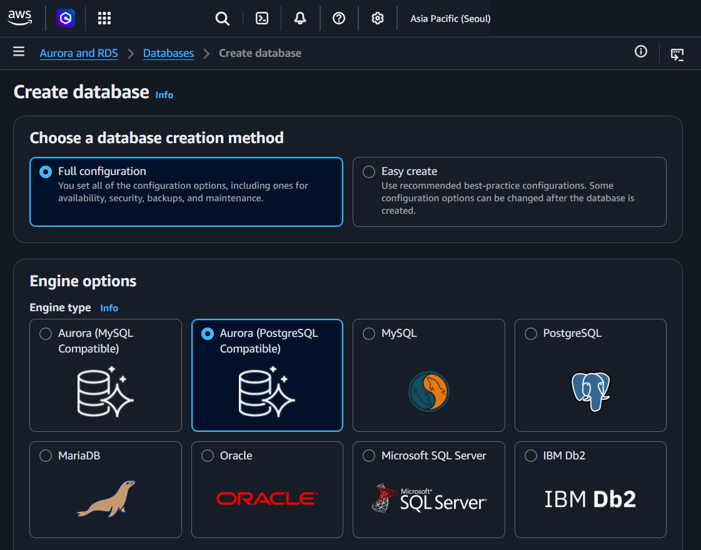

### Choose a database creation method
- **Full configuration** (default) — You set all options: availability, security, backups, maintenance
- **Easy create** — Recommended best-practice defaults, some options changeable after creation

### Engine options
**Engine type (8 options):**
- Aurora (MySQL Compatible)
- Aurora (PostgreSQL Compatible)
- **MySQL** ← RDS
- **PostgreSQL** ← RDS
- **MariaDB** ← RDS
- **Oracle** ← RDS
- **Microsoft SQL Server** ← RDS
- **IBM Db2** ← RDS

> Aurora options create an Aurora cluster. The other 6 are standard RDS instances.

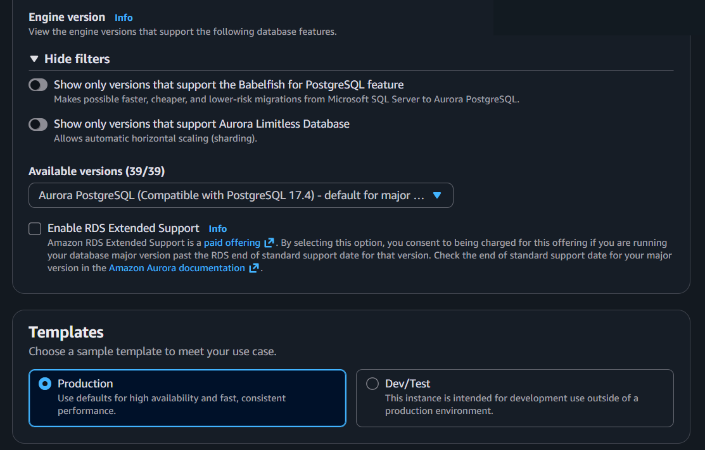

### Engine version
- Version filters:
  - Show only versions that support Babelfish for PostgreSQL (Aurora only)
  - Show only versions that support Aurora Limitless Database (Aurora only)
- **Available versions** dropdown
- **Enable RDS Extended Support** checkbox — paid offering for running past end-of-standard-support date

### Templates
- **Production** — Defaults for high availability and performance
- **Dev/Test** — Intended for development, lower defaults

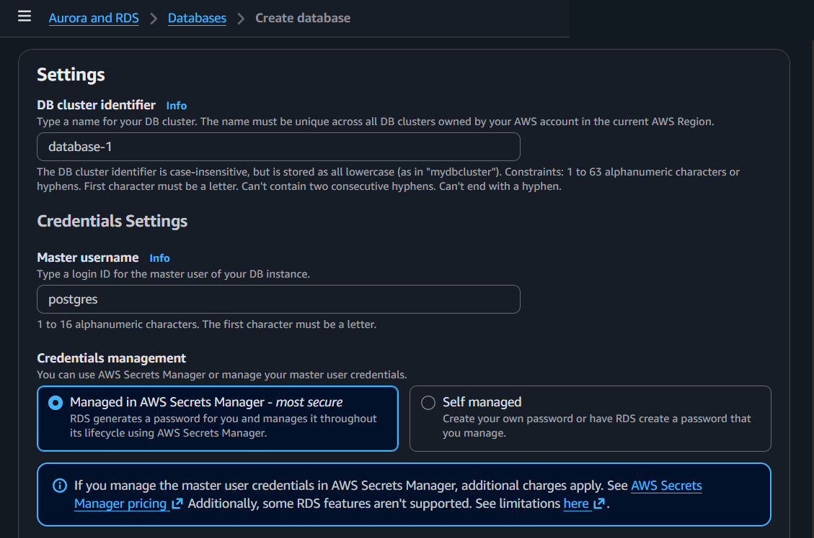

### Settings
- **DB cluster identifier** — Unique name across all DB clusters in the current Region
  - 1–63 characters, alphanumeric or hyphens
  - Must start with a letter, can't end with hyphen, no consecutive hyphens
  - Stored as all lowercase

### Credentials Settings
- **Master username** — Login ID for the master user (default: `postgres` for PostgreSQL, `admin` for MySQL)
  - 1–16 alphanumeric characters, must start with a letter
- **Credentials management:**
  - **Managed in AWS Secrets Manager** (default, most secure) — RDS generates and rotates password automatically
    - Additional charges apply for Secrets Manager
  - **Self managed** — You create your own password or have RDS generate one

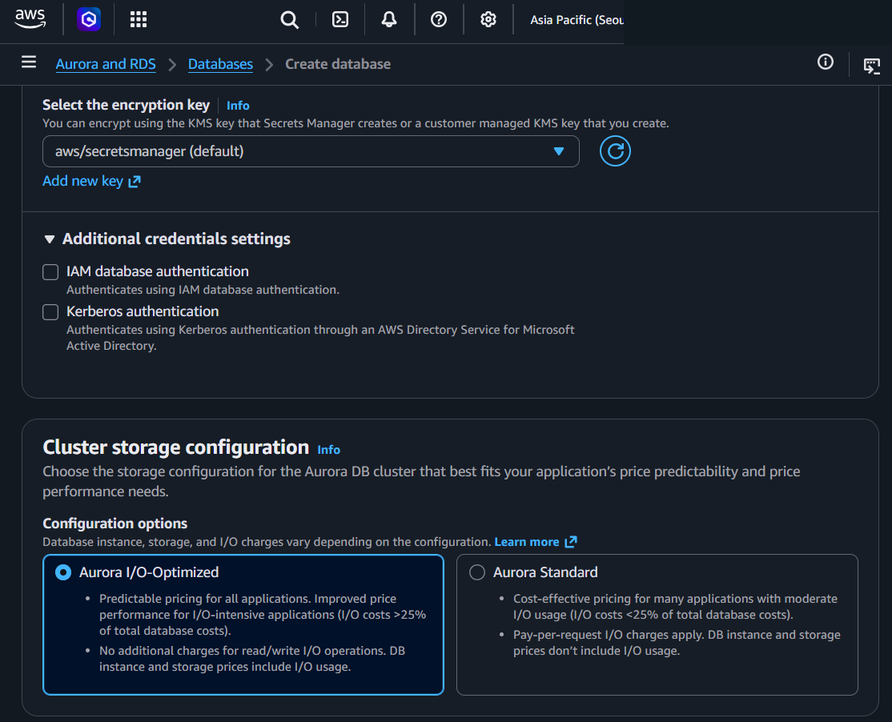

### Select the encryption key (when using Secrets Manager)
- KMS (Key Management Service) key: `aws/secretsmanager` (default) or customer managed key

### Additional credentials settings
- **IAM database authentication** checkbox — Authenticate using IAM instead of password
- **Kerberos authentication** checkbox — Authenticate through AWS Directory Service for Microsoft Active Directory

### Cluster storage configuration (Aurora only)
- **Aurora I/O-Optimized** — Predictable pricing, no I/O charges, good when I/O costs >25% of total
- **Aurora Standard** — Pay-per-request I/O, good when I/O costs <25% of total

> For standard RDS engines, storage is configured as EBS (Elastic Block Store) volumes with options for General Purpose SSD (gp3), Provisioned IOPS SSD (io1/io2), or Magnetic.

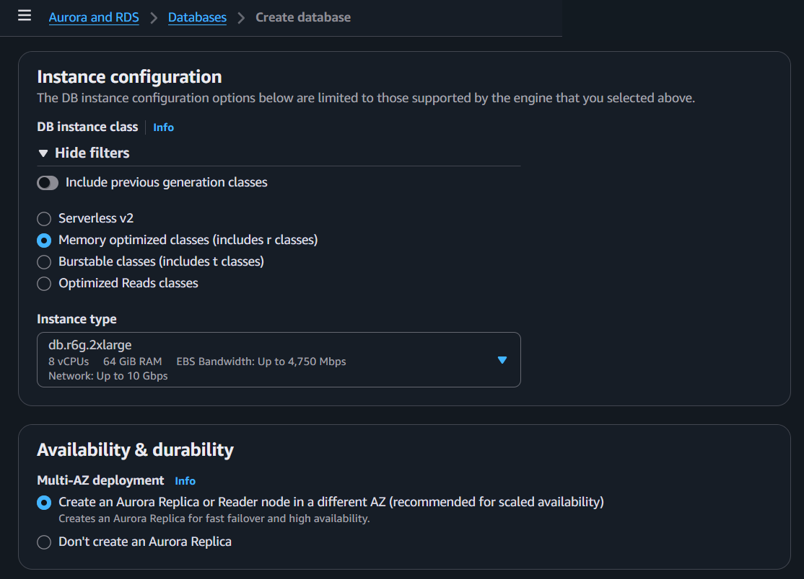

### Instance configuration
**DB instance class (4 categories):**
- **Serverless v2** — Auto-scales compute (Aurora only)
- **Memory optimized classes** (r classes) — For production workloads (e.g., db.r6g.2xlarge: 8 vCPUs, 64 GiB RAM)
- **Burstable classes** (t classes) — For dev/test or low-traffic (cheaper, but performance bursts)
- **Optimized Reads classes** — For read-heavy workloads

- **Include previous generation classes** toggle — Shows older (cheaper but less performant) instance types

### Availability & durability
**Multi-AZ deployment:**
- **Create a Replica or Reader node in a different AZ** (recommended) — Fast failover and high availability
- **Don't create a Replica** — Single AZ, no automatic failover

> For standard RDS: Multi-AZ creates a standby instance (synchronous replication, ~60-120 sec failover)

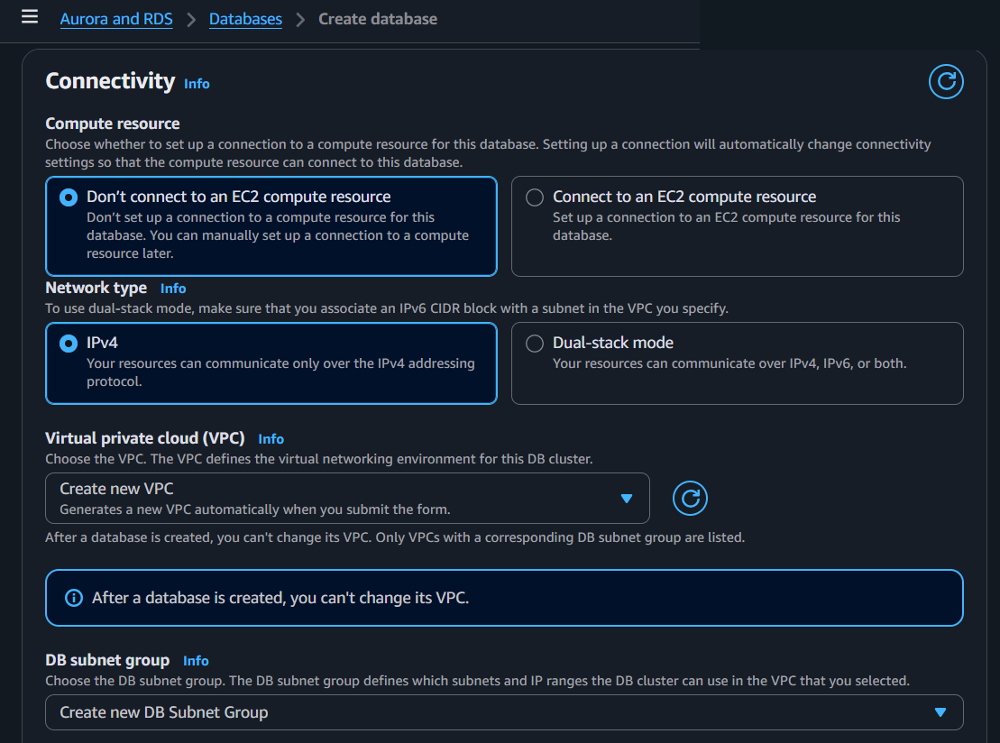

### Connectivity
- **Compute resource:**
  - **Don't connect to an EC2 compute resource** (default) — Set up manually later
  - **Connect to an EC2 compute resource** — Auto-configures connectivity settings

- **Network type:**
  - **IPv4** (default)
  - **Dual-stack mode** — IPv4 + IPv6

- **Virtual Private Cloud (VPC):**
  - Choose existing VPC or create new
  - **"After a database is created, you can't change its VPC"**

- **DB subnet group** — Defines which subnets and IP ranges the DB cluster can use

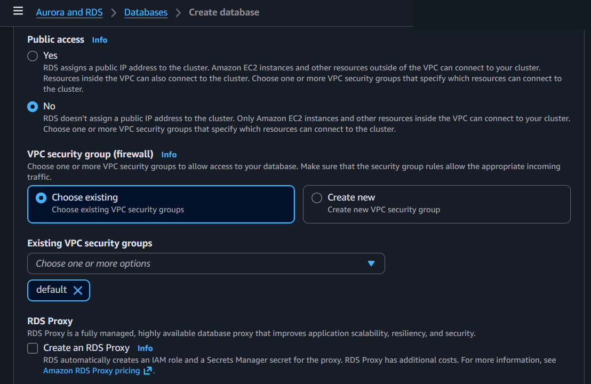

### Public access
- **Yes** — Assigns public IP, accessible from outside VPC (still needs SG rules)
- **No** (default) — Only accessible from within VPC

### VPC security group (firewall)
- **Choose existing** (default) — Select existing VPC security groups
- **Create new** — Create a new security group
- Make sure SG rules allow the appropriate incoming traffic (e.g., port 5432 for PostgreSQL, 3306 for MySQL)

### RDS Proxy
- **Create an RDS Proxy** checkbox — Fully managed database proxy
  - Improves scalability, resiliency, and security
  - Auto-creates IAM role and Secrets Manager secret
  - Additional costs apply

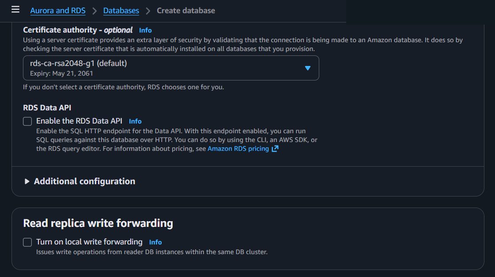

### Certificate authority - optional
- Default: `rds-ca-rsa2048-g1` (expires May 21, 2061)
- Validates that the connection is being made to an Amazon database (SSL/TLS)

### RDS Data API (Aurora only)
- **Enable the RDS Data API** checkbox — Run SQL queries over HTTP (via CLI, SDK, or RDS query editor)

### Read replica write forwarding
- **Turn on local write forwarding** checkbox — Issues write operations from reader DB instances within the same cluster

### Additional configuration (expandable)
- Database options, encryption, failover, backup, backtrack, maintenance, CloudWatch Logs, delete protection

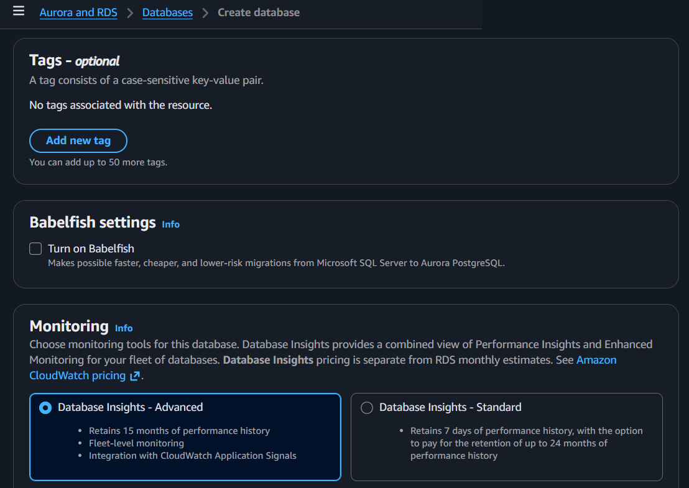

### Tags - optional
- Up to 50 tags, case-sensitive key-value pairs

### Babelfish settings (Aurora PostgreSQL only)
- **Turn on Babelfish** — Enables faster migration from Microsoft SQL Server to Aurora PostgreSQL

### Monitoring
**Database Insights (2 options):**
- **Database Insights - Advanced** — 15 months performance history, fleet-level monitoring, CloudWatch Application Signals integration
- **Database Insights - Standard** — 7 days history (option to pay for up to 24 months)

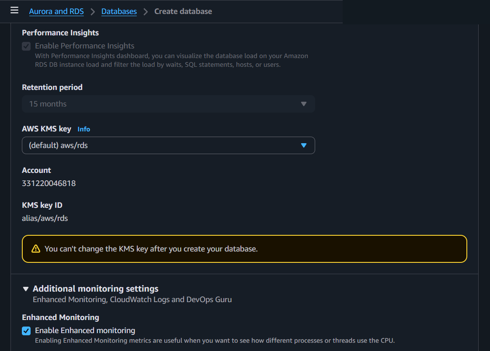

### Performance Insights
- **Enable Performance Insights** checkbox (enabled by default with Advanced)
- Visualize database load, filter by waits, SQL statements, hosts, users
- Retention period: 15 months (Advanced)

### Encryption
- **AWS KMS key:** `(default) aws/rds` or customer managed key
- **"You can't change the KMS key after you create your database"**

### Enhanced Monitoring
- **Enable Enhanced monitoring** checkbox — OS-level metrics (CPU, memory, processes)
- **OS metrics granularity:** 60 seconds (default)
- **Monitoring role for OS metrics:** default (auto-creates `rds-monitoring-role` IAM role)

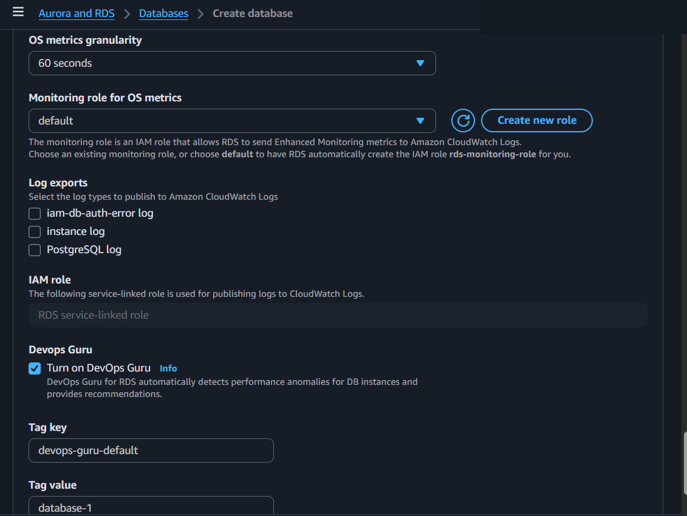

### Log exports (to Amazon CloudWatch Logs)
- iam-db-auth-error log
- instance log
- PostgreSQL log (engine-specific)

### IAM role
- Service-linked role for publishing logs to CloudWatch Logs

### DevOps Guru
- **Turn on DevOps Guru** checkbox — Auto-detects performance anomalies and provides recommendations
- Cost: $0.0042 per resource per hour

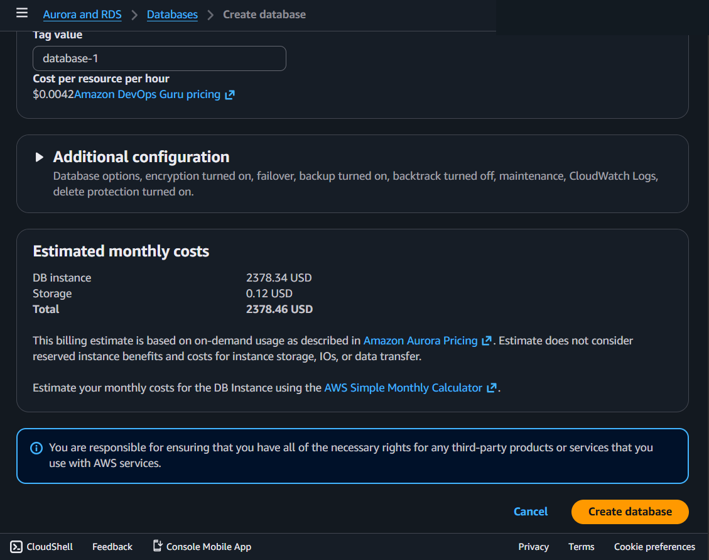

### Additional configuration (expandable)
- Summary: Database options, encryption turned on, failover, backup turned on, backtrack turned off, maintenance, CloudWatch Logs, delete protection turned on

### Estimated monthly costs
- Shows cost estimate based on on-demand pricing
- Does NOT include reserved instance benefits, storage IOs, or data transfer
- Example from screenshot: db.r6g.2xlarge = **$2,378.46 USD/month**

**Action buttons:** Cancel / **Create database**

## Key Concepts

### Supported Engines (RDS, not Aurora)
| Engine | Default Port | Notes |
|---|---|---|
| MySQL | 3306 | Most popular open-source |
| PostgreSQL | 5432 | Advanced open-source, enterprise features |
| MariaDB | 3306 | MySQL fork, community-driven |
| Oracle | 1521 | Enterprise, license options (License Included or BYOL) |
| Microsoft SQL Server | 1433 | Enterprise, license options |
| IBM Db2 | 50000 | Enterprise, mainframe migration |

### Multi-AZ (Multi-Availability Zone)
- Creates a standby replica in a different AZ
- Synchronous replication — data is written to both at the same time
- Automatic failover if primary fails (~60-120 seconds)
- Standby is NOT readable — it's only for failover
- **Tip:** Always enable for production, skip for dev/test to save cost

### Multi-AZ vs Read Replica

| | Multi-AZ (Standby) | Read Replica |
|---|---|---|
| Purpose | **Failover** (high availability) | **Read scaling** (offload reads) |
| Readable? | No — just sits there waiting | Yes — serves read queries |
| Replication | Synchronous (zero lag) | Asynchronous (has lag) |
| Failover | Automatic | Manual (you promote it) |
| Region | Same region, different AZ | Same or different region |

- **Multi-AZ standby** = a backup that does nothing until the primary dies. You're paying for insurance.
- **Read replica** = an active copy that handles read traffic. You're paying for performance.
- You can use both together: Multi-AZ for failover + read replica(s) for scaling reads.

### Read Replicas
- Available for: MySQL, PostgreSQL, MariaDB, Oracle, SQL Server (all standard RDS engines)
- Asynchronous replication — slight delay from primary
- **Readable** — offload read traffic from primary
- Can be in same AZ, different AZ, or different Region (cross-region)
- Can be promoted to standalone DB (one-way, breaks replication)
- Up to 5 read replicas for standard RDS engines

**RDS vs Aurora Read Replicas:**

| | RDS Read Replica | Aurora Read Replica |
|---|---|---|
| Max count | 5 | 15 |
| Replication | Asynchronous (has lag) | Shared storage (near-zero lag) |
| Auto failover | No (manual promotion) | Yes (automatic) |
| Cross-region | Yes | Yes |
| Storage | Each replica has its own EBS | All share cluster storage |

### Storage Types (RDS uses EBS)
- **General Purpose SSD (gp3)** — Balanced price/performance, most workloads
- **Provisioned IOPS SSD (io1/io2)** — High-performance, I/O-intensive workloads
- **Magnetic** — Legacy, not recommended for new databases
- Storage auto-scaling available — automatically increases storage when running low

### Backups
- **Automated backups** — Daily snapshots + transaction logs, retention 1-35 days
- **Manual snapshots** — User-initiated, kept until you delete them
- **Point-in-time recovery** — Restore to any second within retention period
- Backups stored in S3 (managed by AWS, not visible in your S3 console)

### RDS Extended Support
- Paid offering to keep running a DB engine version past its end-of-standard-support date
- Useful when you can't upgrade immediately
- Additional charges apply — plan upgrades to avoid this cost

## Precautions

### MAIN PRECAUTION: VPC and KMS Key Cannot Be Changed After Creation
- Choose your VPC carefully — you cannot move the database to a different VPC later
- Choose your KMS encryption key carefully — it's permanent
- Plan your network architecture before creating the database

### 1. Don't Enable Public Access Unless Absolutely Necessary
- Default is No (private) — keep it that way
- If you need external access, use a bastion host or VPN instead
- Public access + weak SG rules = database exposed to the internet

### 2. Check Instance Size Before Creating
- Production template defaults to large instances (e.g., db.r6g.2xlarge = ~$2,378/month)
- For dev/test, use burstable classes (t classes) — much cheaper
- **Tip:** Always verify instance size with the client before provisioning

### 3. Enable Multi-AZ for Production
- Single AZ = single point of failure
- Multi-AZ adds cost but provides automatic failover
- Skip for dev/test environments to save money

### 4. Use Secrets Manager for Credentials
- Default option (most secure) — auto-generates and rotates passwords
- Self-managed passwords risk being forgotten, shared, or hardcoded
- Secrets Manager has additional charges

### 5. Enable Encryption
- Encryption at rest uses KMS keys
- Enable at creation — you can't encrypt an existing unencrypted database
- To encrypt later: snapshot → copy snapshot with encryption → restore from encrypted snapshot

### 6. Plan Your Security Group Rules
- RDS needs inbound rules for the database port (3306 for MySQL, 5432 for PostgreSQL, etc.)
- Best practice: allow only from your application's security group, not from 0.0.0.0/0
- See [23_security_group.md](./23_security_group.md) for SG details

### 7. Monitor Costs — RDS Can Get Expensive
- Instance cost + storage + I/O + backups + data transfer
- Use Reserved Instances for predictable production workloads (up to 60% savings)
- Review the estimated monthly costs shown at the bottom of the create page

### 8. Always Use Tags
- Tag with environment, project, team, client, cost center
- Up to 50 tags per database
- Essential for MSP cost tracking across multiple clients

## Example

A SaaS application uses an RDS PostgreSQL `db.r6g.large` instance with Multi-AZ enabled.
Automated backups run daily with a 7-day retention window.
A read replica in the same Region offloads reporting queries from the primary instance.

## Why It Matters

RDS removes the undifferentiated heavy lifting of database administration — patching, backups, failover —
so teams can focus on schema design and query optimization instead of infrastructure.

## Q&A

### Q: Does Multi-AZ support more than one standby instance?

Yes. RDS offers two Multi-AZ deployment options:

| Deployment | Standbys | Readable | Failover Time | Supported Engines |
|------------|----------|----------|---------------|-------------------|
| **Multi-AZ Instance** (classic) | 1 | Not readable | 60–120 sec | All RDS engines |
| **Multi-AZ Cluster** (newer) | **2 (readable)** | Readable | ~35 sec | MySQL 8.0.28+, PostgreSQL 13.8+ |

Multi-AZ Cluster places 1 Primary + 2 Readable Standbys across 3 AZs. Benefits include read capacity, faster failover (~35 sec), and lower write latency. Failover is DNS-based — the endpoint automatically points to the new primary.

## Official Documentation
- [Amazon RDS User Guide](https://docs.aws.amazon.com/AmazonRDS/latest/UserGuide/Welcome.html)
- [Amazon RDS FAQs](https://aws.amazon.com/rds/faqs/)

---
← Previous: [Amazon EFS](22_amazon_efs.md) | [Overview](00_overview.md) | Next: [Amazon Aurora](11_amazon_aurora.md) →
