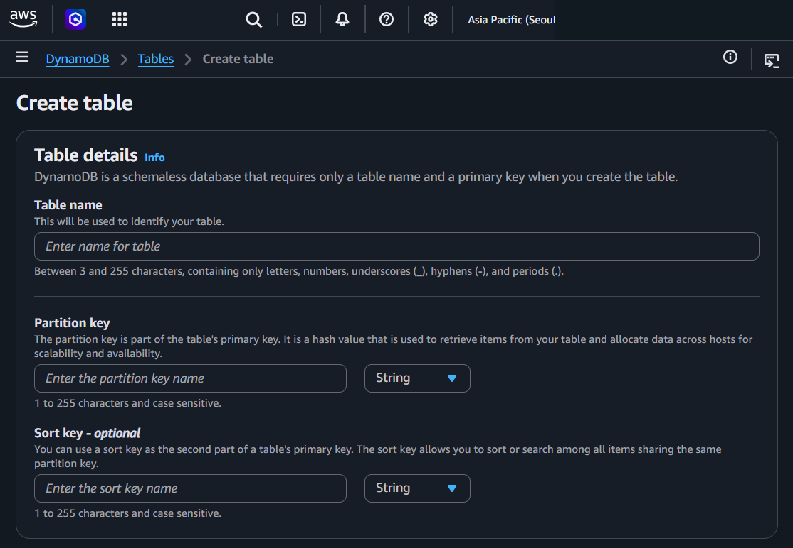
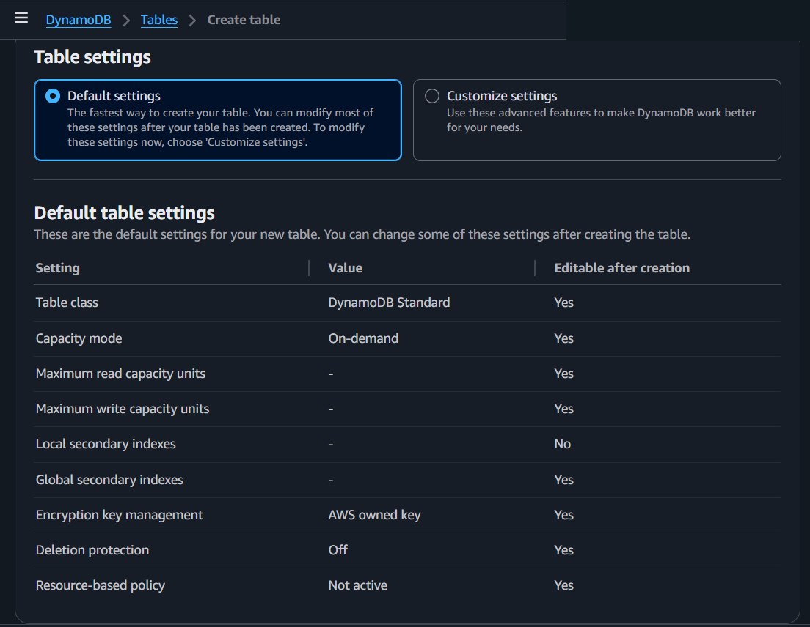
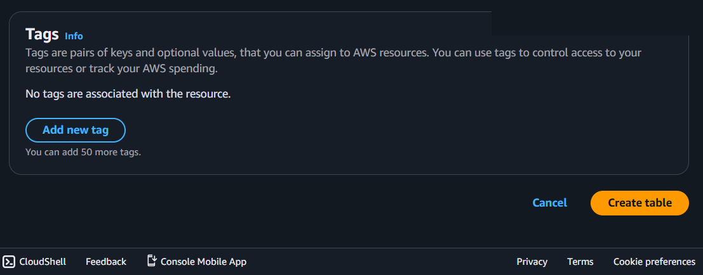

# Amazon DynamoDB

## What It Is
Amazon DynamoDB is a **fully managed** NoSQL (key-value and document) database service. Single-digit millisecond latency at any scale, with near-unlimited scalability.

**Fully managed means:**
- No instances to pick (no EC2 underneath that you choose)
- No storage size to set (grows automatically)
- No OS patching, no DB patching
- No backups to configure manually (continuous backups available)
- No Multi-AZ setup — automatically replicated across 3 AZs
- You just create a table and start reading/writing

**How you connect (API, not database connection):**
- RDS: Connect to `host:port` with username/password (traditional DB connection)
- DynamoDB: Call `https://dynamodb.<region>.amazonaws.com` via AWS SDK/CLI with IAM credentials
- There's no "server" to connect to — it's all API calls over HTTPS
- This is another reason it's fully managed: you're calling a service, not connecting to a server

**VPC Endpoint for DynamoDB:**
- By default, DynamoDB traffic goes over the public internet
- You can create a **VPC Gateway Endpoint** to keep traffic within AWS's private network
- No extra cost for the gateway endpoint itself
- Common setup: EC2/Lambda in private subnet → VPC endpoint → DynamoDB (no internet needed)

### RDS vs DynamoDB

| | RDS (Relational) | DynamoDB (NoSQL) |
|---|---|---|
| Type | SQL (tables, rows, columns) | Key-value / document |
| Schema | Fixed (define columns and types) | Flexible (each item can differ) |
| Scaling | Vertical (bigger instance) | Horizontal (automatic) |
| Management | Managed (you pick instance, storage) | Fully managed (nothing to pick) |
| Latency | ~milliseconds | Single-digit ms (DAX = microseconds) |
| Joins | Yes | No |
| Connection | host:port + username/password | HTTPS API + IAM credentials |
| Best for | Complex queries, relationships | High-speed reads/writes, simple lookups |

## How It Works

You create a table with a primary key (partition key, optionally with a sort key). DynamoDB hashes the partition key to determine which internal partition stores each item, distributing data automatically across storage nodes. Reads and writes go through the AWS SDK or CLI as HTTPS API calls — no database connection string. DynamoDB replicates data across three AZs automatically. You choose on-demand (pay per request) or provisioned (set RCU/WCU) capacity mode.

## Console Access
- Search "DynamoDB" in AWS Console
- DynamoDB > Tables > Create table


## Create Table - Console Flow



### Table details
- "DynamoDB is a schemaless database that requires only a table name and a primary key when you create the table."
- **Table name** — identifies your table
  - 3–255 characters, letters, numbers, underscores (_), hyphens (-), periods (.)
- **Partition key** (required) — Primary key, hash value used to retrieve items and allocate data across hosts
  - 1–255 characters, case sensitive
  - Data type: String, Number, or Binary
- **Sort key** - optional — Second part of composite primary key
  - Allows sorting/searching among items sharing the same partition key
  - 1–255 characters, case sensitive
  - Data type: String, Number, or Binary

> Partition key and sort key have **nothing to do with KMS/encryption**. They are about how DynamoDB organizes and finds your data.

**Partition key — why it's called "partition":**
- DynamoDB splits data across multiple physical **partitions** (internal storage nodes)
- The partition key value gets hashed → the hash determines **which partition** stores that item
- You never see or manage partitions — you just pick a good key

```
e.g. Table: Users, Partition key: userId

userId: "A001" → hash → partition 1
userId: "B002" → hash → partition 3
userId: "C003" → hash → partition 2
```

**Sort key — why it's called "sort":**
- Within the same partition, items are **sorted** by this key
- Enables range queries: "give me all items where sort key is between X and Y"

```
e.g. Table: Orders, Partition key: customerId, Sort key: orderDate

Partition for customer "A001":
  orderDate: 2026-01-01  ← sorted
  orderDate: 2026-02-15  ← sorted
  orderDate: 2026-03-10  ← sorted

Query: "all orders for A001 between January and February" → works!
```

- **Partition key** = which shelf to look at (distribution)
- **Sort key** = what order items are in on that shelf (sorting within partition)
- Good partition key = high cardinality (many unique values). Bad partition key (e.g., boolean) = hot partitions = throttling.



### Table settings
- **Default settings** (selected by default) — Fastest way to create, most settings changeable after creation
- **Customize settings** — Set capacity, encryption, indexes, etc. manually

### Default table settings summary

| Setting | Default Value | Editable after creation |
|---|---|---|
| Table class | DynamoDB Standard | Yes |
| Capacity mode | On-demand | Yes |
| Maximum read capacity units | - | Yes |
| Maximum write capacity units | - | Yes |
| Local secondary indexes | - | **No** |
| Global secondary indexes | - | Yes |
| Encryption key management | AWS owned key | Yes |
| Deletion protection | Off | Yes |
| Resource-based policy | Not active | Yes |

> Notice: **Local secondary indexes** is the only setting that is NOT editable after creation.



### Tags - optional
- Up to 50 tags
- "Tags are pairs of keys and optional values, that you can assign to AWS resources. You can use tags to control access to your resources or track your AWS spending."

**Action buttons:** Cancel / **Create table**


## Key Concepts

### Primary Key
- See console flow section above for full explanation with examples.

### Items and Attributes
- **Item** = a single record (like a row in SQL)
- **Attribute** = a field within an item (like a column in SQL)
- Items in the same table can have different attributes (flexible schema)

### Capacity Modes
**On-demand:**
- No capacity planning needed
- Pay per read/write request
- Instantly accommodates traffic spikes
- More expensive per request, but no wasted capacity

**Provisioned:**
- You set RCU (Read Capacity Units) and WCU (Write Capacity Units)
  - 1 RCU = 1 strongly consistent read/sec for items up to 4 KB
  - 1 WCU = 1 write/sec for items up to 1 KB
- Auto-scaling adjusts capacity based on traffic
- Cheaper per request if traffic is predictable
- Throttling if you exceed provisioned capacity (without auto-scaling)

### Secondary Indexes
- **GSI (Global Secondary Index)** — Query on any attribute, across all partitions
  - Has its own provisioned capacity (separate from table)
  - Up to 20 per table
- **LSI (Local Secondary Index)** — Query on sort key alternatives, same partition key
  - Shares table's provisioned capacity
  - Up to 5 per table
  - Must be created at table creation time (can't add later)

### DynamoDB Streams
- Captures item-level changes (insert, update, delete) in order
- Can trigger AWS Lambda functions (event-driven architecture)
- Retention: 24 hours
- Use cases: replication, analytics, notifications on data changes

### DAX (DynamoDB Accelerator)
- In-memory cache for DynamoDB
- **Microsecond** latency (vs single-digit millisecond without DAX)
- Fully managed, sits between your app and DynamoDB
- Good for: read-heavy workloads, repeated reads of same data

### Global Tables
- Multi-region, multi-active replication
- Write to any region, changes replicate to all other regions
- Good for: global applications, disaster recovery
- Additional cost for cross-region replication


## Precautions

### MAIN PRECAUTION: Choose Your Primary Key Carefully
- Primary key cannot be changed after table creation
- Bad partition key (e.g., a boolean, or a value with few variations) = hot partitions = throttling
- Good partition key = high cardinality (many unique values, evenly distributed)

### 1. On-demand vs Provisioned — Cost Can Surprise You
- On-demand is easy but more expensive per request
- Provisioned without auto-scaling can cause throttling
- **Tip:** Start with on-demand for new tables, switch to provisioned once traffic patterns are clear

### 2. LSI Must Be Created at Table Creation
- Local Secondary Indexes cannot be added after the table exists
- Plan your query patterns before creating the table
- GSI can be added anytime

### 3. No SQL Joins — Design Differently
- DynamoDB is not relational — no joins, no complex queries
- Design your table around your access patterns (not around data normalization)
- If you need joins and complex queries, use RDS instead

### 4. Item Size Limit: 400 KB
- Each item (record) can be max 400 KB
- If you need to store larger data, store it in S3 and keep a reference in DynamoDB

### 5. Encryption Key Choice
- Default (DynamoDB owned) is free and sufficient for most cases
- Customer managed KMS key gives you control but adds KMS costs
- Choose at creation — changing encryption type requires creating a new table

### 6. Use VPC Endpoint for Private Access
- By default, DynamoDB traffic goes over the internet
- Create a VPC Gateway Endpoint for private access (no extra cost)
- Important for security-sensitive MSP clients

### 7. Always Use Tags
- Tag with environment, project, team, client, cost center
- Up to 50 tags per table
- Essential for MSP cost tracking across multiple clients

## Example

A mobile app stores user session data in a DynamoDB table with `userId` as the partition key.
On-demand capacity mode handles unpredictable traffic without any provisioning.
TTL (Time to Live) automatically deletes sessions older than 24 hours.

## Why It Matters

DynamoDB provides single-digit millisecond reads and writes at any scale with zero server management.
It is the default choice for key-value workloads that need consistent low latency.

## Official Documentation
- [Amazon DynamoDB Developer Guide](https://docs.aws.amazon.com/amazondynamodb/latest/developerguide/Introduction.html)
- [Amazon DynamoDB FAQs](https://aws.amazon.com/dynamodb/faqs/)

---
← Previous: [Amazon Aurora](11_amazon_aurora.md) | [Overview](00_overview.md) | Next: [Amazon ElastiCache](13_amazon_elasticache.md) →
