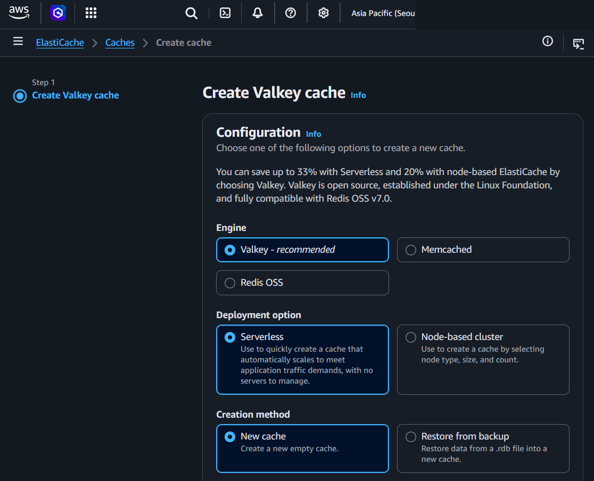
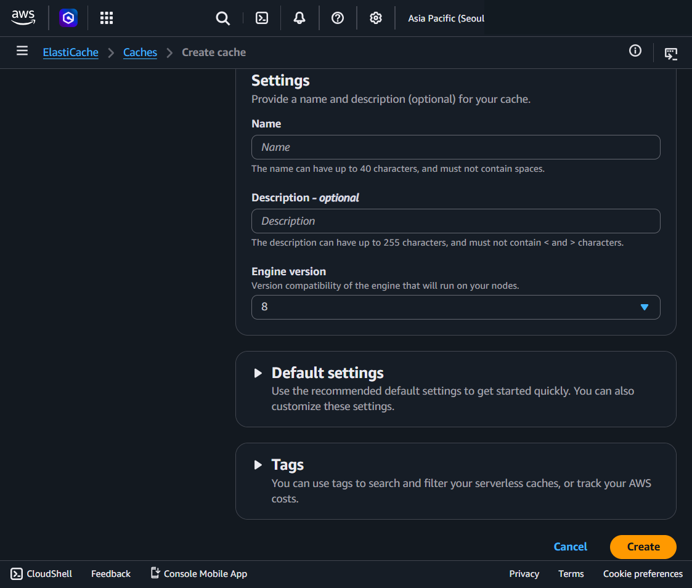

# Amazon ElastiCache

## What It Is
Amazon ElastiCache is a managed in-memory cache service. It stores frequently accessed data in memory (RAM) so your application can read it in microseconds instead of querying a database every time.

**How caching works:**
```
Without cache:
App → Database (every time, slow)

With cache:
App → Cache (in-memory, fast) → hit? return data instantly
                              → miss? → Database → store in cache → return data
```

First request = cache miss (goes to DB). After that, same data served from memory.

**ElastiCache is NOT a database replacement** — it sits between your app and your database to speed things up.

### How ElastiCache Relates to Other AWS Services

| Service | How ElastiCache helps |
|---|---|
| **RDS / Aurora** | Cache frequent DB queries → reduce DB load and latency |
| **EC2 / ECS / Lambda** | Store session data in cache instead of DB |
| **API Gateway** | Cache API responses |
| **CloudFront** | CloudFront caches at edge (CDN), ElastiCache caches at app layer (different levels) |

### ElastiCache vs Similar AWS Services

| | ElastiCache | DAX | MemoryDB for Redis |
|---|---|---|---|
| Purpose | General-purpose cache (speed layer) | DynamoDB cache only | Durable in-memory database |
| Works with | Anything (RDS, Aurora, APIs, etc.) | DynamoDB only | Standalone (can be primary DB) |
| Engine | Valkey, Redis OSS, Memcached | Custom (DynamoDB-aware) | Redis compatible |
| Integration | You write cache logic | Drop-in (same DynamoDB API) | You write app logic |
| Data durability | no Can lose data | no Can lose data | yes Durable (Multi-AZ transaction log) |
| Use as primary DB? | No | No | Yes |
| Management | Managed (Serverless or node-based) | Fully managed | Managed |
| Cost | Lower | Medium | Higher |

**When to use which:**
- Speed layer in front of RDS/Aurora → **ElastiCache**
- Faster DynamoDB reads with zero code changes → **DAX**
- In-memory database that won't lose data → **MemoryDB**

**The simple way to think about it:**
- **ElastiCache** = fast but disposable (cache for any DB)
- **DAX** = fast but disposable (cache for DynamoDB only, drop-in)
- **MemoryDB** = fast AND durable (can replace the DB itself)

## Console Access
- Search "ElastiCache" in AWS Console
- ElastiCache > Caches > Create cache


## Create Cache - Console Flow



### Configuration

**Engine (3 options):**
- **Valkey** (recommended) — Open source, Linux Foundation, fully compatible with Redis OSS v7.0
  - Save up to 33% with Serverless, 20% with node-based vs Redis OSS
- **Redis OSS** — Original open-source Redis
- **Memcached** — Simple key-value caching

> AWS now recommends Valkey over Redis OSS due to licensing changes. Valkey is a Redis fork — same commands, same compatibility.

**Deployment option (2 options):**
- **Serverless** (default) — Auto-scales, no servers to manage
  - Quickly create a cache that scales to meet traffic demands
- **Node-based cluster** — You select node type, size, and count
  - More control over configuration and cost

**Creation method:**
- **New cache** — Create a new empty cache
- **Restore from backup** — Restore data from a .rdb file into a new cache



### Settings
- **Name** — Up to 40 characters, no spaces
- **Description** - optional — Up to 255 characters, no < or > characters
- **Engine version** — Version compatibility (e.g., 8 for Valkey)

### Default settings (expandable)
- Recommended defaults to get started quickly
- Customizable after creation

### Tags (expandable)
- Search, filter caches, and track costs

**Action buttons:** Cancel / **Create**


## Key Concepts

### Engines Comparison

| | Valkey / Redis OSS | Memcached |
|---|---|---|
| Data structures | Rich (strings, lists, sets, sorted sets, hashes) | Simple key-value only |
| Persistence | Yes (data survives restart) | No (data lost on restart) |
| Replication | Yes (Multi-AZ, read replicas) | No |
| Pub/Sub | Yes | No |
| Backup/Restore | Yes | No |
| Use cases | Sessions, leaderboards, queues, pub/sub, complex caching | Simple caching, large-scale horizontal |

**For most use cases, pick Valkey** — it does everything Memcached does and more.

### Serverless vs Node-based

| | Serverless | Node-based cluster |
|---|---|---|
| Management | Fully managed, auto-scales | You pick node type and count |
| Scaling | Automatic | Manual (add/remove nodes) |
| Cost | Pay for usage | Pay for nodes (running 24/7) |
| Best for | Variable traffic, getting started | Predictable traffic, cost optimization |

### Common Caching Patterns

**Cache-aside (most common):**
1. App checks cache first
2. Cache hit → return data
3. Cache miss → query DB → store result in cache → return data
4. App is responsible for cache logic

**Write-through:**
1. App writes to cache AND database at the same time
2. Cache is always up-to-date
3. Slower writes, but reads are always fresh

### Common MSP Pattern
```
User → App (EC2/Lambda) → ElastiCache (Valkey/Redis)
                              → cache hit? return instantly
                              → cache miss? → RDS/Aurora → store in cache → return
```

### TTL (Time to Live)
- Set expiration time on cached data
- After TTL expires, data is removed from cache
- Next request = cache miss → fresh data from DB
- Balance: too short = too many DB hits, too long = stale data


## Precautions

### MAIN PRECAUTION: Cache Is Not a Database — Data Can Be Lost
- In-memory data can be lost on node failure (Memcached) or restart
- Valkey/Redis has persistence options, but don't rely on cache as primary data store
- Always have the source of truth in a database (RDS, Aurora, DynamoDB)

### 1. Engine Choice Cannot Be Changed After Creation
- Valkey, Redis OSS, or Memcached — pick at creation, can't switch later
- When in doubt, pick Valkey (recommended by AWS, most features)

### 2. Serverless vs Node-based — Cost Implications
- Serverless is easier but can be more expensive at steady high traffic
- Node-based is cheaper for predictable workloads but requires capacity planning
- **Tip:** Start with Serverless, switch to node-based once traffic patterns are clear

### 3. Security — VPC and Access Control
- ElastiCache runs inside your VPC (not publicly accessible)
- Use security groups to control which resources can connect
- Enable encryption in-transit (TLS) and at-rest for sensitive data
- Enable authentication (AUTH token for Redis/Valkey)

### 4. Cache Invalidation Is Hard
- Stale data is the #1 caching problem
- Set appropriate TTL values
- Invalidate cache when source data changes
- "There are only two hard things in computer science: cache invalidation and naming things"

### 5. Monitor Cache Hit Rate
- Low hit rate = cache isn't helping (wrong data being cached, or TTL too short)
- Target: 80%+ hit rate for effective caching
- Monitor via CloudWatch metrics

### 6. Always Use Tags
- Tag with environment, project, team, client, cost center
- Essential for MSP cost tracking across multiple clients

## Example

An API caches database query results in an ElastiCache Redis cluster with a 5-minute TTL.
The first request hits RDS and stores the result in Redis; subsequent identical requests return in under a millisecond.
This reduces RDS read load by over 80%.

## Why It Matters

In-memory caching dramatically reduces database load and response times.
ElastiCache handles the operational burden of running Redis or Memcached — replication, patching, failover — so you just use the cache.

## Official Documentation
- [Amazon ElastiCache User Guide](https://docs.aws.amazon.com/AmazonElastiCache/latest/UserGuide/WhatIs.html)
- [Amazon ElastiCache FAQs](https://aws.amazon.com/elasticache/faqs/)

---
← Previous: [Amazon DynamoDB](12_amazon_dynamodb.md) | [Overview](00_overview.md) | Next: [Amazon EMR](08_amazon_emr.md) →
