# Elastic Load Balancing (ELB)

## What It Is
Elastic Load Balancing (ELB) automatically distributes incoming traffic across multiple targets (EC2 instances, containers, IP addresses, Lambda functions). It ensures high availability by spreading load and detecting unhealthy targets.

**See [Networking Basics - Protocols](../../../networking/01_protocols.md) for TCP/UDP/HTTP/HTTPS fundamentals.**

## Console Access
- AWS Console → EC2 → Left sidebar → Load Balancers
- Breadcrumb: EC2 > Load balancers


## Compare and Select Load Balancer Type

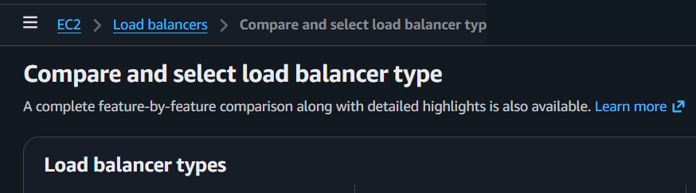

When you click "Create load balancer", you see a comparison page with all types side by side.


### 4 Types of Load Balancers

| Type | Abbreviation | Layer | Protocols | Use Case |
|------|-------------|-------|-----------|----------|
| Application Load Balancer | ALB | Layer 7 (Application) | HTTP, HTTPS | Web apps, microservices, containers |
| Network Load Balancer | NLB | Layer 4 (Transport) | TCP, UDP, TLS | Ultra-high performance, static IPs, gaming |
| Gateway Load Balancer | GWLB | Layer 3 (Network) | GENEVE | Third-party security appliances (firewalls, IDS/IPS) |
| Classic Load Balancer | CLB | Layer 4/7 | TCP, HTTP, HTTPS | **Previous generation** - don't use for new projects |


**Classic Load Balancer** is collapsed at the bottom as "previous generation". AWS recommends migrating to ALB or NLB.


## Create Application Load Balancer (ALB) - Console Flow

### Basic configuration

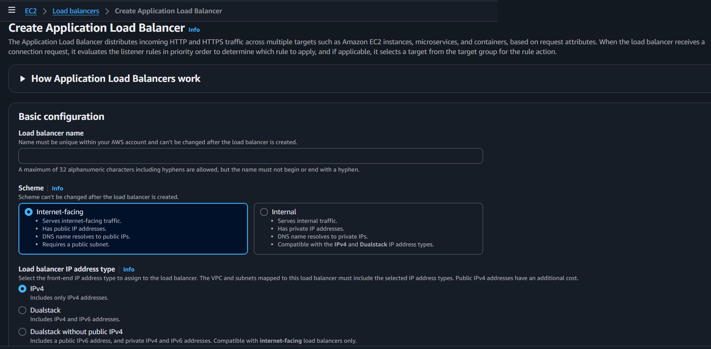

**Load balancer name:**
- Must be unique within your AWS account
- **Can't be changed after creation**
- Max 32 alphanumeric characters + hyphens
- Must not begin or end with a hyphen

**Scheme** (Can't be changed after creation):
- **Internet-facing** (default) - Serves internet-facing traffic, has public IP addresses, DNS resolves to public IPs, requires a public subnet
- **Internal** - Serves internal traffic, has private IP addresses, DNS resolves to private IPs, compatible with IPv4 and Dualstack

**Load balancer IP address type:**
- **IPv4** (default) - Includes only IPv4 addresses
- **Dualstack** - Includes IPv4 and IPv6 addresses
- **Dualstack without public IPv4** - Public IPv6 + private IPv4/IPv6, internet-facing only

### Network mapping

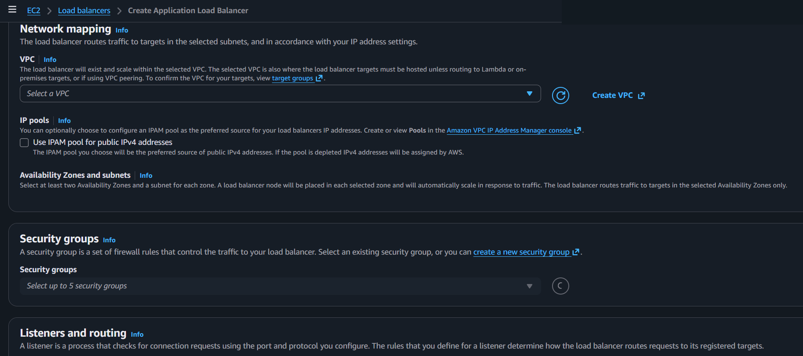

**VPC:**
- Select the VPC where the load balancer will exist and scale
- Targets must be in the same VPC (unless Lambda or on-premises via VPC peering)

**IP pools** (optional):
- Use IPAM pool for public IPv4 addresses
- If pool is depleted, AWS assigns IPv4 addresses

**Availability Zones and subnets:**
- **Select at least two AZs** - A load balancer node is placed in each selected zone
- Routes traffic to targets in selected AZs only
- Automatically scales in response to traffic

### Security groups
- Select up to 5 security groups
- Controls traffic to the load balancer
- Can create a new security group from here

### Listeners and routing

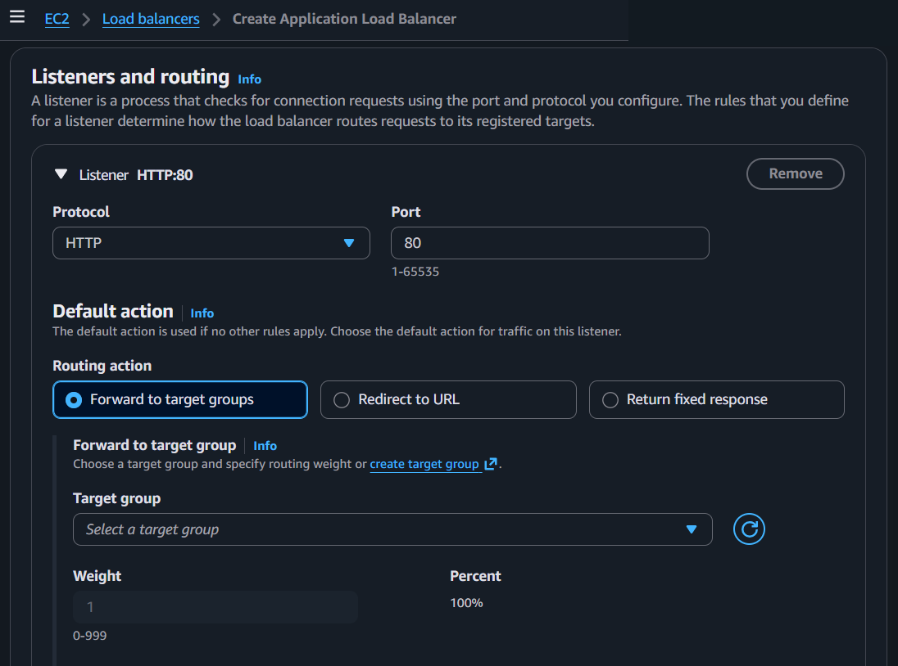

A listener checks for connection requests using the port and protocol you configure.

**Default listener: HTTP:80**
- **Protocol:** HTTP (dropdown)
- **Port:** 80 (1-65535)

**Default action** (Routing action - 3 options):
1. **Forward to target groups** (default) - Select target group, set weight (0-999)
2. **Redirect to URL** - Redirect traffic to another URL
3. **Return fixed response** - Return a custom HTTP response

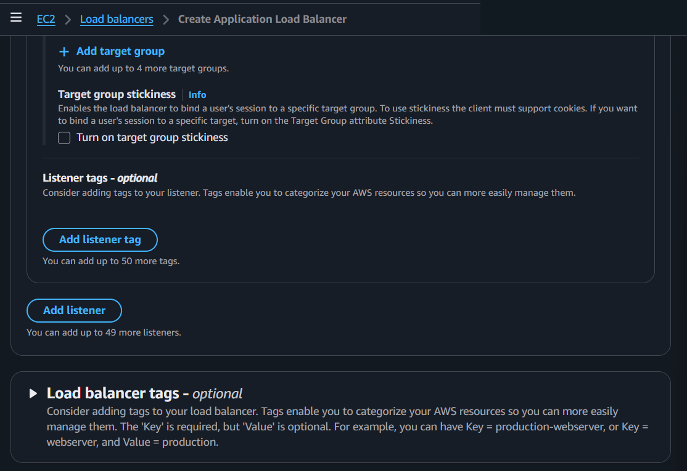

**Target group stickiness** (optional):
- Binds a user's session to a specific target group
- Client must support cookies
- Turn on Target Group attribute Stickiness for specific target binding

**Listener tags** - optional (up to 50 tags)

**Add listener** - You can add up to 49 more listeners (50 total)

**+ Add target group** - Up to 5 target groups per listener

### Optimize with service integrations - optional

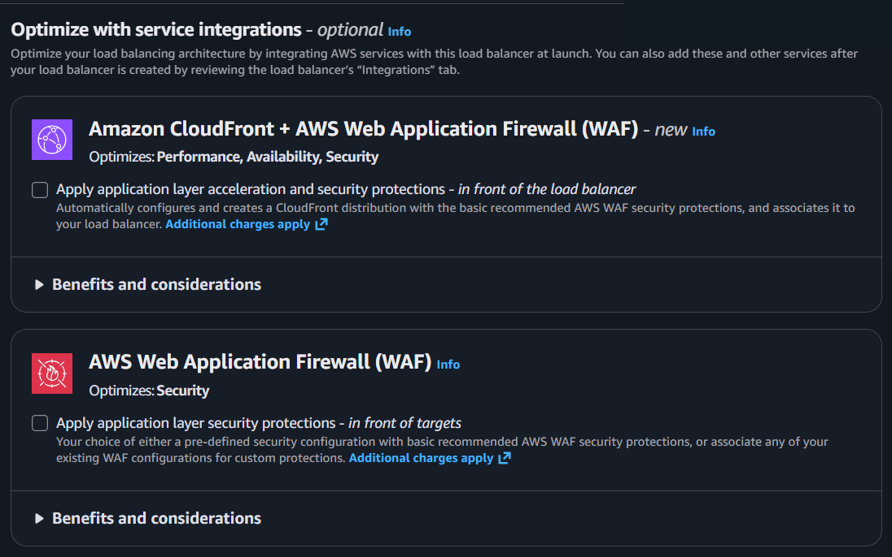
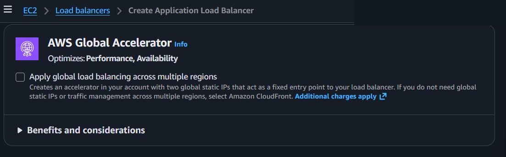

**Amazon CloudFront + AWS WAF (Web Application Firewall)** - *new*
- Optimizes: Performance, Availability, Security
- Apply application layer acceleration and security protections - *in front of the load balancer*
- Automatically creates a CloudFront distribution with basic WAF protections
- **Additional charges apply**

**AWS WAF** (standalone)
- Optimizes: Security
- Apply application layer security protections - *in front of targets*
- Pre-defined or existing WAF configurations
- **Additional charges apply**

**AWS Global Accelerator**
- Optimizes: Performance, Availability
- Apply global load balancing across multiple regions
- Creates two global static IPs as a fixed entry point
- **Additional charges apply**

### Creation workflow and status

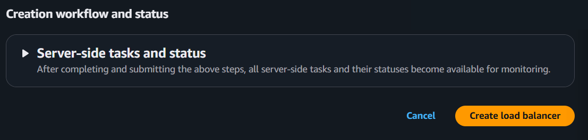

- **Server-side tasks and status** - After submitting, all tasks and statuses become available for monitoring
- **Cancel** / **Create load balancer**


## Create Network Load Balancer (NLB) - Console Flow

### Basic configuration

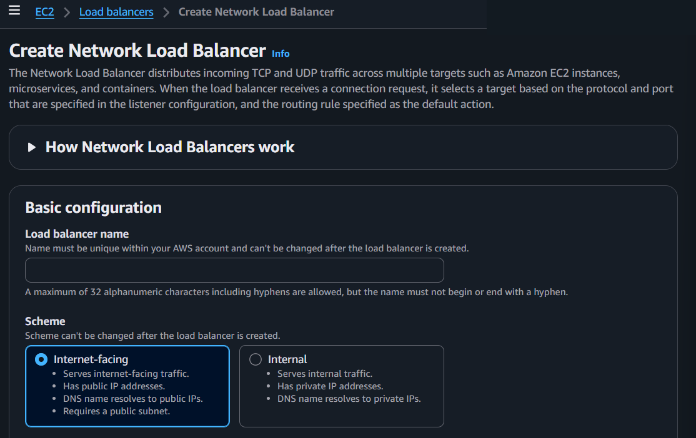

**Load balancer name:**
- Same rules as ALB (unique, max 32 chars, can't change after creation)

**Scheme** (Can't be changed after creation):
- **Internet-facing** (default) - Public IPs, DNS resolves to public IPs, requires public subnet
- **Internal** - Private IPs, DNS resolves to private IPs

**Load balancer IP address type:**
- **IPv4** (default)
- **Dualstack** - IPv4 and IPv6
- ⚠️ No "Dualstack without public IPv4" option (ALB-only feature)

### Network mapping

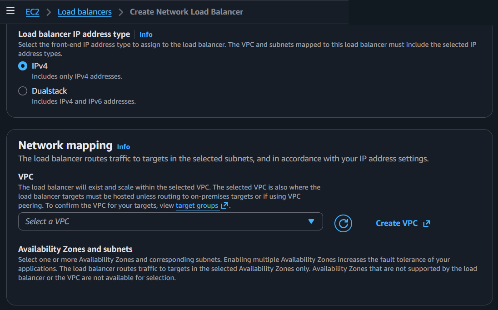

**VPC:**
- Same as ALB - select VPC, targets must be hosted there

**Availability Zones and subnets:**
- Select **one or more** AZs (ALB requires at least two, NLB requires at least one)
- Enabling multiple AZs increases fault tolerance
- AZs not supported by the load balancer or VPC are not available

### Security groups

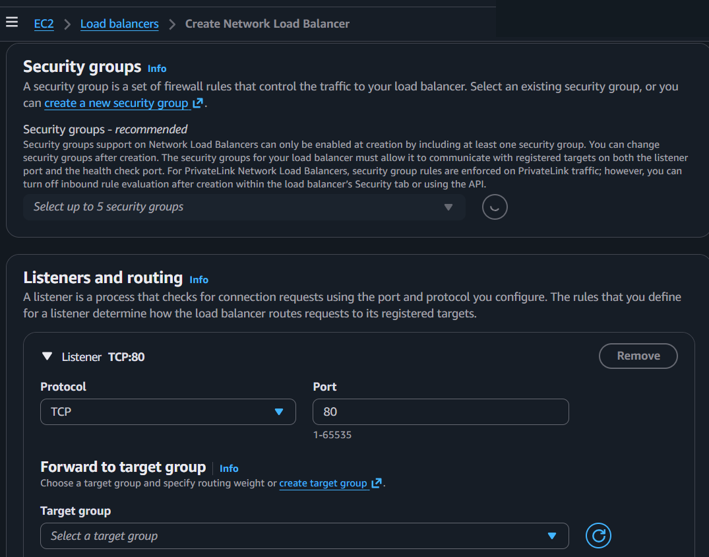

**Security groups - *recommended*:**
- ⚠️ Can only be enabled at creation by including at least one security group
- Can change security groups after creation
- Must allow communication with registered targets on listener port AND health check port
- For PrivateLink NLBs, SG rules are enforced on PrivateLink traffic (can turn off inbound rule evaluation after creation)

### Listeners and routing

**Default listener: TCP:80**
- **Protocol:** TCP (dropdown - TCP, UDP, TLS, TCP_UDP)
- **Port:** 80 (1-65535)

**Forward to target group:**
- Select target group, set weight (0-999)


**Target group stickiness** - Same as ALB

**Listener tags** - optional (up to 50)

**Add listener** - Up to 49 more (50 total)

### Load balancer tags - optional

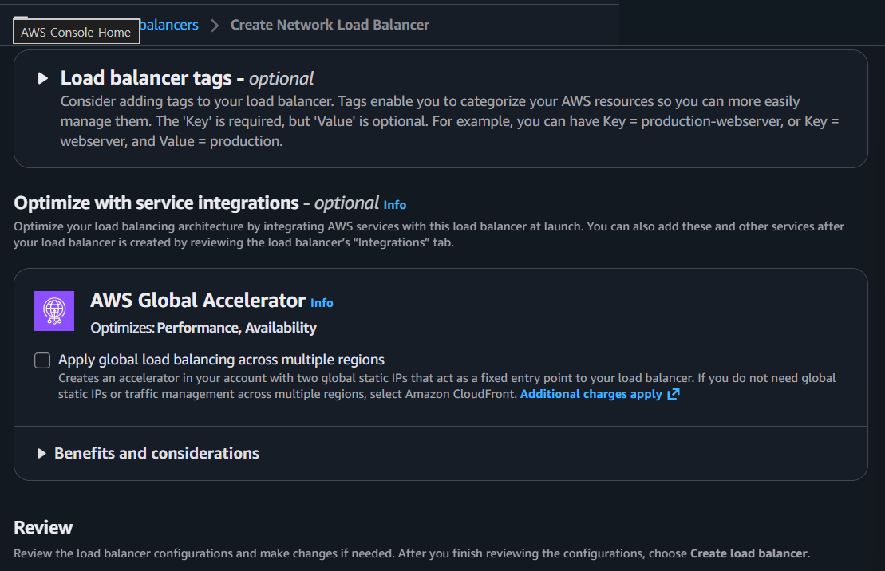

- Key is required, Value is optional
- Example: Key = production-webserver, Key = webserver, Value = production

### Optimize with service integrations - optional

**AWS Global Accelerator** only (no CloudFront/WAF option for NLB)
- Optimizes: Performance, Availability
- Two global static IPs as fixed entry point
- **Additional charges apply**

### Review and create


- Review configurations, make changes if needed
- **Cancel** / **Create load balancer**


## Create Gateway Load Balancer (GWLB) - Console Flow

### Basic configuration

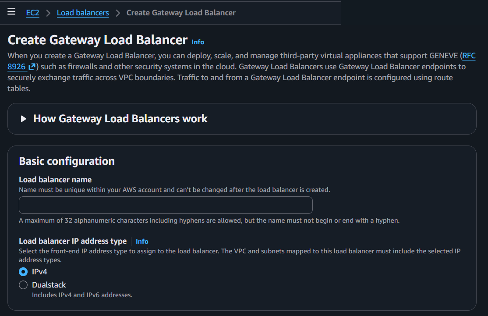

**Description from console:** "When you create a Gateway Load Balancer, you can deploy, scale, and manage third-party virtual appliances that support GENEVE (Generic Network Virtualization Encapsulation) (RFC 8926) such as firewalls and other security systems in the cloud. Gateway Load Balancers use Gateway Load Balancer endpoints to securely exchange traffic across VPC boundaries. Traffic to and from a GWLB endpoint is configured using route tables."

**Load balancer name:**
- Same rules (unique, max 32 chars, can't change)

**Load balancer IP address type:**
- **IPv4** (default)
- **Dualstack**
- ⚠️ No Scheme option (GWLB is always internal - no internet-facing option)

### Network mapping


**VPC:**
- Same as ALB/NLB

**Availability Zones and subnets:**
- ⚠️ **Subnets can't be removed after creation**
- At least one subnet must be specified
- Routes traffic to targets in selected subnets

### IP listener routing

Unlike ALB/NLB which use protocol-based listeners, GWLB uses IP listener routing.

**Default action:**
- Only target groups with **GENEVE protocol** are available
- Forward to target group (select or create)

**Listener tags** - optional

### Load balancer tags - optional

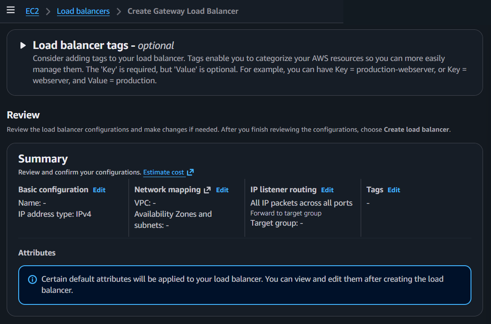

### Review

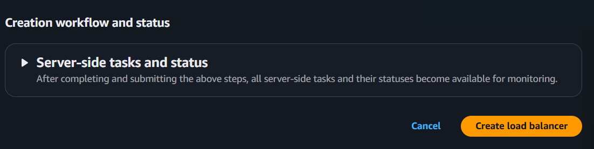

**Summary shows 4 sections:**
- Basic configuration (Name, IP address type)
- Network mapping (VPC, AZs and subnets)
- IP listener routing (All IP packets across all ports, Forward to target group)
- Tags

**Attributes:** Certain default attributes will be applied. View and edit after creation.

- **Cancel** / **Create load balancer**


## Key Concepts

### Target Group
- A group of targets (EC2 instances, IPs, Lambda functions, ALB) that receive traffic
- Each target group has health check settings
- Load balancer routes to healthy targets only
- Must create target group before or during load balancer creation

### Health Checks
- Load balancer periodically sends requests to targets to check their status
- Unhealthy targets stop receiving traffic
- When target becomes healthy again, traffic resumes
- Configurable: interval, timeout, threshold, path (for HTTP)

### Listener
- Process that checks for connection requests
- Defined by protocol + port (e.g., HTTP:80, HTTPS:443, TCP:80)
- Has rules that determine how to route requests
- Up to 50 listeners per load balancer

### Listener Rules (ALB only)
- ALB supports advanced routing rules based on:
  - **Host header** - route by domain (api.example.com → API servers)
  - **Path** - route by URL path (/images/* → image servers)
  - **HTTP method** - route by GET, POST, etc.
  - **Query string** - route by parameters
  - **Source IP** - route by client IP

### Stickiness
- Binds a user's session to a specific target
- Uses cookies (ALB) or source IP (NLB)
- Useful for stateful applications
- Not recommended for stateless architectures


## ALB vs NLB vs GWLB Comparison

### How Layer Affects What ELB Can Do

The layer determines what part of the traffic the load balancer can see and act on.

**ALB = Layer 7 (Application)**
- Sees HTTP/HTTPS details: host, path, headers, method, query string
- Can do smart routing:
  - `/api/*` → API servers, `/images/*` → image servers
  - `app.example.com` → app servers, `admin.example.com` → admin servers
- TLS termination with ACM certificate
- Best when: traffic is web requests and you want content-based routing

**NLB = Layer 4 (Transport)**
- Sees TCP/UDP connection info: IP + port
- Fast pass-through, static IP support
- Cannot inspect HTTP path/header — just forwards based on port
- Best when: performance-sensitive, needs static IP, non-HTTP protocols

**GWLB = Layer 3 (Network)**
- Steers all IP packets to security appliances via GENEVE encapsulation
- Not about routing logic — about inserting firewalls/IDS/IPS into the traffic path
- Best when: client requires third-party security appliances

#### How GWLB Handles Public Traffic

GWLB is always **internal** (no internet-facing option), but it still handles public inbound traffic — indirectly via routing:

```
Internet → IGW → Route Table → GWLB Endpoint → GWLB → Security Appliance → back → your ALB/EC2
                                (PrivateLink)           (firewall, IDS/IPS)
```

- GWLB itself has no public IP — traffic reaches it through route table entries pointing to a GWLB Endpoint
- That traffic can be public inbound (from internet) or private (VPC-to-VPC)
- "Internal" means how GWLB is deployed, not what traffic it inspects
- It's a transparent bump-in-the-wire for security inspection, regardless of traffic origin

**Example — user sends `https://shop.example.com/api/orders`:**
- ALB sees: host=`shop.example.com`, path=`/api/orders` → routes based on that
- NLB sees: destination IP, port 443, TCP connection → forwards to target group
- The layer defines how smart the load balancer can be about the request

**One-liner summary:**
- ALB = "understands the web request"
- NLB = "understands the network connection"
- GWLB = "understands security appliance flow"

### Feature Comparison

### Feature Comparison

| Feature | ALB | NLB | GWLB |
|---------|-----|-----|------|
| Layer | 7 (Application) | 4 (Transport) | 3 (Network) |
| Protocols | HTTP, HTTPS | TCP, UDP, TLS | GENEVE |
| Scheme options | Internet-facing, Internal | Internet-facing, Internal | Internal only |
| Min AZs | 2 | 1 | 1 |
| Security groups | Yes | Optional (enable at creation) | No |
| Static IP | No (use Global Accelerator) | Yes | No |
| IP type options | IPv4, Dualstack, Dualstack without public IPv4 | IPv4, Dualstack | IPv4, Dualstack |
| Routing | Path, host, header, method, query, IP | Port-based | All IP packets |
| Service integrations | CloudFront+WAF, WAF, Global Accelerator | Global Accelerator | None |
| Subnets after creation | Can modify | Can modify | **Can't remove** |
| Use case | Web apps, APIs, microservices | High performance, gaming, IoT | Security appliances (firewalls, IDS/IPS) |

**Common use:**
- **ALB** - Most client web applications (80%+ of cases)
- **NLB** - When client needs static IPs, extreme performance, or non-HTTP protocols
- **GWLB** - When client requires third-party security appliances (Palo Alto, Fortinet, etc.)


## Pricing

**Source:** [AWS ELB Pricing](https://aws.amazon.com/elasticloadbalancing/pricing/)

### Free vs Paid

| | Free? | Details |
|---|---|---|
| **Shield Standard** | ✅ Free | DDoS protection included automatically (not ELB-specific, but protects ELB) |
| **ELB itself** | ❌ Paid | All types (ALB, NLB, GWLB) cost money |
| **AWS Free Tier** | 🟡 Limited | New accounts: 750 hours/month shared between CLB and ALB + 15 LCUs for ALB + 15 GB data for CLB (12 months) |

### Per-Type Pricing (US East - N. Virginia)

| | Hourly Rate | Capacity Unit Cost | Unit Name | ~Monthly Minimum |
|---|---|---|---|---|
| **ALB** | $0.0225/hr | $0.008 per LCU-hour | LCU (Load Balancer Capacity Unit) | ~$16.20 |
| **NLB** | $0.0225/hr | $0.006 per NLCU-hour | NLCU (Network LCU) | ~$16.20 |
| **GWLB** | $0.0125/hr | $0.004 per GLCU-hour | GLCU (Gateway LCU) | ~$9.00 |

> Prices vary by Region. The minimum is just the hourly rate with zero traffic — actual cost depends on capacity unit usage.

### What Counts as a Capacity Unit

**ALB (LCU)** — highest of these 4 dimensions:
- New connections per second (25/LCU)
- Active connections per minute (3,000/LCU)
- Processed bytes per hour (1 GB/LCU for EC2/IP, 0.4 GB/LCU for Lambda)
- Rule evaluations per second (1,000/LCU, first 10 rules free)

**NLB (NLCU)** — highest of these 3 dimensions:
- New connections/flows per second
- Active connections/flows per minute
- Processed bytes per hour

**GWLB (GLCU)** — highest of these 3 dimensions:
- New flows per second
- Active flows per minute
- Processed bytes per hour

### Additional Costs
- **Data transfer** — Standard AWS data transfer charges apply on top of ELB charges
- **Public IPv4 address** — Standard public IPv4 address charges apply
- **GWLB Endpoint (GWLBE)** — Priced separately via AWS PrivateLink
- **Service integrations** — CloudFront, WAF, Global Accelerator each have their own charges


## Precautions

### ⚠️ MAIN PRECAUTION: Name and Scheme Can't Be Changed After Creation
- Load balancer name is permanent
- Scheme (Internet-facing vs Internal) is permanent
- If you need to change either, you must delete and recreate the load balancer
- Plan your naming convention before creating

### 1. Choose the Right Type Before Creating
- ALB for HTTP/HTTPS (most web apps)
- NLB for TCP/UDP (high performance, static IPs)
- GWLB for security appliances (GENEVE)
- Changing type requires delete and recreate

### 2. Use At Least Two AZs for High Availability
- ALB requires minimum 2 AZs
- NLB/GWLB allow 1, but always use 2+ for production
- Single AZ = single point of failure

### 3. NLB Security Groups Must Be Enabled at Creation
- If you forget to add a security group when creating NLB, you can't enable SG support later
- Must delete and recreate the NLB to add security group support

### 4. GWLB Subnets Can't Be Removed After Creation
- Plan your subnet selection carefully
- You can add subnets later but can't remove existing ones

### 5. Service Integrations Cost Extra
- CloudFront + WAF, standalone WAF, Global Accelerator all have additional charges
- Don't enable unless the client specifically needs them
- Can be added after creation via the Integrations tab

### 6. Health Checks Are Critical
- Misconfigured health checks = targets marked unhealthy = no traffic
- Test health check path/port before going live
- Common mistake: health check port doesn't match application port

### 7. Always Use Tags
- Tag load balancers, listeners, and target groups
- MSP essential: Client, Environment, Project, CostCenter
- Up to 50 tags per resource
- Key is required, Value is optional

## Example

An ALB listens on HTTPS (443) with an ACM certificate and routes `/api/*` requests to an API target group
and all other paths to a frontend target group. Health checks on `/health` remove unhealthy instances automatically.
The ALB spans two AZs for high availability.

## Why It Matters

Load balancers distribute traffic, absorb failures, and enable zero-downtime deployments.
Pairing an ALB with Auto Scaling is the standard pattern for resilient, scalable web applications on AWS.

## Q&A

### Q: Can NLB use TLS certificates?

Yes. NLB supports TLS termination through **TLS listeners**, using certificates from ACM or IAM.

| Attribute | ALB | NLB |
|-----------|-----|-----|
| Certificate support | ✅ HTTPS listener | ✅ TLS listener |
| mTLS | ✅ Supported | ❌ Not supported |
| TLS renegotiation | ✅ Supported | ❌ Not supported |
| Layer | L7 (HTTP/HTTPS) | L4 (TCP/UDP/TLS) |

NLB + TLS provides high-performance encryption. ALB offers richer TLS features including mTLS and path-based routing.

### Q: How do you implement global load balancing?

ALB and NLB are regional services, so they cannot handle global traffic distribution alone. Combine these services:

| Service | Layer | Purpose | Key Feature |
|---------|-------|---------|-------------|
| **Route 53** | DNS (L7) | Geographic/latency-based routing | DNS-based, subject to TTL propagation delay |
| **[CloudFront](21_amazon_cloudfront.md)** | CDN (L7) | Static/dynamic content acceleration | Edge caching, origin protection |
| **Global Accelerator** | L3/L4 | TCP/UDP global acceleration | 2 fixed Anycast IPs, instant failover (no DNS propagation) |

**Recommended architectures:**
- Web services: **Route 53 → CloudFront → ALB (per region)**
- Non-HTTP protocols: **Global Accelerator → NLB (per region)**

ALB itself does not provide country-optimized routing. Use Route 53 geolocation or latency-based routing combined with CloudFront for per-country optimization.

## Official Documentation
- [Elastic Load Balancing Documentation](https://docs.aws.amazon.com/elasticloadbalancing/)
- [ALB Documentation](https://docs.aws.amazon.com/elasticloadbalancing/latest/application/)
- [NLB Documentation](https://docs.aws.amazon.com/elasticloadbalancing/latest/network/)
- [GWLB Documentation](https://docs.aws.amazon.com/elasticloadbalancing/latest/gateway/)

---
← Previous: [Security Group](14_security_group.md) | [Overview](00_overview.md) | Next: [Amazon CloudFront](21_amazon_cloudfront.md) →
