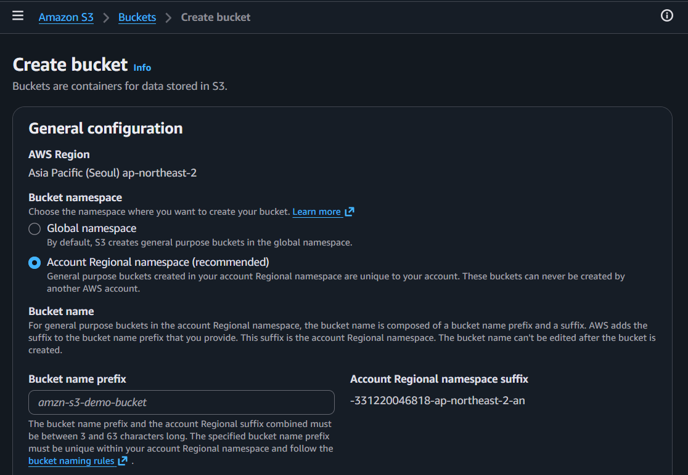
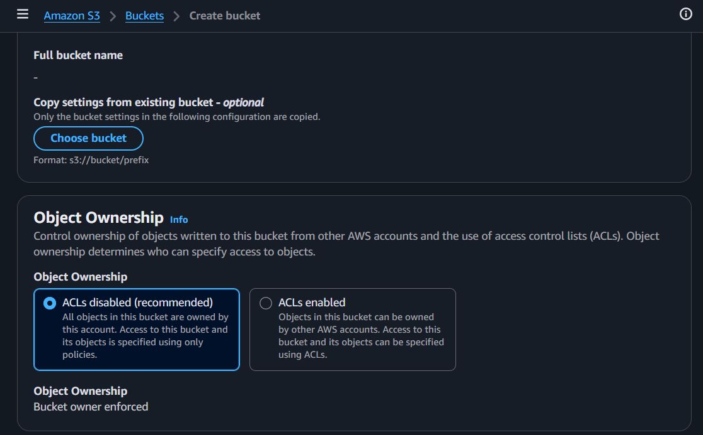
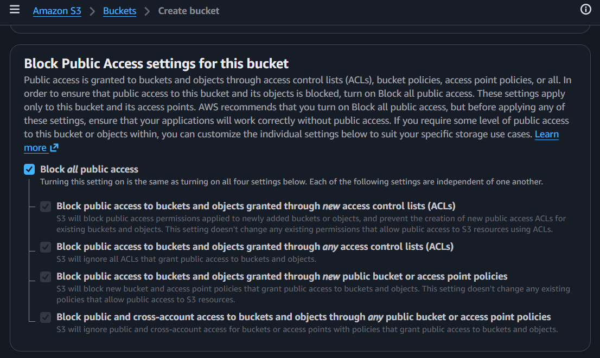
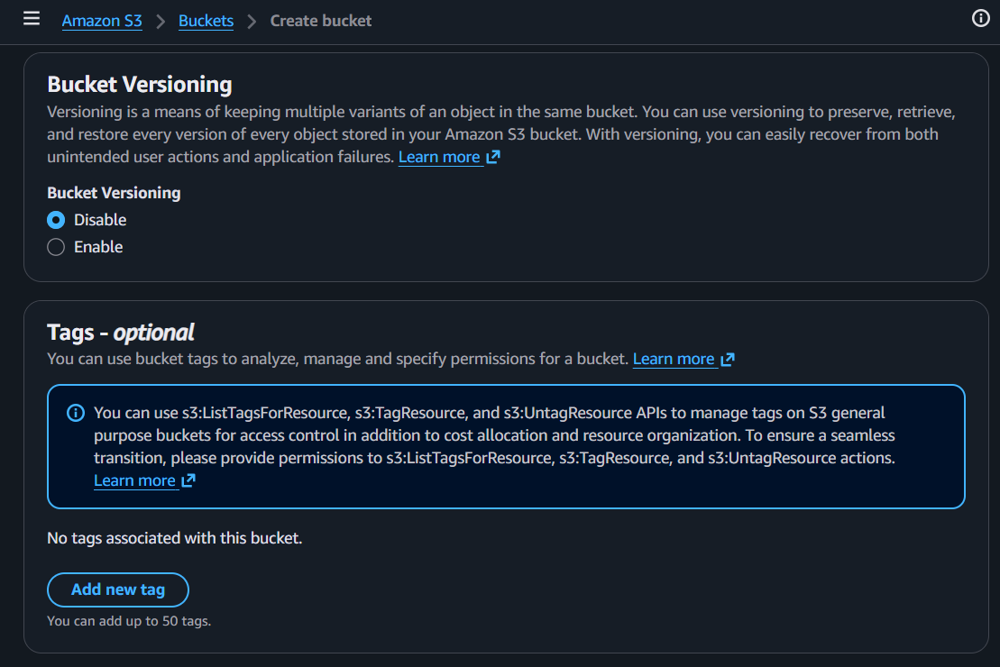
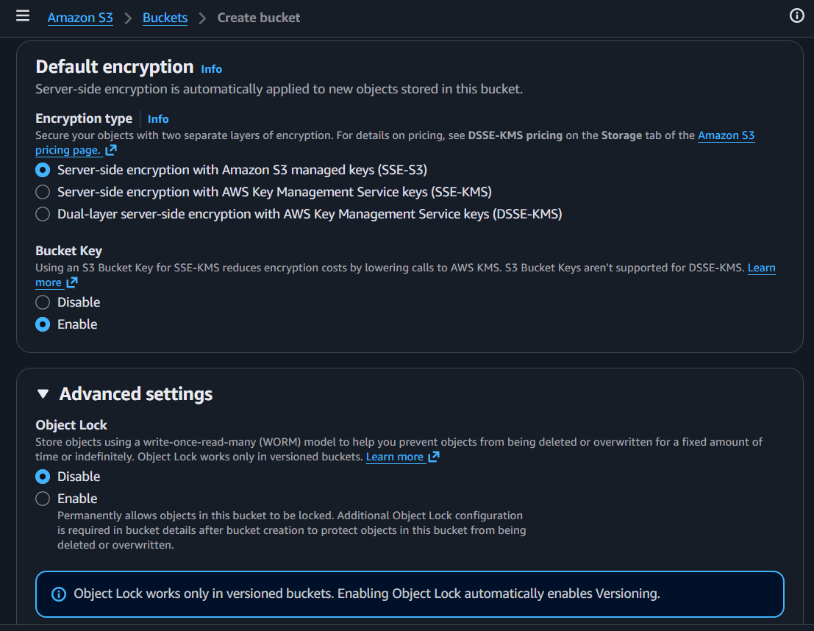

# Amazon S3 - AWS Console Guide

## Official Documentation
- [Amazon S3 Documentation](https://docs.aws.amazon.com/s3/)
- [S3 Storage Classes](https://docs.aws.amazon.com/AmazonS3/latest/userguide/storage-class-intro.html)

## What It Is
**S3 (Simple Storage Service)** is fully managed object storage with 99.999999999% (11 nines) durability. Objects (files) are stored in buckets. Unlike EBS (block) or EFS (file), S3 is accessed via HTTP API — not mounted as a filesystem.

- **S3 is not a bucket** — S3 is the service, buckets are containers inside S3
- **Global service, regional storage** — S3 console is global, but each bucket lives in a specific region

**See [Amazon EBS](./20_amazon_ebs.md) and [Amazon EFS](./22_amazon_efs.md) for block/file storage comparison.**

## Console Access
- AWS Console → Amazon S3 → Buckets → Create bucket
- Breadcrumb: Amazon S3 > Buckets > Create bucket

---

## Create Bucket - Console Flow

### General configuration



**AWS Region:**
- Shown: Asia Pacific (Seoul) ap-northeast-2
- Bucket is created in this region — data stays here

**Bucket namespace** (two options):
- **Global namespace** — bucket name must be globally unique across ALL AWS accounts worldwide
- **Account Regional namespace (recommended)** — bucket name only needs to be unique within your account + region. AWS adds a suffix automatically

**Bucket name:**
- For Account Regional namespace: you provide a **prefix**, AWS adds suffix (account ID + region)
  - Example prefix: `amzn-s3-demo-bucket`
  - Suffix: `-331220046818-ap-northeast-2-an`
  - Full name: `amzn-s3-demo-bucket-331220046818-ap-northeast-2-an`
- 3-63 characters, lowercase, numbers, hyphens
- ⚠️ **Bucket name can't be changed after creation**

### Copy settings & Object Ownership



**Copy settings from existing bucket** (optional):
- Clone settings from another bucket (format: `s3://bucket/prefix`)

**Object Ownership:**
- **ACLs disabled (recommended)** — all objects owned by this account, access controlled by policies only. "Bucket owner enforced"
- **ACLs enabled** — objects can be owned by other AWS accounts, access via ACLs

ACLs disabled = your bucket, your rules. Someone uploads a file → it becomes your property, you control access.
ACLs enabled = someone uploads a file → they keep ownership and control access to it, not you. Messy.

Best practice: keep ACLs disabled, use IAM/bucket policies for access control. ACLs are legacy.

### Block Public Access



**Block all public access** — ✅ enabled by default (all 4 sub-settings checked):

All 4 settings control whether **objects inside the bucket** can be publicly accessed from the internet — "can someone without any AWS credentials read my objects?" They don't affect private access (IAM users/roles), VPC endpoint access, or cross-account access via IAM roles.

There are two ways someone can make your bucket public: **ACLs** and **Bucket Policies**. And for each, there's a difference between blocking **new** (future) attempts vs overriding **existing** (past) ones. That gives 4 combinations.

**Timeline example to understand "new" vs "any":**
```
Day 1: Create bucket with Block Public Access OFF
Day 2: Add ACL "public-read" to file_A.txt           ← existing ACL
Day 3: Add bucket policy with Principal: "*"          ← existing policy
Day 4: Turn ON Block Public Access
Day 5: Try to add ACL "public-read" to file_B.txt    ← "new" ACL attempt
Day 6: Try to add another public bucket policy        ← "new" policy attempt
```

| Setting | Scope | Day 2 (old ACL) | Day 3 (old policy) | Day 5 (new ACL) | Day 6 (new policy) |
|---------|-------|-----------------|-------------------|-----------------|-------------------|
| 1. Block **new** ACLs | Future ACLs only | ❌ still public | — | ✅ blocked | — |
| 2. Block **any** ACLs | All ACLs (past + future) | ✅ overridden | — | ✅ blocked | — |
| 3. Block **new** policies | Future policies only | — | ❌ still public | — | ✅ blocked |
| 4. Block **any** policies | All policies (past + future) | — | ✅ overridden | — | ✅ blocked |

- **Settings 1 & 3** = "stop me from making new mistakes" — but old public access stays active
- **Settings 2 & 4** = "fix everything — override old AND block new"
- **All 4 together** = complete protection, past and future

**How they relate:**
```
              ACLs                    Policies
New only    → Setting 1              → Setting 3
              "Block future            "Block future
               public ACLs"            public policies"

All (any)   → Setting 2              → Setting 4
              "Override ALL             "Override ALL
               public ACLs"            public policies"
```

**The master checkbox "Block all public access"** turns on all 4 at once. For AWS 101: just keep this master checkbox on and don't touch individual settings.

⚠️ **Leave this ON unless you specifically need public access** (e.g., static website hosting). S3 data breaches are almost always caused by disabling this. This is the #1 S3 security setting.

### Bucket Versioning & Tags



**Bucket Versioning:**
- **Disable** (default) — overwriting a file replaces it permanently
- **Enable** — keeps every version of every object, can restore previous versions
- Use case: protect against accidental deletes/overwrites
- ⚠️ Once enabled, can only be suspended (not fully disabled). All versions continue to incur storage costs.

**Tags** (optional):
- Up to 50 tags per bucket
- "Add new tag" button
- Note: S3 tags use `s3:ListTagsForResource`, `s3:TagResource`, `s3:UntagResource` APIs — ensure IAM permissions include these

### Default Encryption & Advanced Settings



**Default encryption** (automatically applied to new objects):

Encryption type:
- **SSE-S3 (default)** — Server-side encryption with Amazon S3 managed keys. Free, no setup.
- **SSE-KMS** — Server-side encryption with AWS KMS keys. More control, audit trail via CloudTrail. KMS costs apply.
- **DSSE-KMS** — Dual-layer server-side encryption with KMS keys. Two layers of encryption.

**Bucket Key:**
- Disable / **Enable** (default for SSE-KMS)
- Reduces KMS API calls → lowers encryption costs
- Not supported for DSSE-KMS

**Advanced settings — Object Lock:**
- **Disable** (default) / Enable
- WORM model (Write Once Read Many) — prevents objects from being deleted or overwritten
- ⚠️ Only works with versioned buckets — enabling Object Lock automatically enables Versioning
- Use case: regulatory compliance, legal hold (법원 공문서 보관 등)

---

## Storage Classes

| Class | Use Case | Retrieval | Durability | Availability |
|-------|----------|-----------|-----------|-------------|
| **S3 Standard** | Frequently accessed | Instant (ms) | 11 nines | 99.99% |
| **S3 Standard-IA** | Infrequent access, rapid retrieval | Instant (ms) | 11 nines | 99.9% |
| **S3 One Zone-IA** | Infrequent, non-critical, single AZ | Instant (ms) | 11 nines* | 99.5% |
| **S3 Glacier Instant** | Archive, quarterly access | Instant (ms) | 11 nines | 99.9% |
| **S3 Glacier Flexible** | Archive, minutes to hours | Minutes-hours | 11 nines | 99.99%** |
| **S3 Glacier Deep Archive** | Long-term archive | Standard ≤12h, Bulk ≤48h | 11 nines | 99.99%** |
| **S3 Intelligent-Tiering** | Unknown/changing access patterns | Auto-moves between tiers | 11 nines | 99.9% |

*One Zone-IA: 11 nines within one AZ, but data lost if AZ destroyed
**After restore

**How to choose:**
- Hot data → **Standard**
- Accessed < 1x/month → **Standard-IA**
- Archive, need instant access → **Glacier Instant**
- Archive, can wait → **Glacier Flexible**
- 법원 공문서, 장기 보관 → **Glacier Deep Archive**
- Don't know access pattern → **Intelligent-Tiering**

### Intelligent-Tiering — How It Works

Intelligent-Tiering is one storage class with multiple tiers inside. AWS automatically moves objects between tiers based on access patterns — you don't manage it.

```
S3 Intelligent-Tiering (one storage class, multiple tiers inside)
├── Frequent Access tier        ← objects start here
├── Infrequent Access tier      ← auto-moved after 30 days no access
├── Archive Instant Access tier ← auto-moved after 90 days no access
├── Archive Access tier         ← optional, you enable, after 90+ days
└── Deep Archive Access tier    ← optional, you enable, after 180+ days
```

- Object accessed again → automatically moves back to Frequent Access (no retrieval fee)
- Monitoring fee: $0.0025 per 1,000 objects/month
- Best for: larger objects with unpredictable access patterns
- Not ideal for: lots of tiny files (monitoring fee adds up)

| | Manual (Standard/IA/Glacier) | Intelligent-Tiering |
|---|---|---|
| **Who decides** | You, via lifecycle rules | AWS, automatically |
| **Retrieval fee** | IA/Glacier charge per-access | No retrieval fee when moving back |
| **Monitoring fee** | None | $0.0025/1K objects/month |

### Storage Class Is Per Object, Not Per Bucket

Within the same bucket, different objects can have different storage classes:

```
Bucket A
├── photo.jpg    → Standard
├── report.pdf   → Intelligent-Tiering
└── archive.zip  → Glacier Deep Archive
```

You set storage class:
- At upload time (per object)
- Via **lifecycle rules** on the bucket (e.g., "move all objects to IA after 30 days")
- Or use Intelligent-Tiering and let AWS handle it automatically

---

## Key Concepts

### Bucket vs Object
- **Bucket** = container (like a folder at the top level)
- **Object** = file stored in a bucket (key = full path, value = file data)
- No real folder hierarchy — "folders" are just key prefixes (e.g., `images/photo.jpg`)

### 11 Nines Durability
- 99.999999999% = store 10 billion objects, expect to lose 1 per year
- Achieved by automatically replicating across ≥3 AZs
- This is durability (data won't be lost), not availability (service might be briefly unavailable)

### S3 Performance
- No performance difference between buckets
- Per prefix: 5,500 GET/s + 3,500 PUT/s
- Distribute across prefixes for higher throughput

### Access Control (layered)
1. **Block Public Access** — account/bucket level kill switch
2. **Bucket Policy** — JSON policy on the bucket (who can do what)
3. **IAM Policy** — attached to users/roles
4. **ACLs** — legacy, keep disabled
5. **VPC Endpoint Policy** — for private access from VPC

---

## S3 vs EBS vs EFS

| | S3 | EBS | EFS |
|---|---|---|---|
| **Type** | Object | Block | File (NFS) |
| **Access** | HTTP API | Single instance, single AZ | Multiple instances, regional |
| **Max size** | Unlimited (5 TB per object) | 64 TiB per volume | Auto-grows |
| **Durability** | 11 nines (3+ AZs) | Within single AZ | Regional (multi-AZ) |
| **Use case** | Static files, backups, data lake | Boot volumes, databases | Shared files, CMS |
| **Cost (Standard)** | $0.023/GB | $0.08/GB (gp3) | $0.30/GB |

---

## Pricing

**Source:** [AWS S3 Pricing](https://aws.amazon.com/s3/pricing/)

| Class | Storage (US East) | PUT/POST | GET |
|-------|------------------|----------|-----|
| **Standard** | $0.023/GB-month | $0.005/1K | $0.0004/1K |
| **Standard-IA** | $0.0125/GB-month | $0.01/1K | $0.001/1K |
| **Glacier Flexible** | $0.0036/GB-month | $0.03/1K | $0.0004/1K + retrieval |
| **Glacier Deep Archive** | $0.00099/GB-month | $0.05/1K | $0.0004/1K + retrieval |

Additional costs:
- Data transfer out to internet: $0.09/GB (first 10 TB/month)
- Data transfer in: free
- Lifecycle transitions: per-request charge
- Retrieval fees for IA/Glacier classes

---

## Precautions

### ⚠️ MAIN PRECAUTION: Block Public Access — Don't Turn Off Unless You Mean It
- S3 data breaches are almost always caused by disabling this setting
- Leave it ON, use IAM/bucket policies + VPC endpoints for private access

### 1. Bucket Name Is Permanent
- Can't rename after creation
- Account Regional namespace (recommended) avoids global uniqueness headaches

### 2. Versioning Costs Add Up
- Every version is stored and billed separately
- Enable lifecycle rules to expire old versions
- Once enabled, can only be suspended — existing versions remain

### 3. Object Lock Can't Be Disabled
- Once enabled on a bucket, it's permanent
- Only enable if you have a compliance requirement

### 4. Encryption Is Always On
- Since Jan 2023, all new objects are encrypted by default (SSE-S3)
- SSE-KMS gives more control but costs more (KMS API calls)

### 5. No Performance Difference Between Buckets
- Performance is per-prefix, not per-bucket
- Spread objects across prefixes for high throughput workloads
