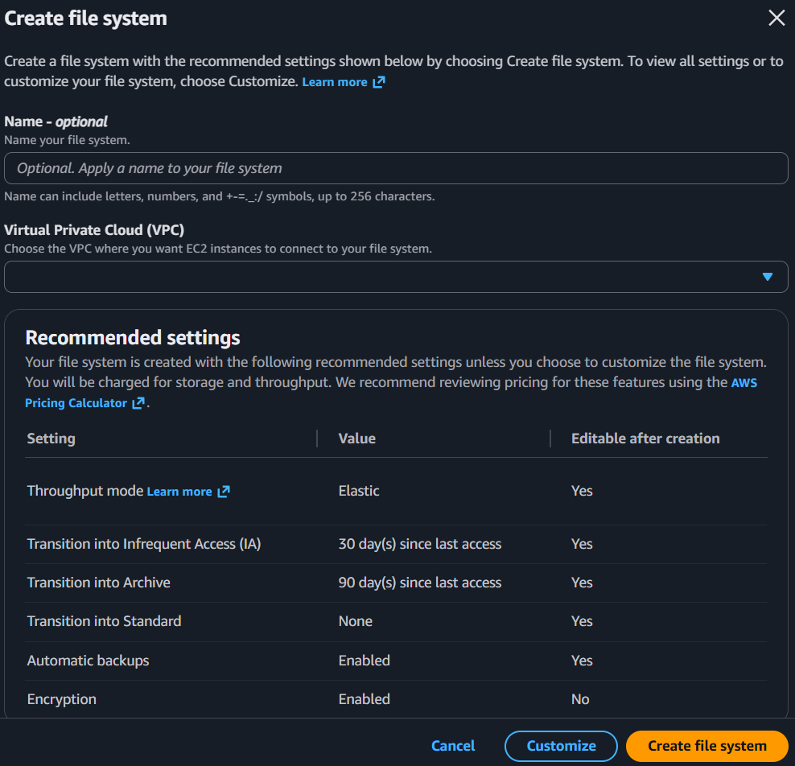

# Amazon EFS - AWS Console Guide

## Official Documentation
- [Amazon EFS Documentation](https://docs.aws.amazon.com/efs/)
- [EFS Performance](https://docs.aws.amazon.com/efs/latest/ug/performance.html)

## What It Is
**EFS (Elastic File System)** is a fully managed, serverless NFS file system that multiple EC2 instances can mount simultaneously. Unlike EBS (one volume = one instance), EFS is shared storage — multiple instances across multiple AZs can read/write the same files at the same time. It grows and shrinks automatically.

**EFS is Linux only.** For Windows file shares, use **Amazon FSx for Windows File Server** (SMB protocol).

**See [Amazon EBS](./20_amazon_ebs.md) for block storage comparison.**

## Console Access
- AWS Console → EFS → File systems → Create file system
- Breadcrumb: EFS > File systems

---

## Create File System - Console Flow

**Two creation paths:**
- **Create file system** (orange button) — quick create with recommended defaults
- **Customize** (blue button) — full control over all settings

### Quick Create Settings

**Name** (optional):
- Letters, numbers, and `+-=._:/` symbols, up to 256 characters

**Virtual Private Cloud (VPC):**
- Choose the VPC where EC2 instances will connect
- EFS creates mount targets in the VPC's subnets

### Recommended Settings (defaults)

| Setting | Default Value | Editable after creation |
|---------|--------------|------------------------|
| **Throughput mode** | Elastic | Yes |
| **Transition into Infrequent Access (IA)** | 30 days since last access | Yes |
| **Transition into Archive** | 90 days since last access | Yes |
| **Transition into Standard** | None | Yes |
| **Automatic backups** | Enabled | Yes |
| **Encryption** | Enabled | **No** |

Key observations:
- **Throughput mode: Elastic** — automatically scales throughput with workload, pay per use. Alternative: Provisioned (fixed throughput, pay whether you use it or not)
- **Lifecycle policies** — automatically move files to cheaper storage tiers based on access patterns (IA after 30 days, Archive after 90 days)
- **Automatic backups: Enabled** — uses AWS Backup, unlike EBS which has no auto-backup by default
- ⚠️ **Encryption cannot be changed after creation** — same as EBS

**Cancel / Customize / Create file system** buttons

---

## EFS vs EBS vs S3

| | EFS | EBS | S3 |
|---|-----|-----|-----|
| **Type** | File storage (NFS) | Block storage (disk) | Object storage |
| **Access** | Multiple instances, multiple AZs | One instance, one AZ | Any, via HTTP API |
| **Protocol** | NFS v4.1 | Attached as block device | REST API |
| **OS** | Linux only | Linux + Windows | N/A |
| **Size** | Auto-grows/shrinks | Fixed (manual resize) | Unlimited |
| **Performance** | Good for shared workloads | Best for single-instance IOPS | Best for large objects |
| **Use case** | Shared config, CMS, home dirs | Boot volumes, databases | Static assets, backups, data lake |

---

## Key Concepts

### Mount Targets
- EFS creates a mount target in each AZ you select
- EC2 instances connect to the mount target in their AZ
- For HA, create mount targets in all AZs where you have instances

### Storage Classes & Lifecycle
- **Standard** — frequently accessed, lowest latency
- **Infrequent Access (IA)** — cheaper storage, per-access charge
- **Archive** — cheapest, for rarely accessed data
- Lifecycle policies auto-move files between tiers based on last access time

### Throughput Modes
- **Elastic** (default) — auto-scales, pay per use, recommended for most
- **Provisioned** — fixed throughput, pay whether used or not
- **Bursting** — throughput scales with storage size (legacy)

### On-Premises Connectivity
EFS can be mounted from on-premises via:
- **AWS Direct Connect** — dedicated private connection, best for production
- **AWS VPN** — encrypted tunnel over internet, simpler setup
- **AWS Transit Gateway** — hub for connecting multiple VPCs + on-premises

---

## Pricing

**Source:** [AWS EFS Pricing](https://aws.amazon.com/efs/pricing/)

| Storage Class | Cost (US East) |
|--------------|---------------|
| **Standard** | $0.30/GB-month |
| **Infrequent Access** | $0.025/GB-month + $0.01/GB read |
| **Archive** | $0.008/GB-month + $0.03/GB read |

Throughput costs (Elastic mode): $0.04/GB transferred for reads, $0.06/GB for writes

Example: 100 GB all in Standard = $30/month. With lifecycle (50% in IA) = ~$16/month.

---

## Precautions

### ⚠️ MAIN PRECAUTION: Encryption Cannot Be Changed After Creation
- Decide before creating — enable encryption (recommended, and it's the default)
- Must delete and recreate to change encryption setting

### 1. Linux Only
- EFS uses NFS protocol — Windows cannot mount it
- For Windows: use Amazon FSx for Windows File Server (SMB)

### 2. Cost Can Add Up
- Standard storage at $0.30/GB is much more expensive than EBS gp3 ($0.08/GB) or S3 ($0.023/GB)
- Use lifecycle policies to move cold data to IA/Archive tiers
- Monitor with CloudWatch: `StorageBytes` metric by storage class

### 3. Mount Targets in Each AZ
- If you forget to create a mount target in an AZ, instances there can't access EFS
- Cross-AZ mount target access works but incurs data transfer charges

### 4. Security Groups on Mount Targets
- Each mount target has a security group
- Must allow NFS (port 2049) inbound from your EC2 instances' security group
