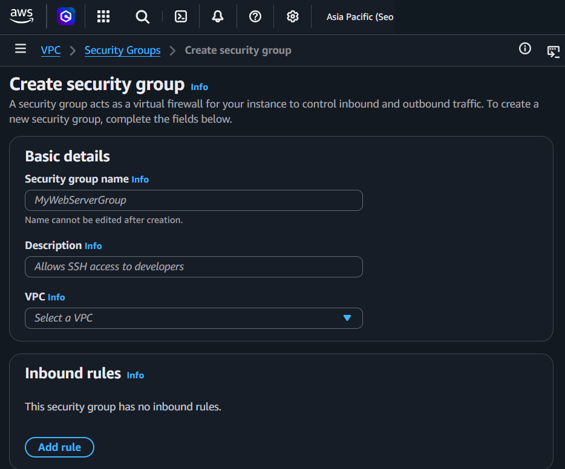
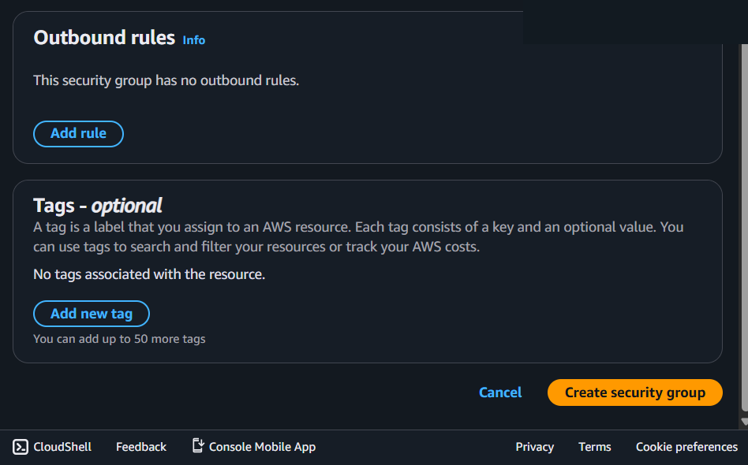

---
tags:
  - aws
  - security
  - networking
  - infrastructure
created_at: 2026-03-13T00:00:00
updated_at: 2026-04-18T11:46:13
recent_editor: CLAUDE
---

↑ [Overview](./00_aws_overview.md)

# Security Group

## What It Is
**Security Group (SG)** is a virtual firewall that controls inbound and outbound traffic at the instance/ENI (Elastic Network Interface) level.

## How It Works

A security group is attached to an ENI (Elastic Network Interface) on each resource. Inbound rules list which source IPs or security groups are allowed to send traffic to specific ports and protocols. Security groups are stateful — if an inbound rule allows a request, the response is automatically allowed outbound. All traffic not explicitly allowed is denied. Multiple security groups can be attached to one resource; all rules are evaluated together.

## Console Access
**VPC Console → Security Groups** or **EC2 Console → Security Groups**
- Direct link: https://console.aws.amazon.com/vpc/home#SecurityGroups

## Console Options

### Security Group List View
- View all security groups in current Region
- Filter by VPC, name, or group ID
- See number of rules and associated resources

### Create Security Group

**Basic details:**
1. **Security group name**
   - Text input field
   - Example: "MyWebServerGroup"
   - **Cannot be edited after creation**

2. **Description**
   - Text input field
   - Example: "Allows SSH access to developers"
   - **Cannot be changed after creation**

3. **VPC**
   - Dropdown: "Select a VPC"
   - Choose which VPC the security group belongs to
   - **Cannot be changed after creation**

**Inbound rules:**
- Initially empty: "This security group has no inbound rules"
- Click **"Add rule"** button to add rules
- Configure after creation or during setup

**Outbound rules:**
- Initially empty: "This security group has no outbound rules"
- Click **"Add rule"** button to add rules
- Default behavior: Allow all outbound (if not specified)

**Tags (optional):**
- Click **"Add new tag"** button
- Key-value pairs for organization
- Can add up to 50 tags
- Used to search, filter, and track costs

**Action buttons:**
- **Cancel** - Discard changes
- **Create security group** - Create the security group

### Security Group Rules
**See [Networking Basics - Protocols](../../../networking/01_protocols.md) for TCP/UDP/ICMP fundamentals and [Addressing](../../../networking/02_addressing.md) for port details.**

**Security Group rules control: WHO + WHERE + HOW**

**Inbound rules** - Control incoming traffic to instances
**Outbound rules** - Control outgoing traffic from instances

**Each rule specifies:**

**WHO** - Source (inbound) or Destination (outbound)
- IP address/CIDR block (e.g., 1.2.3.4/32, 0.0.0.0/0)
- Another security group (e.g., sg-12345678)
- Prefix list (AWS-managed IP ranges)

**WHERE** - Port range
- Single port: 22, 80, 443
- Range: 1024-65535

**HOW** - Protocol
- TCP (Transmission Control Protocol)
- UDP (User Datagram Protocol)
- ICMP (Internet Control Message Protocol)
- All protocols

**Type** - Predefined templates (SSH, HTTP, HTTPS, Custom TCP/UDP)

**Example rule:**
- **WHO:** 1.2.3.4/32 (your office IP)
- **WHERE:** Port 22 (SSH)
- **HOW:** TCP
- **Meaning:** Allow TCP connections on port 22 from 1.2.3.4

### Modify Security Group
- **Add/remove rules** - Edit inbound/outbound rules
- **Add tags** - For organization
- **Cannot change:** Name, Description, VPC after creation

## Key Concepts

### Security Group vs IAM (Common Confusion)
**Security Groups control NETWORK traffic** - not AWS permissions.

- **Security Group:** "Can this IP address connect to this port?" (Network firewall)
- **IAM:** "Can this user perform AWS actions?" (AWS API permissions)

**They are completely separate systems.**

**Setting Security Group rules:**
- Done directly in Security Group console
- No IAM policy/role/user flow involved
- Network admin/DevOps sets the rules

### Stateful Firewall
- **Allow inbound = response automatically allowed outbound**
- Example: Allow port 80 inbound → response traffic automatically allowed back
- Don't need to configure ephemeral ports for responses

**Outbound rules:**
- **Default:** Allow all outbound traffic
- **In practice:** Most people leave outbound as "allow all" and don't touch it
- **Focus:** Inbound rules (what can reach your instance)
- **When to configure outbound:** High security environments, compliance requirements, restricting what instances can connect to

**Stateful means:**
- Inbound rule allows request → response automatically allowed outbound
- Outbound rules are only for connections **initiated** from the instance
- Example: Instance connects to external API → need outbound rule for that

### Allow Rules Only
- Security Groups only have ALLOW rules
- No DENY rules (everything not explicitly allowed is denied)
- Default: Deny all inbound, allow all outbound

### Security Group References
Can reference other security groups in rules:
- "Allow traffic from sg-web-servers"
- Instances can communicate if they're in allowed security groups
- No need to specify IP addresses

### Multiple Security Groups
- Instance can have up to 5 security groups
- All rules from all groups are combined
- More permissive rule wins (if one allows, traffic is allowed)

## NACL vs Security Group

**See [Networking Basics - Protocols](../../../networking/01_protocols.md) for protocol/traffic fundamentals and [OSI Model](../../../networking/03_osi_model.md) for layer understanding.**

**Why Security Groups are used 95%+ of the time:**

| Aspect | Security Group (SG) | NACL (Network ACL) |
|--------|--------------------|--------------------|
| **Level** | Instance/ENI level | Subnet level |
| **Granularity** | Per instance (precise) | Entire subnet (too broad) |
| **Stateful/Stateless** | Stateful (auto-allow responses) | Stateless (must configure both directions) |
| **Rules** | Allow only | Allow AND Deny |
| **Rule processing** | All rules evaluated | Processed in number order |
| **Default** | Deny all inbound (secure) | Allow all (not secure) |
| **Ease of use** | Simple, intuitive | Complex, double the work |
| **Troubleshooting** | Easier (one layer) | Harder (two layers) |

**Why NACL isn't used much:**
1. **Stateless = double work** - Must configure inbound AND outbound + ephemeral ports
2. **Too broad** - Applies to entire subnet, can't differentiate instances
3. **Rule numbering** - Must plan order (100, 200, 300...), easy to mess up
4. **Default allows everything** - Not secure by default
5. **No real benefit** - SG provides same security for most use cases
6. **Harder to troubleshoot** - "Is it NACL or SG blocking me?"

**When NACL IS used (rare):**
- Blocking specific IPs at subnet level (DDoS mitigation)
- Compliance requires "defense in depth"
- Need explicit DENY rules (SG can't deny)

**Reality:** Most AWS users only use Security Groups. NACL is mostly ignored.

## Common Security Group Patterns

### Web Server (Public)
**Inbound:**
- HTTP (80) from 0.0.0.0/0
- HTTPS (443) from 0.0.0.0/0
- SSH (22) from your IP only (e.g., 1.2.3.4/32)

**Outbound:**
- All traffic (default)

### Application Server (Private)
**Inbound:**
- Custom port (e.g., 8080) from web server security group
- SSH (22) from bastion security group

**Outbound:**
- All traffic (default)

### Database (Private)
**Inbound:**
- MySQL (3306) or PostgreSQL (5432) from application server security group

**Outbound:**
- All traffic (default) or restrict to specific destinations

### Bastion Host
**Inbound:**
- SSH (22) from your office IP only

**Outbound:**
- SSH (22) to private instances

## Precautions

### MAIN PRECAUTION: Never Use 0.0.0.0/0 for SSH/RDP
- **0.0.0.0/0 = entire internet can try to connect**
- SSH (22) and RDP (3389) should only allow your IP
- Use your office IP or VPN IP (e.g., 1.2.3.4/32)

### 1. Default Deny All Inbound
- New security group denies all inbound by default
- Must explicitly allow traffic
- Outbound allows all by default

### 2. Cannot Delete Default Security Group
- Every VPC has a default security group
- Cannot delete it
- Don't use it for production (use custom SGs)

### 3. Changes Take Effect Immediately
- Rule changes apply instantly to all associated instances
- No need to restart instances
- Test carefully before applying to production

### 5. Description Cannot Be Changed
- Description is permanent after creation
- Choose descriptive text carefully
- Name can be changed via tags, but description cannot

### 6. VPC Cannot Be Changed
- Can attach up to 5 SGs per instance
- All rules are combined
- Plan security group design to stay within limit

### 7. Rule Limits
- Default: 60 inbound + 60 outbound rules per security group
- Can request increase
- Use CIDR blocks instead of individual IPs to save rules

### 8. Referencing Security Groups
- Can reference SG from same VPC only
- Referenced SG must exist
- Deleting referenced SG will break rules

### 9. Removing Security Group from Instance
- Must have at least one security group
- Cannot remove all security groups
- Replace with different SG if needed

### 10. Stateful = Don't Configure Response Traffic
- Don't add outbound rules for response traffic
- Automatically handled by stateful nature
- Only configure outbound for initiated connections

### 11. Always Use Tags
- **Tag every security group** with Name, Environment, Purpose
- Without tags, hard to identify which SG does what
- Common tags: Name, Environment (prod/dev), Application, Owner

### 12. Document Security Group Purpose
- Use clear names: "web-server-public", "db-private", "bastion-ssh"
- Add description explaining purpose
- Maintain documentation of which SGs are used where

### 13. Regular Security Audits
- Review rules periodically
- Remove unused security groups
- Check for overly permissive rules (0.0.0.0/0)
- Use AWS Security Hub or third-party tools

### 14. Least Privilege Principle
- Only allow necessary ports and sources
- Use specific CIDR blocks or security group references
- Avoid "allow all" unless absolutely necessary

## Example

A web server's security group allows inbound HTTP/HTTPS from `0.0.0.0/0` and SSH from the office IP only.
A database security group allows inbound MySQL (3306) only from the web server's security group.
This SG-to-SG reference automatically adapts when web server instances are added or removed.

## Why It Matters

Security groups are the primary network access control for every resource with an ENI.
Properly configured SG rules enforce least-privilege access and are easier to manage than IP-based firewall rules.

## Q&A

### Q: Which is evaluated first — Security Groups or NACLs?

For inbound traffic, **NACL is evaluated first, then Security Group**.

**Traffic flow order:**
1. Inbound: Internet → VPC → **NACL (subnet level)** → **SG (instance level)** → EC2
2. Outbound: EC2 → **SG** → **NACL** → Internet

| Attribute | Security Group (SG) | Network ACL (NACL) |
|-----------|---------------------|---------------------|
| Level | Instance (ENI) | Subnet |
| State | **Stateful** (return traffic auto-allowed) | **Stateless** (separate inbound/outbound rules needed) |
| Rule type | Allow only | Allow + **Deny** |
| Evaluation | All rules evaluated, then allow/deny decided | **Evaluated in order by rule number**, first match applies |
| Default | All outbound allowed, inbound denied | All traffic allowed |

## Official Documentation
- [Security Groups for Your VPC](https://docs.aws.amazon.com/vpc/latest/userguide/vpc-security-groups.html)

---
← Previous: [Amazon VPC](04_amazon_vpc.md) | [Overview](./00_aws_overview.md) | Next: [Elastic Load Balancing](16_elastic_load_balancing.md) →
