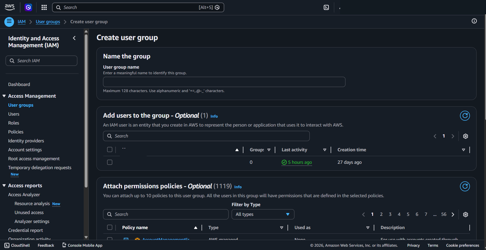
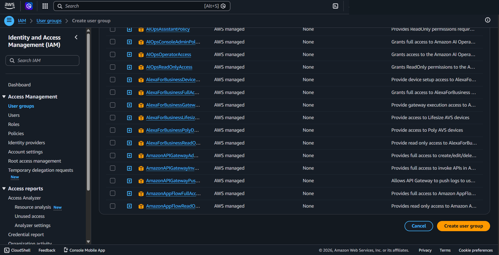
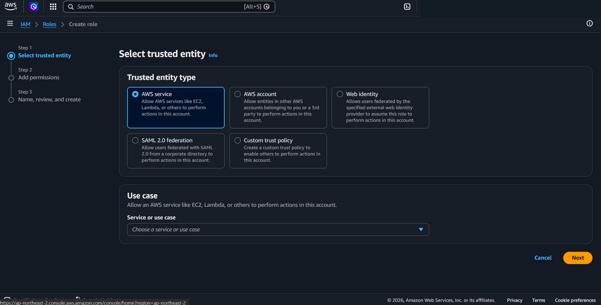
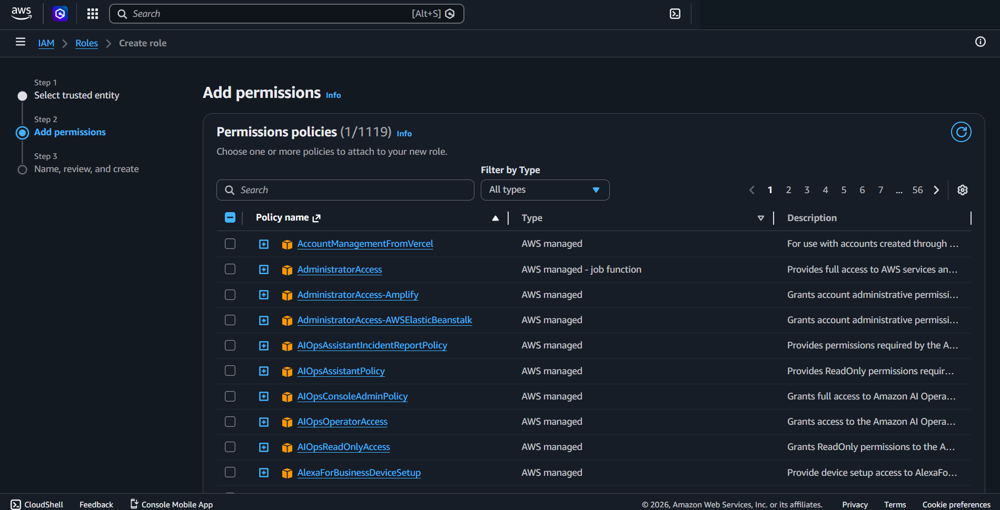
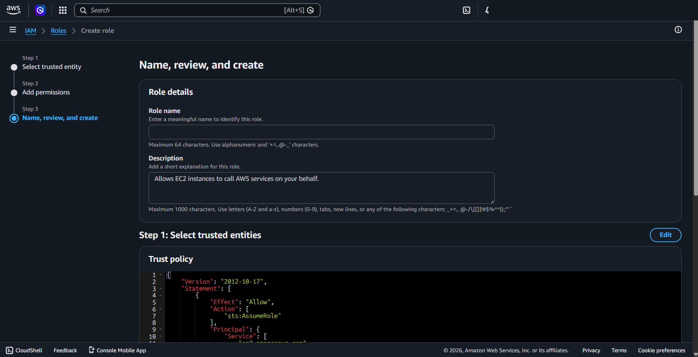
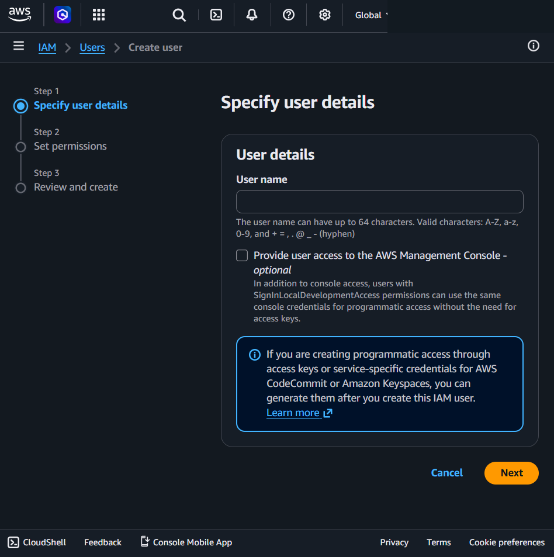
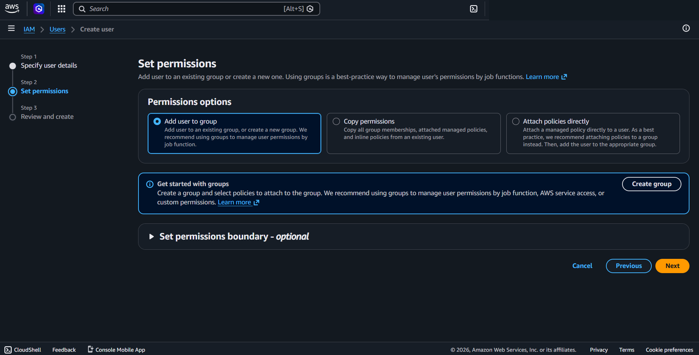
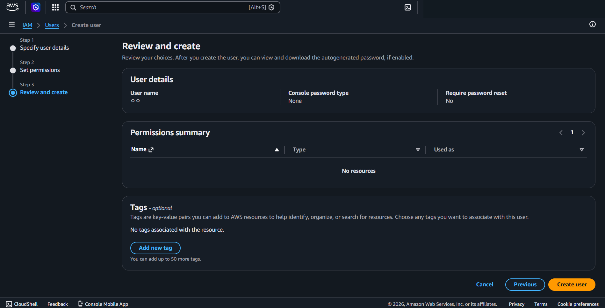
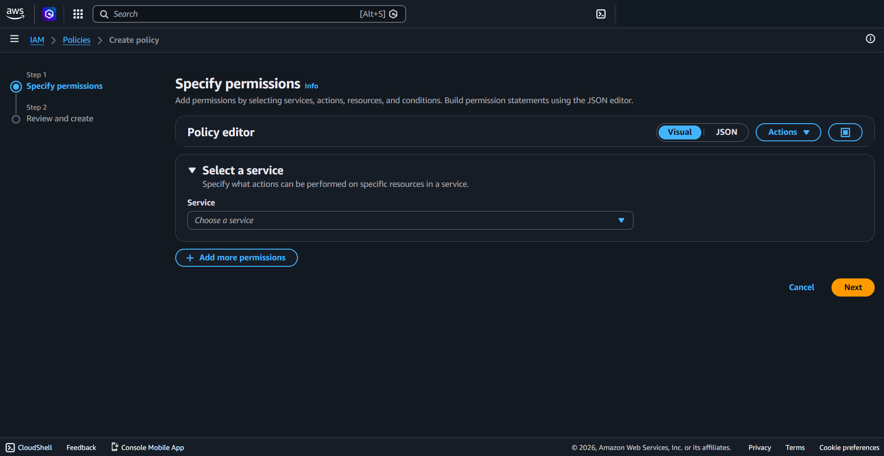

---
tags:
  - aws
  - security
created_at: 2026-03-13T00:00:00
updated_at: 2026-04-17T14:18:47
recent_editor: CLAUDE
---

↑ [Overview](./00_overview.md)

# Amazon IAM

## What It Is
**IAM (Identity and Access Management)** controls WHO can do WHAT on AWS resources. It manages users, groups, roles, and permissions.

**IAM is a Global service** - Not Region-specific. Changes apply across all Regions.

## How It Works

Every AWS API call is authenticated (who are you?) and authorized (are you allowed?). IAM Users have permanent credentials (password, access keys). IAM Roles have no permanent credentials — they are assumed temporarily by AWS services, users, or federated identities via the STS AssumeRole API. Policies (JSON documents) attached to users, groups, or roles define which actions are allowed on which resources.

## Console Access
**IAM Console → Users / Groups / Roles / Policies**
- Direct link: https://console.aws.amazon.com/iam/
- Region selector shows "Global" (not Region-specific)

## IAM Console Navigation Order

**Left sidebar (Access Management):**
1. **User groups** - Collections of users with shared permissions
2. **Users** - Individual identities (people or applications)
3. **Roles** - Temporary permissions for services or cross-account access
4. **Policies** - Permission documents (JSON) that define what actions are allowed

**Recommended learning order:** User groups → Users → Roles → Policies


## Create User Group - Console Flow



### Name the group
**User group name:**
- Text input field
- Enter a meaningful name to identify this group
- Maximum 128 characters
- Use alphanumeric and '+=,.@-_' characters

  **Naming tips:**
  - **Pattern:** `[Environment]-[Role/Function]` or just `[Role/Function]`
  - **Examples:**
    - `Developers` - All developers
    - `Admins` - All administrators
    - `ReadOnly` - Read-only access users
    - `Prod-Developers` - Production environment developers
    - `ClientA-Admins` - Client A administrators
  - **Best practice:** Name by job function, not by person
  - **Avoid:** Names like "Group1", "MyGroup", "JohnTeam"

### Add users to the group - Optional (1)
- Search bar to find existing users
- Table showing: User name, Groups, Last activity, Creation time
- Checkboxes to select users
- **Note:** "An IAM user is an entity that you create in AWS to represent the person or application that uses it to interact with AWS"
- Can add users later if group is empty

### Attach permissions policies - Optional (1119)



- "You can attach up to 10 policies to this user group. All the users in this group will have permissions that are defined in the selected policies."
- Search bar to find policies
- **Filter by Type** dropdown: All types, AWS managed, Customer managed
- Table showing: Policy name, Type, Used as, Description
- Checkboxes to select policies (up to 10)
- Pagination

**Action buttons:**
- **Cancel** - Discard
- **Create user group** - Create the group


## Create IAM Role - Console Flow (3 Steps)



### Step 1: Select trusted entity

**Trusted entity type (5 options):**

1. **AWS service** (Most common, selected by default)
   - Allow AWS services like EC2, Lambda, or others to perform actions in this account
   - **Use case:** EC2 instances need to access S3, Lambda needs to write logs
   - **Service or use case dropdown:** Choose which service (EC2, Lambda, etc.)
   - **Who:** Services (not people)

2. **AWS account**
   - Allow entities in other AWS accounts belonging to you or a 3rd party to perform actions in this account
   - **Use case:** Cross-account access, multi-account organizations
   - **Who:** IAM users/roles from another AWS account (people who already have AWS credentials in their own account)

3. **Web identity**
   - Allows users federated by the specified external web identity provider to assume this role to perform actions in this account
   - **Use case:** Mobile apps, web apps with social login (Google, Facebook)
   - **Who:** Public end users with social media accounts

4. **SAML 2.0 federation**
   - Allow users federated with SAML 2.0 (Security Assertion Markup Language) from a corporate directory to perform actions in this account
   - **SAML = Security Assertion Markup Language** - Standard protocol for enterprise Single Sign-On (SSO)
   - **Use case:** Corporate SSO - Employees log in once to company system (Active Directory, Okta, Google Workspace), get access to AWS without separate AWS password
   - **Example:** Employee logs into company portal → Company identity provider sends SAML assertion to AWS → AWS grants temporary access via role
   - **Difference from Web Identity:** SAML is for enterprise/corporate identity systems, Web Identity is for consumer apps (Facebook, Google login)
   - **Who:** Company employees with corporate credentials

5. **Custom trust policy**
   - Create a custom trust policy to enable others to perform actions in this account
   - **Use case:** Advanced scenarios, custom trust relationships
   - **Who:** Defined by your custom JSON policy

**Most common:** AWS service (for EC2, Lambda, etc.)



### Step 2: Add permissions


**Key idea: Search and select policies that define what this role can do**

- **1119 policies available** - AWS provides many pre-built policies
- **Search bar** - Type what you need (e.g., "S3", "Lambda", "ReadOnly")
- **Filter by Type:** AWS managed (created by AWS) or Customer managed (created by you)
- **Select one or more policies** - Checkbox to attach multiple policies to the role

**Frequently used policies (remember the pattern, not all names):**

1. **Full access to everything (dangerous!):**
   - `AdministratorAccess` - God mode, can do anything

2. **Read-only access:**
   - `ReadOnlyAccess` - Can view everything, cannot change anything
   - `ViewOnlyAccess` - Similar to ReadOnly

3. **Service-specific pattern (most common):**
   - `Amazon[ServiceName]FullAccess` - Full control of that service
   - `Amazon[ServiceName]ReadOnlyAccess` - Read-only for that service
   - Examples: `AmazonS3FullAccess`, `AmazonS3ReadOnlyAccess`, `AmazonEC2FullAccess`, `AmazonRDSReadOnlyAccess`

4. **Power user (common for developers):**
   - `PowerUserAccess` - Can do most things except IAM management

**Real-world usage:**
- **Developers:** PowerUserAccess or specific service access (S3FullAccess + EC2FullAccess)
- **Admins:** AdministratorAccess (carefully!)
- **Monitoring/auditing:** ReadOnlyAccess
- **Applications:** Specific minimal access (S3ReadOnly for backup script)

**Tip:** Just search for service name + "FullAccess" or "ReadOnlyAccess" - AWS naming is consistent
- AmazonAPIGatewayAdministrator - AWS managed

**Set permissions boundary - optional** (Expandable section at bottom)



### Step 3: Name, review, and create

**Role details:**
- **Role name** - Text input
  - Maximum 64 characters
  - Use alphanumeric and '+=,.@-_' characters
  - Enter a meaningful name to identify this role
  
  **Naming tips for easy management:**
  - **Pattern:** `[Environment]-[Service]-[Purpose]-Role`
  - **Examples:**
    - `Prod-EC2-S3Access-Role` - Production EC2 instances accessing S3
    - `Dev-Lambda-DynamoDB-Role` - Development Lambda accessing DynamoDB
    - `Staging-ECS-ECRPull-Role` - Staging ECS tasks pulling container images
  - **Include:** Environment (Prod/Dev/Staging), Service using the role, What it accesses
  - **Avoid:** Generic names like "MyRole", "TestRole", "Role1"
  - **Tip:** Add client name prefix for multi-client environments: `ClientA-Prod-EC2-S3Access-Role`

- **Description** - Text area
  - Add a short explanation for this role
  - Maximum 1000 characters
  - Example: "Allows EC2 instances to call AWS services on your behalf."
  - **Tip:** Explain WHO uses it and WHY - "Used by production web servers to read/write customer uploads to S3 bucket prod-uploads"

**Step 1: Select trusted entities** (Review, with Edit button)
- **Trust policy** - JSON document shown
  - Defines who can assume this role
  - Example shows EC2 service trust policy

**Step 2: Add permissions** (Review, with Edit button)
- **Permissions policy summary** - Table showing selected policies
  - Policy name, Type, Attached as

**Step 3: Add tags - optional**
- "No tags associated with the resource"
- **"Add new tag"** button
- Can add up to 50 tags

**Action buttons:**
- **Cancel** - Discard
- **Previous** - Go back
- **Create role** - Create the IAM role


## Create IAM User - Console Flow (3 Steps)



**Step 1: Specify user details**

**User name:**
- Text input field
- Up to 64 characters
- Valid characters: A-Z, a-z, 0-9, and + = , . @ _ - (hyphen)

  **Naming tips:**
  - **Pattern:** `firstname.lastname` (e.g., `john.doe`, `jane.smith`)
  - **For service accounts:** `svc-[purpose]` (e.g., `svc-backup`, `svc-monitoring`)
  - **Tip:** Add client prefix: `clienta-john.doe`, `svc-clienta-backup`
  - **Avoid:** Generic names like "admin", "user1", "test"

**Provide user access to the AWS Management Console (optional checkbox):**
- **Checked:** User gets password and can log into AWS Console (web interface)
- **Unchecked:** User has NO console access, programmatic access only (API/CLI/SDK)

**When to check (common use):**
- Yes: Human users (developers, admins) who need to see/click in console
- No: Applications, scripts, automation (they use access keys or roles)

**Example:**
- Client's developer needs to check EC2 instances → Check it
- Monitoring script needs to read CloudWatch → Don't check it (use access keys)

**Note:** Users with SignInLocalDevelopmentAccess permissions can use console credentials for programmatic access without access keys

**Note:** Access keys for programmatic access or service-specific credentials (CodeCommit, Keyspaces) can be generated after creating the user.



### Step 2: Set permissions

**3 Permission options:**

1. **Add user to group** (Default, recommended)
   - Add user to existing group or create new group
   - AWS recommends: Manage permissions by job function using groups
   - **"Create group" button** available

2. **Copy permissions**
   - Copy all group memberships, managed policies, and inline policies from an existing user
   - Quick way to duplicate another user's access

3. **Attach policies directly**
   - Attach managed policy directly to user
   - **Not recommended** - AWS says attach to group instead, then add user to group

**Set permissions boundary (optional, expandable):**
- Advanced feature to limit maximum permissions
- Rarely used at 101 level



### Step 3: Review and create

**Review shows:**
- **User details:** User name, Console password type, Require password reset
- **Permissions summary:** Table with Name, Type, Used as columns
- **Tags (optional):** Key-value pairs, up to 50 tags
  - **Tagging tip:** Use consistent tags across all IAM resources
  - **Common tags:** `Environment:Prod`, `Team:Engineering`, `CostCenter:IT`, `Owner:john.doe`
  - **Tip:** Always tag with `Client:ClientA` for billing and access control

**Action buttons:**
- **Cancel** - Discard
- **Previous** - Go back
- **Create user** - Create the IAM user


## Create IAM Policy - Console Flow (2 Steps)

**Note:** AWS provides 1119+ pre-built managed policies that cover most scenarios. Create custom policies only when AWS managed policies are too broad or don't fit your specific needs.

**When to use AWS Managed Policies (90% of cases):**
- Standard access patterns already covered (S3ReadOnly, EC2FullAccess, PowerUserAccess)

**When to create Custom Policies:**
1. **Too much access** - AWS policy gives more than needed (e.g., need access to one S3 bucket, not all)
2. **Specific combination** - Need permissions across services that no single AWS policy provides
3. **Compliance requirements** - Must restrict by IP, require MFA, limit by time
4. **Least privilege** - Application needs only specific actions, not full service access

**Best practice:** Start with AWS managed policies, create custom only when necessary.



### Step 1: Specify permissions

**Policy editor (3 modes):**

1. **Visual** (Default, selected)
   - User-friendly interface to build policies without writing JSON
   - **Select a service** section
   - "Specify what actions can be performed on specific resources in a service"

2. **JSON**
   - Write policy in JSON format directly
   - For advanced users who know policy syntax

3. **Actions** dropdown
   - Additional options for policy creation

**Select a service:**
- **Service** dropdown - "Choose a service"
- After selecting service, you specify:
  - **Actions:** What operations (Read, Write, List, etc.)
  - **Resources:** Which specific resources (ARNs)
  - **Conditions:** Optional conditions (IP address, time, MFA, etc.)

**Add more permissions** button
- Can add multiple service permissions to one policy
- Example: One policy with S3 read + DynamoDB write

**Action buttons:**
- **Cancel** - Discard
- **Next** - Go to Step 2

### Step 2: Review and create

**Policy details:**
- **Policy name** - Text input (required)
  - **Naming tip:** `[Service]-[Action]-Policy` (e.g., `S3-ReadOnly-Policy`, `EC2-StartStop-Policy`)
- **Description** - Text area (optional)
  - Explain what this policy allows and why it exists
- **Policy JSON** - Review the generated JSON

**Action buttons:**
- **Cancel** - Discard
- **Previous** - Go back
- **Create policy** - Create the custom policy


## Key Concepts

### 1. User Groups
- Collection of users with shared permissions
- Attach policies to group → all users in group get those permissions
- **Best practice:** Always use groups, not direct user policies
- **Tip:** Create groups per role (Developers, Admins, ReadOnly), add users to appropriate group
- Example groups: Developers, Admins, ReadOnly, Billing

**Why groups first:**
- Easier to manage permissions at scale
- Add/remove users from groups instead of editing individual permissions
- AWS recommends this approach (default option in console)

**Recommended flow:**
1. Create User Group (e.g., "Developers")
2. Attach Policies to Group (e.g., `AmazonS3FullAccess`)
3. Add Users to Group (e.g., john.doe, jane.smith)
4. Users automatically get all permissions from group's policies (permanent permissions)

### 2. Users
- Represents a person or application
- Has **permanent** credentials (password, access keys)
- Can belong to multiple groups (gets combined permissions from all groups)
- Can have policies attached directly (not recommended)

### 3. Roles
- **Temporary** permissions that can be assumed
- No permanent credentials (no password or access keys)
- **Flexible:** Can be assumed by AWS services, other accounts, federated users, SAML providers, web identities
- **AssumeRole** - Action to temporarily switch to a role's permissions (credentials expire after 15 min to 12 hours)

**Role vs User:**
- **User:** Permanent credentials, permanent permissions (via groups/policies)
- **Role:** No credentials, temporary permissions when assumed

**Key insight: Role = Permissions + Trust Policy**
- **Permissions:** What actions can be performed (attached policies)
- **Trust Policy:** Who can assume this role (trusted entities)

**Common use cases with examples:**

1. **AWS Service assumes role (most common)**
   - EC2 instance needs S3 access → Create role with S3 permissions, trust policy allows EC2 service
   - Lambda function needs DynamoDB access → Create role with DynamoDB permissions, trust policy allows Lambda service
   - ECS task needs to pull images from ECR → Create role with ECR permissions, trust policy allows ECS tasks

2. **Another AWS Account assumes role (cross-account)**
   - Your company has Account A (production) and Account B (development)
   - Account B developers need read-only access to Account A
   - Create role in Account A with ReadOnly permissions, trust policy allows Account B
   - Developers in Account B can "switch role" to access Account A resources

3. **Federated user assumes role (SSO/SAML)**
   - Company uses Google Workspace for employee login
   - Employees need AWS access without separate AWS passwords
   - Create role with appropriate permissions, trust policy allows Google SAML provider
   - Employee logs into Google → Google authenticates → AWS grants temporary credentials via role

4. **Web identity assumes role (mobile/web apps)**
   - Mobile app users log in with Facebook/Google
   - App needs to upload photos to S3
   - Create role with S3 upload permissions, trust policy allows Facebook/Google identity provider
   - User logs into Facebook → App gets temporary AWS credentials via role

5. **IAM User assumes role (automation/elevated access)**
   - Automation script runs as IAM user `svc-backup` with limited permissions
   - Needs temporary admin access to delete old backups
   - Create role with admin permissions, trust policy allows `svc-backup` user
   - Script calls STS AssumeRole API → Gets temporary credentials (1-12 hours) → Performs admin tasks → Credentials expire
   - **Why:** Security (user only has admin when needed), audit trail, least privilege

6. **Custom application assumes role (programmatic)**
   - Application running on-premises needs AWS access
   - Create role with required permissions, trust policy allows specific IAM user or external ID
   - Application uses STS AssumeRole API to get temporary credentials

**Role vs User:**
- **User:** Permanent identity with credentials (password/access keys)
- **Role:** Temporary permissions, no credentials, must be assumed

### 4. Policies
- JSON documents that define permissions
- Specify: What actions, on which resources, allow or deny
- Types:
  - **AWS Managed** - Created by AWS (e.g., AmazonS3ReadOnlyAccess)
  - **Customer Managed** - Created by you
  - **Inline** - Embedded directly in user/group/role (not recommended)

### How Permissions Work
**Policy = WHO can do WHAT on WHICH resources**

Example policy (allow reading S3):
```json
{
  "Effect": "Allow",
  "Action": "s3:GetObject",
  "Resource": "arn:aws:s3:::my-bucket/*"
}
```

- **Effect:** Allow or Deny
- **Action:** AWS API action (s3:GetObject, ec2:StartInstances)
- **Resource:** Which AWS resource (ARN)

### IAM vs Security Group (Common Confusion)
- **IAM:** "Can this user/role call this AWS API?" (AWS permissions)
- **Security Group:** "Can this IP connect to this port?" (Network firewall)
- Completely separate systems

## Precautions

### MAIN PRECAUTION: Never Use Root Account for Daily Tasks
- Root account has unlimited access to everything
- Create IAM users for daily work
- Enable MFA (Multi-Factor Authentication) on root account
- Only use root for account-level tasks (billing, closing account)

### 1. Use Groups, Not Direct Policies
- AWS recommends groups in the console (default option)
- Easier to manage permissions at scale
- Add/remove users from groups instead of editing individual permissions

### 2. Enable MFA (Multi-Factor Authentication)
- Extra security layer beyond password
- Required for root account
- Recommended for all users with console access
- Supports: Virtual MFA (phone app), hardware token, security key

### 3. Least Privilege Principle
- Give minimum permissions needed
- Start with no permissions, add as needed
- Don't use AdministratorAccess unless absolutely necessary
- Review and remove unused permissions regularly

### 4. Never Share Credentials
- Each person gets their own IAM user
- Don't share passwords or access keys
- Use roles for cross-account access

### 5. Rotate Access Keys Regularly
- Access keys can be compromised
- Rotate periodically (every 90 days recommended)
- Delete unused access keys
- Use roles instead of access keys when possible

### 6. Use Roles for AWS Services
- EC2 instances should use IAM roles, not access keys
- Lambda functions use execution roles
- Never hardcode access keys in code

### 7. Monitor with CloudTrail
- CloudTrail logs all IAM actions
- Know who did what and when
- Enable in all Regions

### 8. Permissions Boundary
- Optional advanced feature
- Sets maximum permissions a user/role can have
- Even if policy allows, boundary can restrict
- Useful for delegating user creation safely

### 9. Always Use Tags
- **Tag IAM users** with Department, Team, Project
- Helps identify and manage users
- Common tags: Department, Team, Environment, Owner

### 10. Review Unused Users and Roles
- Delete users who no longer need access
- Remove unused roles
- Use IAM Access Analyzer to find unused permissions
- Credential report shows last login dates

### 11. Password Policy
- Set strong password requirements
- Minimum length, require special characters
- Password expiration
- Prevent password reuse

### 12. Access Keys vs Console Access
- **Console access:** Password + MFA for web console login
- **Access keys:** For CLI/API/SDK programmatic access
- User can have both, one, or neither
- Generate access keys after user creation

## Example

A company creates an IAM role `AppServerRole` with a policy granting `s3:GetObject` on a specific bucket.
EC2 instances assume this role instead of storing access keys.
A separate `ReadOnlyAudit` role lets the security team view resources across all services without modification permissions.

## Why It Matters

IAM is the gatekeeper for every AWS API call. Misconfigured permissions are one of the most common causes of security breaches.
Understanding roles, policies, and least-privilege access is foundational to working with AWS.

## Q&A

### Q: Who is responsible for Amazon Linux 2023 security on EC2?

Under the AWS Shared Responsibility Model, **both sides share responsibility**.

**AWS is responsible for:**
- Physical infrastructure (data centers, servers, network)
- Hypervisor-level security
- Initial AMI image security (packages included in the published AMI)

**Customer is responsible for:**
- OS updates and security patches (including Amazon Linux 2023)
- Application software installation and management
- Security Group configuration
- OS-level firewall and user account management

Even though Amazon Linux 2023 is an AWS-provided AMI, once deployed on EC2, OS patching and security configuration are the **customer's responsibility**. AWS only covers the initial AMI state and publishing new AMI versions.

### Q: What happens when an AssumeRole session expires?

Temporary credentials from AssumeRole are automatically invalidated when the session expires.

- **Default session**: 1 hour (3,600 seconds)
- **Configurable range**: 15 minutes (900 sec) to 12 hours (43,200 sec)
- **MaxSessionDuration**: Set on the IAM Role (1–12 hours). Then specify `DurationSeconds` in the AssumeRole call.
- **After expiry**: Credentials become invalid. A new AssumeRole call is required.

Longer sessions reduce re-authentication frequency but increase security risk if credentials are compromised.

## Official Documentation
- [What is IAM](https://docs.aws.amazon.com/IAM/latest/UserGuide/introduction.html)

---
← Previous: [AWS Data Pipeline](25_aws_data_pipeline.md) | [Overview](./00_overview.md) | Next: [AWS Shield](17_aws_shield.md) →
