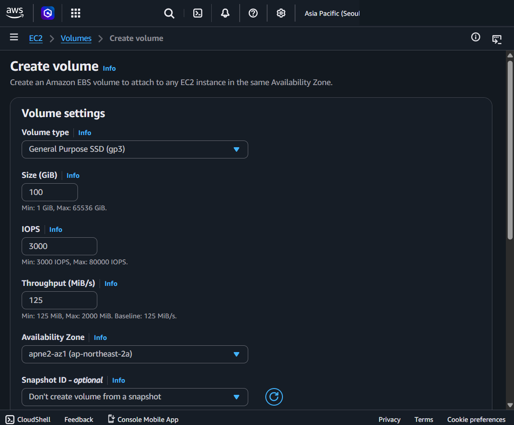
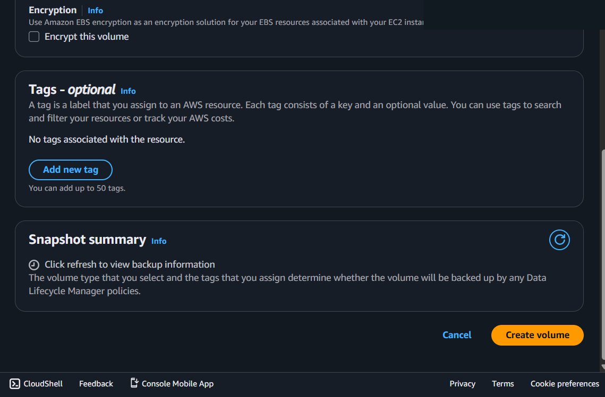

---
tags:
  - aws
  - storage
  - computing
created_at: 2026-03-31T00:00:00
updated_at: 2026-04-17T14:18:47
recent_editor: CLAUDE
---

↑ [Overview](./00_overview.md)

# Amazon EBS

## What It Is
**EBS (Elastic Block Store)** is block-level storage that you attach to EC2 instances. Think of it as a virtual hard drive — it persists independently from the instance, so data survives instance stop/start. Each EBS volume exists in a single Availability Zone.

**See [Computing Basics - Storage](../../../computing/03_storage.md) for block vs file vs object storage fundamentals.**

## How It Works

You create an EBS volume in a specific AZ and attach it to an EC2 instance in the same AZ. The volume appears as a block device that you format and mount like a physical disk. Data persists independently of the instance lifecycle — stopping or terminating the instance does not delete the volume unless "Delete on Termination" is enabled. Snapshots capture the volume state at a point in time and are stored in S3 (AWS-managed); new volumes can be created from snapshots in any AZ.

## Console Access
- AWS Console → EC2 → Left sidebar → Elastic Block Store → Volumes
- Breadcrumb: EC2 > Volumes

## Create Volume - Console Flow

### Volume settings

**Page header:** "Create an Amazon EBS volume to attach to any EC2 instance in the same Availability Zone."

**Volume type** (dropdown):
- **General Purpose SSD (gp3)** — default, most workloads
- **General Purpose SSD (gp2)** — previous gen, burstable IOPS
- **Provisioned IOPS SSD (io1)** — high-performance databases
- **Provisioned IOPS SSD (io2 Block Express)** — highest performance
- **Throughput Optimized HDD (st1)** — big data, data warehouses
- **Cold HDD (sc1)** — infrequent access, lowest cost
- **Magnetic (standard)** — previous generation

**Size (GiB):**
- Default: 100 GiB
- Min: 1 GiB, Max: 65,536 GiB (64 TiB)

**IOPS:**
- Default: 3,000 (for gp3)
- Min: 3,000, Max: 80,000
- gp3 baseline: 3,000 IOPS included free, can provision up to 80,000 for extra cost
- gp2: IOPS scales with volume size (3 IOPS per GiB, burst to 3,000)

**Throughput (MiB/s):**
- Default: 125 MiB/s (for gp3)
- Min: 125, Max: 2,000 MiB/s
- Baseline: 125 MiB/s included free with gp3

**Availability Zone:**
- Selected: apne2-az1 (ap-northeast-2a)
- **Volume must be in the same AZ as the EC2 instance you want to attach it to**
- Cannot attach across AZs — must snapshot and recreate in another AZ

**Snapshot ID** (optional):
- "Don't create volume from a snapshot" — default
- Or select an existing snapshot to restore from
- Use case: clone a volume, restore from backup, migrate across AZs

### Encryption, Tags, Snapshot summary

**Encryption:**
- Checkbox: "Encrypt this volume" (unchecked by default)
- Uses AWS KMS (Key Management Service) for encryption
- Can use default AWS-managed key or custom CMK
- Once created, you cannot change encryption status — must snapshot → copy with encryption → create new volume

**Tags** (optional):
- Up to 50 tags per volume
- Key is required, Value is optional
- "Add new tag" button
- MSP essential: Name, Environment, Client, CostCenter

**Snapshot summary:**
- "Click refresh to view backup information"
- Shows whether any **Data Lifecycle Manager (DLM)** policies will auto-backup this volume based on its volume type and tags
- DLM is not enabled by default — you must create a policy separately (EC2 > Lifecycle Manager)
- This section is informational only, not a configuration step

**Cancel / Create volume** buttons

## Volume Types Comparison

| Type | API Name | Use Case | IOPS (max) | Throughput (max) | Size |
|------|----------|----------|-----------|-----------------|------|
| General Purpose SSD | **gp3** | Most workloads (default) | 80,000 | 2,000 MiB/s | 1 GiB - 64 TiB |
| General Purpose SSD | **gp2** | Boot volumes, dev/test | 16,000 (burst) | 250 MiB/s | 1 GiB - 16 TiB |
| Provisioned IOPS SSD | **io1** | Databases needing sustained IOPS | 64,000 | 1,000 MiB/s | 4 GiB - 16 TiB |
| Provisioned IOPS SSD | **io2 BE** | Highest performance DBs | 256,000 | 4,000 MiB/s | 4 GiB - 64 TiB |
| Throughput Optimized HDD | **st1** | Big data, log processing | 500 | 500 MiB/s | 125 GiB - 16 TiB |
| Cold HDD | **sc1** | Infrequent access archives | 250 | 250 MiB/s | 125 GiB - 16 TiB |

**How to choose:**
- Default → **gp3** (best price/performance for most cases)
- Need guaranteed high IOPS for DB → **io1/io2**
- Sequential reads, big data → **st1**
- Rarely accessed, cheapest → **sc1**

## Key Concepts

### AZ-Locked
- EBS volume lives in one AZ only
- To move to another AZ: snapshot → create volume from snapshot in target AZ
- To move to another Region: snapshot → copy snapshot to target Region → create volume

### Attach / Detach
- One EBS volume attaches to one EC2 instance at a time (except io1/io2 Multi-Attach)
- Can detach and reattach to a different instance in the same AZ
- Root volume is deleted by default when instance terminates (configurable)

### Snapshots
- Point-in-time backup of a volume — stored in AWS-managed S3 (not visible in your S3 console, managed from EC2 > Snapshots)
- Incremental — only changed blocks are stored after first snapshot
- **Not automatic by default** — you must manually create or set up automation:
  - Manual: EC2 > Volumes > select > Actions > Create snapshot
  - Automated: Data Lifecycle Manager (DLM) policy — define schedule + tag-based targeting
  - Centralized: AWS Backup — cross-service backup plans
- Can create volumes from snapshots in any AZ within the Region
- Can copy snapshots across Regions

### Snapshots Across AWS Services

"Snapshot" is used across many services — same concept (capture state at a point in time), different names:

| Service | Snapshot name | What it captures | Where stored |
|---------|--------------|-----------------|-------------|
| **EBS** | EBS Snapshot | Block-level disk data | S3 (AWS-managed, invisible) |
| **EC2 (AMI)** | AMI | OS + apps + config (= EBS snapshots + metadata) | S3 (AWS-managed) |
| **RDS** | DB Snapshot | Entire database (data + config) | S3 (AWS-managed) |
| **Aurora** | DB Cluster Snapshot | Entire cluster (all DBs) | S3 (AWS-managed) |
| **ElastiCache (Redis)** | Backup/Snapshot | In-memory cache data | S3 (AWS-managed) |
| **DynamoDB** | On-demand Backup | Table data | DynamoDB-managed |
| **EFS** | AWS Backup | File system data | AWS Backup vault |

Not snapshot-able: S3 (use versioning/replication), Lambda (code versions are the "snapshot").

### gp3 vs gp2
- **gp3**: IOPS and throughput are independently configurable, baseline 3,000 IOPS + 125 MiB/s included
- **gp2**: IOPS tied to volume size (3 IOPS/GiB), burst up to 3,000 for small volumes
- gp3 is generally cheaper and more flexible — use gp3 for new volumes

### EBS + Other Services

| Service | EBS Support | Notes |
|---------|------------|-------|
| **EC2** | yes | Primary use case |
| **EKS (EC2 nodes)** | yes | Via EBS CSI driver |
| **EKS (Fargate)** | no | Fargate pods cannot mount EBS |
| **ECS (EC2 launch type)** | yes | Via Docker volume driver |
| **ECS (Fargate)** | no | Fargate tasks cannot mount EBS |
| **Lambda** | no | No persistent block storage |

## Pricing

**Source:** [AWS EBS Pricing](https://aws.amazon.com/ebs/pricing/)

| Type | Storage Cost (US East) | IOPS Cost | Throughput Cost |
|------|----------------------|-----------|----------------|
| **gp3** | $0.08/GB-month | $0.005/IOPS-month (over 3,000) | $0.04/MiB/s-month (over 125) |
| **gp2** | $0.10/GB-month | Included (scales with size) | Included |
| **io1** | $0.125/GB-month | $0.065/IOPS-month | Included |
| **io2** | $0.125/GB-month | Tiered IOPS pricing | Included |
| **st1** | $0.045/GB-month | Included | Included |
| **sc1** | $0.015/GB-month | Included | Included |
| **Snapshots** | $0.05/GB-month | — | — |

Example: 100 GiB gp3 with default settings = $8/month

Additional costs:
- Snapshot storage (per GB stored)
- Snapshot copy across Regions (data transfer)
- Public IPv4 if applicable to attached instance

## Precautions

### MAIN PRECAUTION: Same AZ as EC2 Instance
- Volume and instance must be in the same AZ
- Plan your AZ before creating volumes
- Cross-AZ requires snapshot → recreate workflow

### 1. Encryption Cannot Be Changed After Creation
- Decide encryption before creating
- Best practice: enable encryption by default (account-level setting)

### 2. Root Volume Deletes on Termination by Default
- "Delete on Termination" is enabled by default for root volumes
- Disable this if you want data to persist after instance termination
- Additional (non-root) volumes are NOT deleted by default

### 3. gp2 IOPS Depends on Size
- Small gp2 volumes (< 1,000 GiB) have low baseline IOPS
- 100 GiB gp2 = only 300 baseline IOPS (bursts to 3,000)
- Use gp3 instead — guaranteed 3,000 IOPS regardless of size

### 4. Snapshot Before Major Changes
- Always snapshot before resizing, changing type, or detaching
- Snapshots are incremental and cheap

### 5. Monitor IOPS/Throughput
- CloudWatch metrics: VolumeReadOps, VolumeWriteOps, VolumeThroughputPercentage
- If consistently hitting limits → resize or upgrade volume type

## Example

A production EC2 instance uses a 100 GiB `gp3` root volume and a separate 500 GiB `gp3` data volume for the database.
The data volume has "Delete on Termination" set to No and daily snapshots via AWS Backup.
If the instance is terminated, the data volume and its snapshots survive.

## Why It Matters

EBS provides persistent block storage for EC2 — it is the virtual hard drive behind every instance.
Choosing the right volume type and configuring snapshots correctly protects data and controls costs.

## Q&A

### Q: Can one EBS volume attach to multiple EC2 instances?

By default, one EBS volume attaches to one EC2 instance. However, **Multi-Attach** allows simultaneous attachment to multiple instances.

- **Default**: 1 EBS → 1 EC2. One EC2 can have multiple EBS volumes.
- **Multi-Attach**: io1/io2 volumes only. Up to **16 Nitro-based EC2 instances** in the same AZ.
- **Limitation**: gp2/gp3/st1/sc1 do not support Multi-Attach. A cluster-aware filesystem (e.g., GFS2) is recommended.

### Q: Should you keep using gp2 as the default EBS volume?

No — use gp3. The current AWS console default for new EC2 instances is **gp3**. It is 20% cheaper with higher baseline performance.

| Attribute | gp2 | gp3 |
|-----------|-----|-----|
| Price | $0.10/GB/month | $0.08/GB/month (20% cheaper) |
| Baseline IOPS | 3 IOPS/GB (min 100) | **3,000 IOPS** (regardless of size) |
| Max IOPS | 16,000 | 16,000 |
| Max throughput | 250 MB/s | 1,000 MB/s |
| IOPS/throughput tuning | Tied to volume size | **Independently adjustable** |

Example: 100 GB volume → gp2: $10/month, 300 IOPS vs gp3: $8/month, 3,000 IOPS.

Switching from gp2 to gp3 is **non-disruptive** (EBS Elastic Volumes).

### Q: What storage is best for frequent modifications on ~4 TB of data?

For frequent read/write/delete operations, **block storage (EBS)** is the best fit. [S3](19_amazon_s3.md) requires overwriting entire objects, making it unsuitable for frequent modifications.

| Criteria | S3 | EBS | [EFS](22_amazon_efs.md) |
|----------|-----|-----|-----|
| Frequent modification | no (full overwrite) | yes (block-level edits) | yes (file-level edits) |
| 4 TB capacity | Unlimited | Max 64 TB | Auto-scales |
| Single instance | — | Optimal | Possible but overkill |
| Multi-instance sharing | yes | Multi-Attach (io only) | Optimal |
| Cost (~4 TB) | ~$92/month | ~$320/month (gp3) | ~$1,200/month |

**Recommendation**: Single EC2 with frequent modifications → **EBS gp3**. Multiple EC2s needing shared access → **EFS**.

## Official Documentation
- [Amazon EBS Documentation](https://docs.aws.amazon.com/ebs/)
- [EBS Volume Types](https://docs.aws.amazon.com/ebs/latest/userguide/ebs-volume-types.html)

---
← Previous: [Amazon S3](19_amazon_s3.md) | [Overview](./00_overview.md) | Next: [Amazon EFS](22_amazon_efs.md) →
