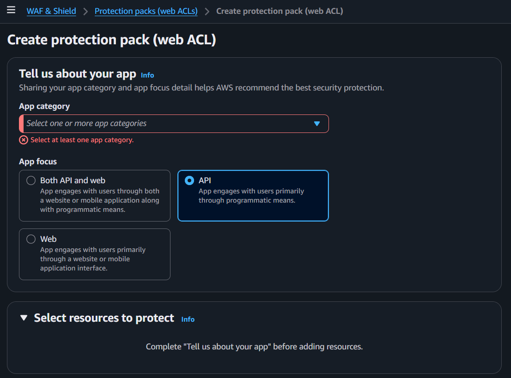
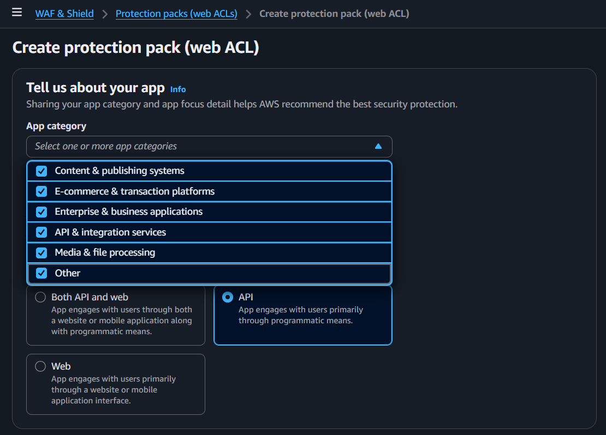
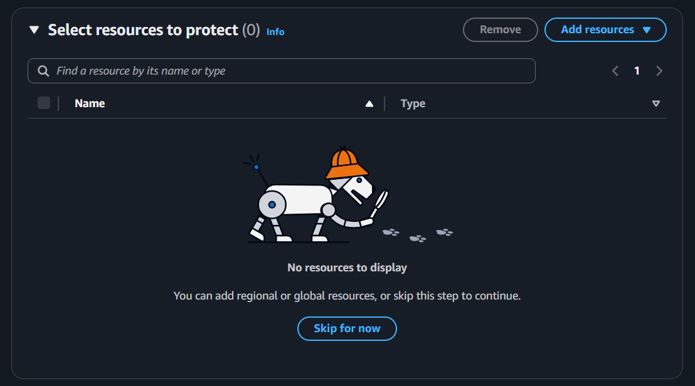
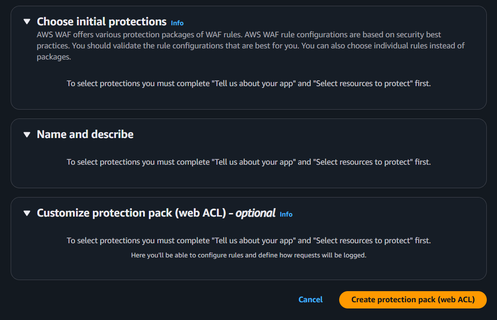

---
tags:
  - aws
  - security
created_at: 2026-03-20T00:00:00
updated_at: 2026-04-19T09:11:51
recent_editor: CLAUDE
---

↑ [Overview](./00_networking_overview.md)

# AWS WAF (Web Application Firewall)

## What It Is
AWS WAF (Web Application Firewall) is a Layer 7 (Application layer) firewall that filters HTTP/HTTPS requests based on rules you define.

While Shield stops DDoS volume floods, WAF inspects the **content** of each request and decides: allow, block, or count.

**What WAF protects against:**
- SQL injection (malicious database queries in URLs/forms)
- XSS (Cross-Site Scripting — injecting scripts into web pages)
- Bad bots and scrapers
- Requests from specific countries/IPs
- Rate limiting (e.g., block IP after 1,000 requests in 5 minutes)

### Shield vs WAF vs Security Group

| | Security Group | WAF | Shield |
|---|---|---|---|
| Layer | Layer 3/4 (IP + port) | Layer 7 (HTTP content) | Layer 3/4/7 (volume) |
| What it checks | Source IP, port, protocol | HTTP headers, URLs, body, cookies | Traffic volume patterns |
| Purpose | Network access control | Application attack filtering | DDoS protection |
| Protects | EC2, RDS, etc. | CloudFront, ALB, API Gateway | All AWS resources |
| Example | "Allow port 443 from 10.0.0.0/16" | "Block requests with SQL in URL" | "Absorb 1M fake requests/sec" |

### WAF Works With
- **Amazon CloudFront** (CDN)
- **Application Load Balancer (ALB)**
- **Amazon API Gateway**
- **AWS AppSync**
- **Amazon Cognito user pools**
- **AWS App Runner**
- **AWS Verified Access**

## How It Works

You create a Web ACL containing ordered rules. Each incoming HTTP/HTTPS request is evaluated against the rules in priority order. When a rule matches, the defined action (Allow, Block, Count, or CAPTCHA) is applied and evaluation stops. If no rule matches, the Web ACL's default action applies. The Web ACL is attached to a CloudFront distribution, ALB, or API Gateway to intercept all requests before they reach your application.

## Console Access
- Search "WAF" in AWS Console
- Breadcrumb: WAF & Shield > Protection packs (web ACLs) > Create protection pack (web ACL)
- Note: WAF and Shield share the same console


## Create Protection Pack (Web ACL) - Console Flow

> Note: AWS recently redesigned the WAF console. It now uses a "protection pack" wizard that guides you through app profiling → resource selection → rule configuration.

### Step 1: Tell us about your app



**App category** (required, multi-select dropdown):



- Content & publishing systems
- E-commerce & transaction platforms
- Enterprise & business applications
- API & integration services
- Media & file processing
- Other

AWS uses your selection to recommend the best protection rules. Select all that apply.

**App focus** (3 options):
- **Both API and web** — website/mobile app + programmatic access
- **API** (selected in screenshot) — primarily programmatic access
- **Web** — primarily website or mobile app interface

**Select resources to protect** (expandable):
- Must complete "Tell us about your app" first
- Choose which AWS resources this Web ACL protects (CloudFront, ALB, API Gateway, etc.)

### Step 2: Select resources to protect



- Search by resource name or type
- "Add resources" button to browse regional or global resources
- Can add regional resources (ALB, API Gateway) or global resources (CloudFront)
- "Skip for now" — can attach resources later
- "No resources to display" if none added yet

### Step 3: Choose protections, Name, Customize



**Choose initial protections** (expandable):
- AWS WAF offers protection packages (bundles of WAF rules) based on security best practices
- Can choose individual rules instead of packages
- Must complete previous sections first

**Name and describe** (expandable):
- Name and description for your Web ACL
- Must complete previous sections first

**Customize protection pack (web ACL)** (optional, expandable):
- Configure rules and define how requests will be logged
- Advanced customization — add custom rules, change rule order, set default action

**Cancel / Create protection pack (web ACL)** buttons


## Key Concepts

### Web ACL (Web Access Control List)
- The main WAF resource — a set of rules that inspect and filter web requests
- You attach a Web ACL to your CloudFront, ALB, or API Gateway
- Each request is evaluated against the rules in order
- **Default action** — What to do if no rule matches (Allow or Block)

### Rules and Rule Groups
**Rule types:**
- **AWS Managed Rules** — Pre-built by AWS, updated automatically
  - e.g., AWSManagedRulesCommonRuleSet (SQL injection, XSS, bad inputs)
  - e.g., AWSManagedRulesKnownBadInputsRuleSet
  - e.g., AWSManagedRulesBotControlRuleSet
- **Custom Rules** — You write your own
  - e.g., Block requests from specific countries
  - e.g., Rate limit: block IP after 2,000 requests in 5 minutes
- **Marketplace Rules** — Third-party rule sets (additional cost)

### Rule Actions
- **Allow** — Let the request through
- **Block** — Reject the request (returns 403 Forbidden)
- **Count** — Let it through but count it (for testing rules before enforcing)
- **CAPTCHA** — Challenge the requester to prove they're human

### WCU (Web ACL Capacity Units)
- Each rule costs a certain number of WCUs
- Web ACL has a limit of 5,000 WCUs
- More complex rules = more WCUs
- Managed rule groups show their WCU cost

### How WAF Evaluates Requests
```
Request arrives → Web ACL rules evaluated in priority order
  → Rule 1: Match? → Action (Allow/Block/Count)
  → Rule 2: Match? → Action
  → Rule 3: Match? → Action
  → No match → Default action (Allow or Block)
```

### Common MSP Setup
```
Internet → CloudFront → WAF (Web ACL) → ALB → EC2
                         ↑
                    Rules:
                    1. AWS Managed Rules (SQL injection, XSS)
                    2. Rate limiting (block after 2,000 req/5min)
                    3. Geo blocking (block specific countries)
                    4. Default: Allow
```


## Precautions

### MAIN PRECAUTION: Start with Count Mode, Not Block
- New rules might accidentally block legitimate traffic
- Use **Count** action first to see what would be blocked
- Review the logs, then switch to **Block** once you're confident
- This prevents breaking your app with overly aggressive rules

### 1. WAF Costs Per Rule and Per Request
- You pay per Web ACL, per rule, and per million requests inspected
- More rules = higher cost
- **Tip:** Start with AWS Managed Rules (good coverage, reasonable cost), add custom rules as needed

### 2. Use AWS Managed Rules First
- AWS maintains and updates them automatically
- Covers most common attacks (SQL injection, XSS, bad bots)
- Don't reinvent the wheel — start here, customize later

### 3. WAF Only Works with Specific Services
- CloudFront, ALB, API Gateway, AppSync, Cognito, App Runner, Verified Access
- Does NOT work with NLB (Network Load Balancer) or EC2 directly
- If you need WAF, put an ALB or CloudFront in front

### 4. Shield + WAF Together for Full Protection
- Shield handles volume attacks (DDoS)
- WAF handles content attacks (SQL injection, XSS, bots)
- Use both for production web applications
- See [AWS Shield](./04_aws_shield.md) for Shield details

### 5. Log Everything
- Enable WAF logging to S3, CloudWatch Logs, or Kinesis Data Firehose
- Essential for troubleshooting blocked requests
- Review logs regularly to tune rules

### 6. Always Use Tags
- Tag Web ACLs with environment, project, team, client
- Essential for MSP cost tracking across multiple clients

## Example

A web application attaches a WAF Web ACL to its ALB with three rule groups:
the AWS Managed Core Rule Set (blocks common exploits), a SQL injection rule,
and a rate-based rule limiting each IP to 2,000 requests per 5 minutes. Blocked requests return a 403.

## Why It Matters

WAF protects web applications from common exploits like SQL injection and XSS at the application layer.
Combined with Shield for volumetric protection, WAF provides defense-in-depth for internet-facing workloads.

## Q&A

### Q: Why is Route 53 shown alongside WAF in architecture diagrams?

WAF and Route 53 together form a DDoS defense architecture:

- **AWS Shield Standard**: Automatically applied to [CloudFront](./02_amazon_cloudfront.md) and Route 53. Mitigates L3/L4 DDoS attacks in real time.
- **WAF**: Attached to CloudFront, ALB, or API Gateway for L7 (application layer) attack defense.
- **Route 53**: Receives Shield Standard protection at the DNS level, mitigating DNS query flood attacks.

**Architecture flow**: User → **Route 53 (DNS, Shield protection)** → **CloudFront (WAF + Shield)** → ALB → EC2

### Q: Does Route 53 itself perform defense?

Route 53 does not defend on its own — **AWS Shield Standard protects Route 53**.

- When using CloudFront and Route 53, all packets pass through a fully inline DDoS mitigation system with no observable latency.
- **Shield Advanced** (additional $3,000/month) adds more sophisticated protection and 24/7 Shield Response Team (SRT) support.

For DDoS protection tiers, use AWS Shield.

## Official Documentation
- [AWS WAF Developer Guide](https://docs.aws.amazon.com/waf/latest/developerguide/waf-chapter.html)
- [AWS WAF FAQs](https://aws.amazon.com/waf/faqs/)

---
↑ [Overview](./00_networking_overview.md)

**Related:** [AWS Shield](./04_aws_shield.md), [CloudFront](./02_amazon_cloudfront.md)
**Tags:** #aws #security
