# Auto Scaling - AWS Console Guide

## Official Documentation
- [Amazon EC2 Auto Scaling User Guide](https://docs.aws.amazon.com/autoscaling/ec2/userguide/what-is-amazon-ec2-auto-scaling.html)
- [AWS Auto Scaling User Guide](https://docs.aws.amazon.com/autoscaling/plans/userguide/what-is-a-scaling-plan.html)

## What It Is
Auto Scaling automatically adjusts the number of resources based on demand. When traffic increases, it adds resources. When traffic decreases, it removes them.

**"Auto Scaling" usually means EC2 Auto Scaling Group (ASG)** — but it works with other services too.

### Services That Support Auto Scaling

| Service | What scales | How |
|---|---|---|
| **EC2** (most common) | Number of instances | Auto Scaling Group (ASG) |
| **ECS** | Number of tasks/containers | Service Auto Scaling |
| **DynamoDB** | Read/Write capacity units | Target tracking on RCU/WCU |
| **Aurora** | Number of read replicas (0-15) | Aurora Auto Scaling |
| **Lambda** | Concurrent executions | Automatic (built-in, no config) |
| **ElastiCache** | Number of nodes/shards | ElastiCache Auto Scaling |
| **EMR** | Number of cluster nodes | Managed scaling |

## Console Access
- Search "EC2" > Auto Scaling Groups (left sidebar)
- Or search "Auto Scaling" directly

---

## Create Auto Scaling Group - Console Flow (7 Steps)

> ⚠️ No console screenshots available — based on known ASG console structure. May not match current console exactly.

### Step 1: Choose launch template
- **Auto Scaling group name** — Name for the ASG
- **Launch template** — Select existing or create new
  - Shows: template name, version (Latest/Default/specific)
  - Defines: AMI, instance type, key pair, security group, storage, user data

### Step 2: Choose instance launch options
- **Instance type requirements** — Override launch template instance type
  - Single instance type or mixed (multiple types for cost optimization)
- **Network:**
  - **VPC** — Select VPC
  - **Availability Zones and subnets** — Select 1 or more subnets (use multiple AZs for HA)
  - **Availability Zone distribution** — Select a distribution strategy for how instances are spread across AZs

### Step 3: Configure advanced options
- **Load balancing:**
  - No load balancer
  - Attach to an existing load balancer
  - Attach to a new load balancer
- **VPC Lattice integration** — Optional service-to-service networking
- **Amazon Application Recovery Controller (ARC) zonal shift** — Shift traffic away from an impaired AZ
- **Health checks:**
  - EC2 (default)
  - ELB (recommended when using load balancer)
  - EBS health checks — Monitors and replaces instances with impaired EBS volumes
  - Health check grace period (default 300 seconds)

### Step 4: Configure group size and scaling
- **Group size:**
  - Desired capacity
  - Minimum capacity
  - Maximum capacity
- **Scaling policies:**
  - None
  - Target tracking scaling policy (other types created after ASG creation)
- **Instance maintenance policy** — Controls how instances are replaced during updates
- **Capacity Reservation preference** — Whether to use reserved capacity
- **Instance scale-in protection** — Prevent specific instances from being terminated
- **CloudWatch group metrics collection** — Toggle ASG-level CloudWatch metrics
- **Default instance warmup** — Time before a new instance's metrics count toward scaling decisions

### Step 5: Add notifications (optional)
- SNS (Simple Notification Service) topic for scaling events
- Events: launch, terminate, fail to launch, fail to terminate

### Step 6: Add tags (optional)
- Key-value pairs
- Option to tag instances launched by this ASG

### Step 7: Review
- Review all settings
- **Create Auto Scaling group**

---

## EC2 Auto Scaling Group (ASG) — Core Concept

### How It Works
You define 3 numbers:
- **Minimum** — Never go below this (e.g., 2)
- **Desired** — How many to run normally (e.g., 2)
- **Maximum** — Never go above this (e.g., 10)

```
e.g. Min: 2, Desired: 2, Max: 10

Normal:    2 instances running (desired)
Traffic ↑: scales to 5, 6, 7... up to 10 (max)
Traffic ↓: scales back down to 2 (min)
```

Auto Scaling + ELB (Elastic Load Balancing) work together:
```
Users → ELB (distributes traffic) → EC2 instances (managed by ASG)
                                     ↑ ASG adds/removes instances based on demand
```

### What You Need to Create an ASG
1. **Launch Template** — Defines what to launch (AMI, instance type, key pair, security group, etc.)
2. **VPC and Subnets** — Where to launch instances (use multiple AZs for high availability)
3. **Scaling policies** — When to scale (see below)
4. **Load Balancer** (optional but recommended) — Distributes traffic across instances

### Scaling Policies (4 types)

| Policy | How it works | Example |
|---|---|---|
| **Target tracking** | Maintain a metric at a target value | "Keep average CPU at 50%" |
| **Step scaling** | Add/remove based on metric thresholds | "If CPU > 70% add 2, if > 90% add 4" |
| **Scheduled** | Scale at specific times | "Scale to 10 every Monday 9AM" |
| **Predictive** | ML-based, predicts traffic patterns | Auto-learns your weekly traffic pattern |

**Most common:** Target tracking (simplest, works well for most cases).

### Health Checks
- ASG monitors instance health
- **EC2 health check** — Is the instance running? (default)
- **ELB health check** — Is the instance responding to requests? (recommended when using ELB)
- Unhealthy instance → ASG terminates it → launches a replacement automatically

### Cooldown Period
- After a scaling action, ASG waits before scaling again
- Default: 300 seconds (5 minutes)
- Prevents rapid scale up/down (thrashing)

### Instance Refresh
- Update all instances in an ASG to a new launch template version
- Rolling update — replaces instances gradually (e.g., 20% at a time)
- No downtime if configured properly

---

## Load Balancer Types (used with ASG)

ASG is commonly paired with a load balancer (Step 3 above). Here's the full console flow for each type.

> For pricing, capacity units, and additional details, see [Elastic Load Balancing](16_elastic_load_balancing.md).

---

### Compare and Select Load Balancer Type


When you click "Create load balancer", you see a comparison page with all types side by side.

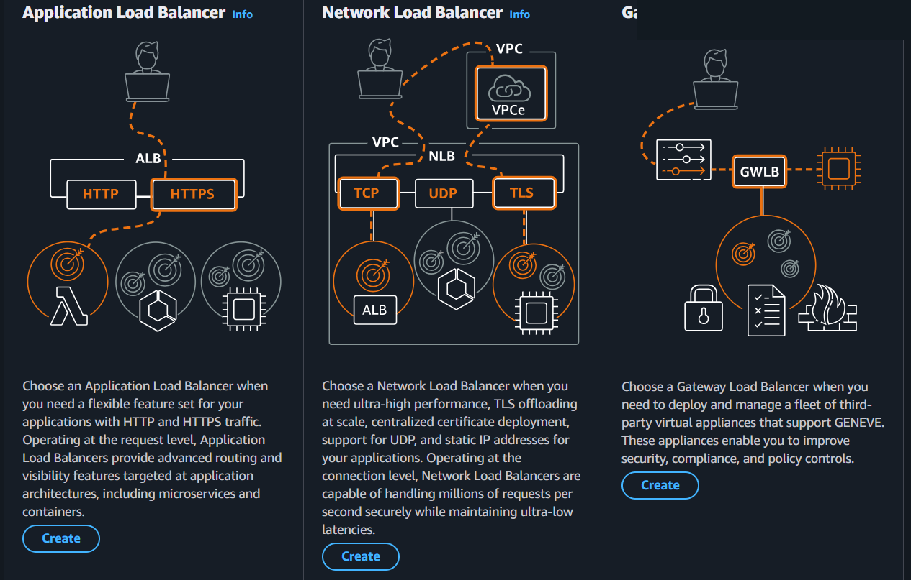

| Type | Abbreviation | Layer | Protocols | Use Case |
|------|-------------|-------|-----------|----------|
| Application Load Balancer | ALB | Layer 7 (Application) | HTTP, HTTPS | Web apps, microservices, containers |
| Network Load Balancer | NLB | Layer 4 (Transport) | TCP, UDP, TLS | Ultra-high performance, static IPs, gaming |
| Gateway Load Balancer | GWLB | Layer 3 (Network) | GENEVE | Third-party security appliances (firewalls, IDS/IPS) |
| Classic Load Balancer | CLB | Layer 4/7 | TCP, HTTP, HTTPS | **Previous generation** - don't use for new projects |


**Classic Load Balancer** is collapsed at the bottom as "previous generation". AWS recommends migrating to ALB or NLB.

---

### Create Application Load Balancer (ALB) - Console Flow

#### Basic configuration


**Load balancer name:**
- Must be unique within your AWS account
- **Can't be changed after creation**
- Max 32 alphanumeric characters + hyphens
- Must not begin or end with a hyphen

**Scheme** (Can't be changed after creation):
- **Internet-facing** (default) — Serves internet-facing traffic, has public IP addresses, DNS resolves to public IPs, requires a public subnet
- **Internal** — Serves internal traffic, has private IP addresses, DNS resolves to private IPs, compatible with IPv4 and Dualstack

**Load balancer IP address type:**
- **IPv4** (default) — Includes only IPv4 addresses
- **Dualstack** — Includes IPv4 and IPv6 addresses
- **Dualstack without public IPv4** — Public IPv6 + private IPv4/IPv6, internet-facing only

#### Network mapping


**VPC:**
- The load balancer will exist and scale within the selected VPC
- Targets must be hosted in the same VPC (unless routing to Lambda or on-premises via VPC peering)

**IP pools** (optional):
- Use IPAM pool as preferred source for public IPv4 addresses
- If pool is depleted, AWS assigns IPv4 addresses

**Availability Zones and subnets:**
- **Select at least two AZs** — A load balancer node is placed in each selected zone
- Routes traffic to targets in selected AZs only
- Automatically scales in response to traffic

#### Security groups
- A set of firewall rules that control traffic to the load balancer
- Select up to 5 security groups
- Can create a new security group from here

#### Listeners and routing


A listener checks for connection requests using the port and protocol you configure.

**Default listener: HTTP:80**
- **Protocol:** HTTP (dropdown)
- **Port:** 80 (1-65535)

**Default action** (Routing action — 3 options):
1. **Forward to target groups** (default) — Select target group, set weight (0-999)
2. **Redirect to URL** — Redirect traffic to another URL
3. **Return fixed response** — Return a custom HTTP response

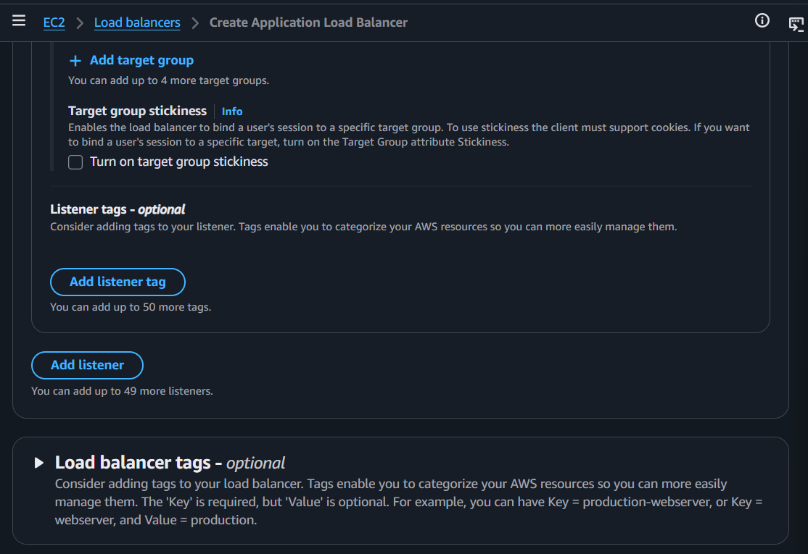

**+ Add target group** — Up to 5 target groups per listener

**Target group stickiness** (optional):
- Binds a user's session to a specific target group
- Client must support cookies
- Turn on Target Group attribute Stickiness for specific target binding

**Listener tags** — optional (up to 50 tags)

**Add listener** — Up to 49 more listeners (50 total)

**Load balancer tags** — optional:
- Key is required, Value is optional
- Example: Key = production-webserver, or Key = webserver, Value = production

#### Optimize with service integrations — optional

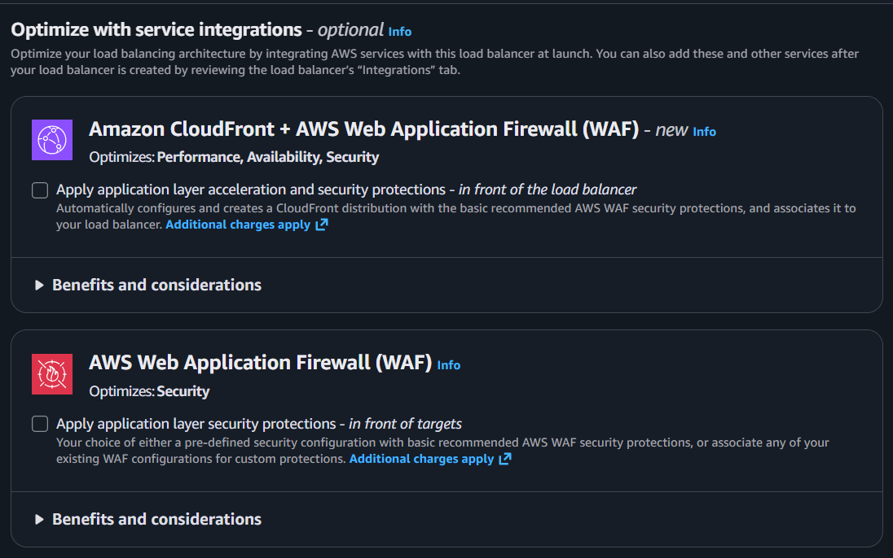

**Amazon CloudFront + AWS WAF** — *new*
- Optimizes: Performance, Availability, Security
- Apply application layer acceleration and security protections — *in front of the load balancer*
- Automatically creates a CloudFront distribution with basic WAF protections
- **Additional charges apply**

**AWS WAF** (standalone)
- Optimizes: Security
- Apply application layer security protections — *in front of targets*
- Pre-defined or existing WAF configurations
- **Additional charges apply**

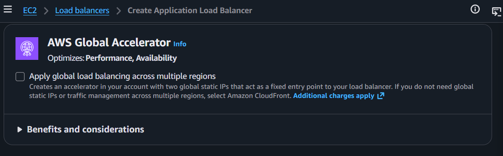

**AWS Global Accelerator**
- Optimizes: Performance, Availability
- Apply global load balancing across multiple regions
- Creates two global static IPs as a fixed entry point
- If you don't need global static IPs, select CloudFront instead
- **Additional charges apply**

#### Creation workflow and status

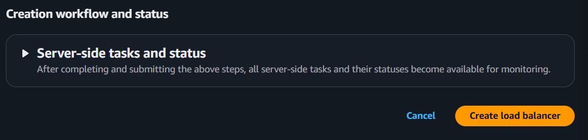

- **Server-side tasks and status** — After submitting, all tasks and statuses become available for monitoring
- **Cancel** / **Create load balancer**

---

### Create Network Load Balancer (NLB) - Console Flow

#### Basic configuration


**Load balancer name:**
- Same rules as ALB (unique, max 32 chars, can't change after creation)

**Scheme** (Can't be changed after creation):
- **Internet-facing** (default) — Public IPs, DNS resolves to public IPs, requires public subnet
- **Internal** — Private IPs, DNS resolves to private IPs

**Load balancer IP address type:**
- **IPv4** (default) — Includes only IPv4 addresses
- **Dualstack** — Includes IPv4 and IPv6 addresses
- ⚠️ No "Dualstack without public IPv4" option (ALB-only feature)

#### Network mapping

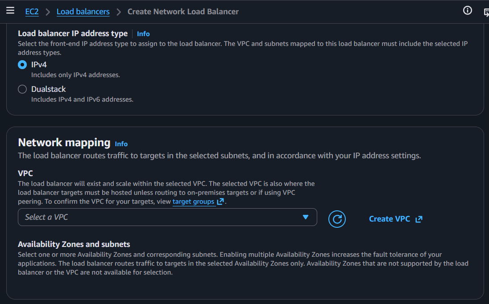

**VPC:**
- Same as ALB — load balancer exists and scales within the selected VPC
- Targets must be hosted there (unless routing to on-premises via VPC peering)

**Availability Zones and subnets:**
- Select **one or more** AZs (ALB requires at least two, NLB requires at least one)
- Enabling multiple AZs increases fault tolerance
- AZs not supported by the load balancer or VPC are not available for selection

#### Security groups

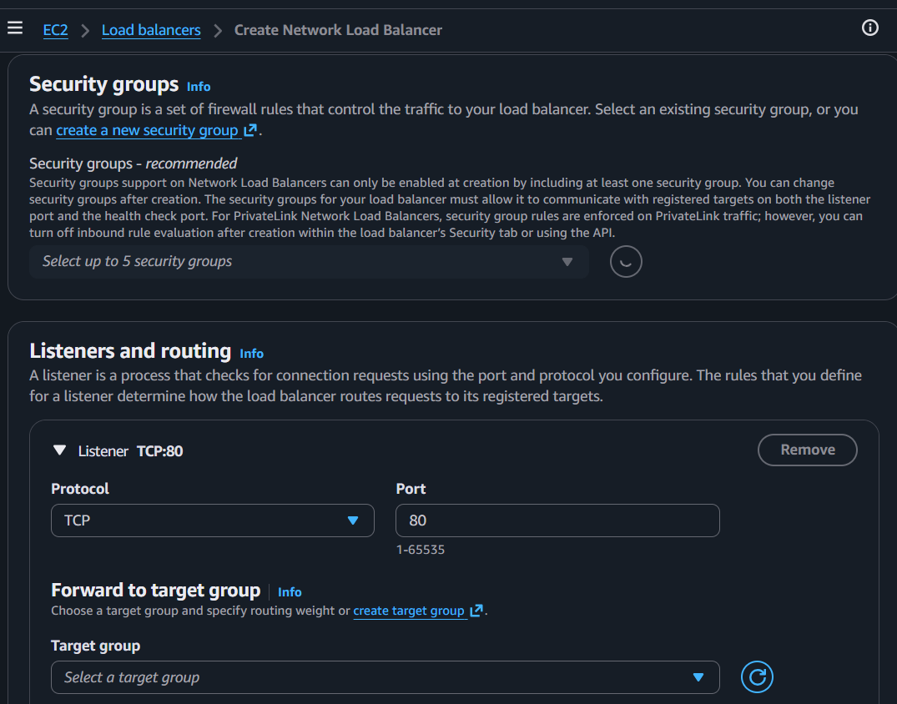

**Security groups — *recommended*:**
- ⚠️ Can only be enabled at creation by including at least one security group
- Can change security groups after creation
- Must allow communication with registered targets on listener port AND health check port
- For PrivateLink NLBs, SG rules are enforced on PrivateLink traffic (can turn off inbound rule evaluation after creation)

#### Listeners and routing

**Default listener: TCP:80**
- **Protocol:** TCP (dropdown — TCP, UDP, TLS, TCP_UDP)
- **Port:** 80 (1-65535)

**Forward to target group:**
- Select target group, set weight (0-999)

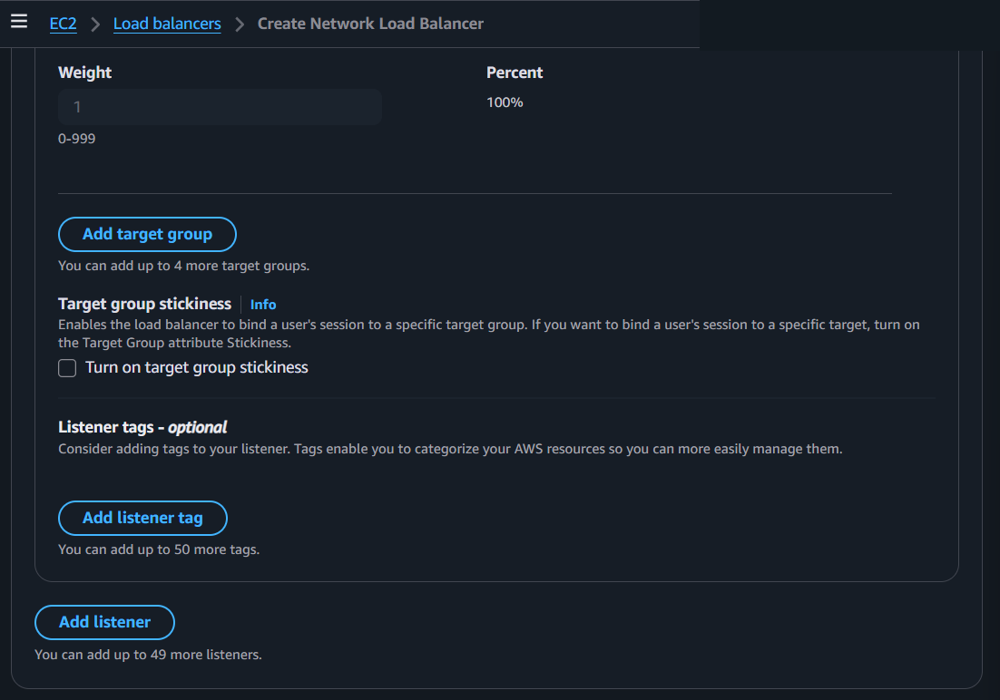

**+ Add target group** — Up to 5 target groups per listener

**Target group stickiness** (optional):
- Same as ALB — binds a user's session to a specific target group

**Listener tags** — optional (up to 50)

**Add listener** — Up to 49 more (50 total)

#### Load balancer tags, service integrations, review


**Load balancer tags** — optional:
- Key is required, Value is optional

**Optimize with service integrations** — optional:
- **AWS Global Accelerator** only (no CloudFront/WAF option for NLB)
- Optimizes: Performance, Availability
- Two global static IPs as fixed entry point
- **Additional charges apply**

**Review:**
- Review configurations, make changes if needed

#### Creation workflow and status

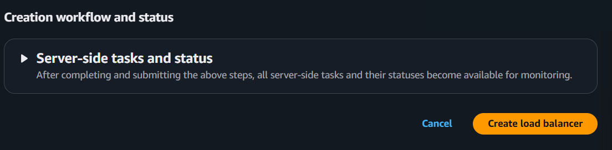

- **Server-side tasks and status** — After submitting, all tasks and statuses become available for monitoring
- **Cancel** / **Create load balancer**

---

### Create Gateway Load Balancer (GWLB) - Console Flow

#### Basic configuration

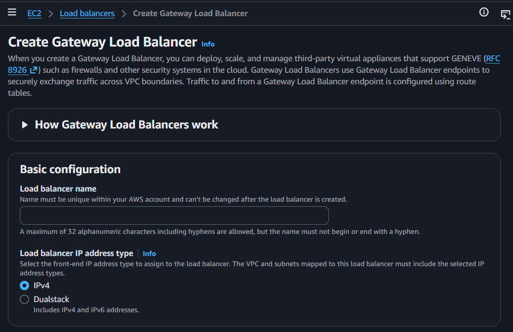

**Description:** Deploy, scale, and manage third-party virtual appliances that support GENEVE (RFC 8926) such as firewalls and other security systems. Uses Gateway Load Balancer endpoints to securely exchange traffic across VPC boundaries. Traffic is configured using route tables.

**Load balancer name:**
- Same rules (unique, max 32 chars, can't change after creation)

**Load balancer IP address type:**
- **IPv4** (default)
- **Dualstack** — Includes IPv4 and IPv6 addresses
- ⚠️ No Scheme option — GWLB is always internal (no internet-facing option)

#### Network mapping

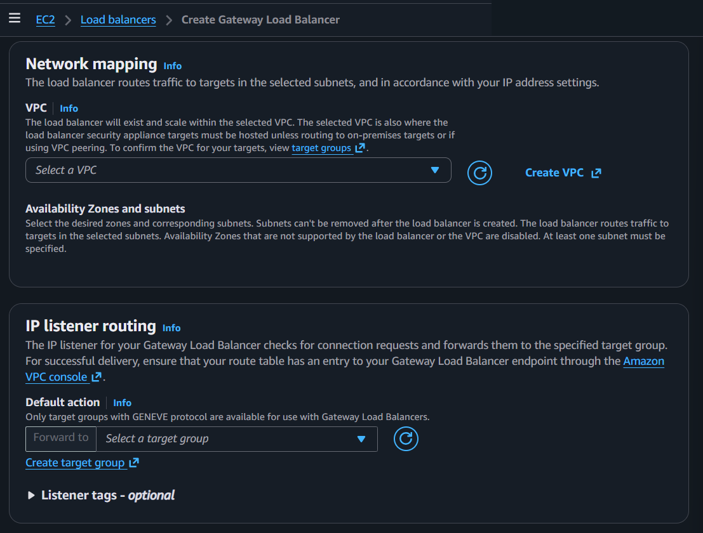

**VPC:**
- Load balancer exists and scales within the selected VPC
- Security appliance targets must be hosted there (unless routing to on-premises via VPC peering)

**Availability Zones and subnets:**
- ⚠️ **Subnets can't be removed after creation**
- At least one subnet must be specified
- Routes traffic to targets in selected subnets
- AZs not supported by the load balancer or VPC are disabled

#### IP listener routing

Unlike ALB/NLB which use protocol-based listeners, GWLB uses IP listener routing.

**Default action:**
- Only target groups with **GENEVE protocol** are available
- Forward to target group (select or create)
- Ensure route table has an entry to your GWLB endpoint via the VPC console

**Listener tags** — optional

#### Load balancer tags, review, summary


**Load balancer tags** — optional:
- Key is required, Value is optional

**Review — Summary shows 4 sections:**
- Basic configuration (Name, IP address type)
- Network mapping (VPC, AZs and subnets)
- IP listener routing (All IP packets across all ports, Forward to target group)
- Tags

**Attributes:** Certain default attributes will be applied. View and edit after creating the load balancer.

#### Creation workflow and status

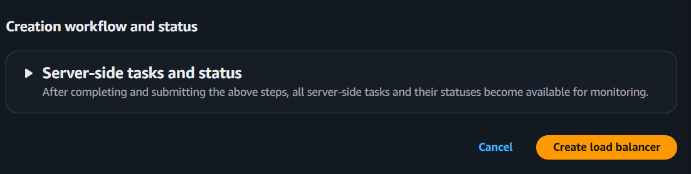

- **Server-side tasks and status** — After submitting, all tasks and statuses become available for monitoring
- **Cancel** / **Create load balancer**

---

## Key Concepts

### Launch Template vs Launch Configuration
- **Launch Template** (recommended) — Newer, supports versioning, more features
- **Launch Configuration** (legacy) — Older, no versioning, AWS recommends migrating to templates
- Both define: AMI, instance type, key pair, security group, user data

### Scaling In vs Scaling Out vs Scaling Up
- **Scale out** (horizontal) = add more instances (traffic increasing). ASG does this automatically. No downtime.
- **Scale in** (horizontal) = remove instances (traffic decreasing). ASG does this automatically.
- **Scale up** (vertical) = make instance bigger (e.g., t3.micro → t3.large). ASG does NOT do this. Requires instance stop → change type → start = downtime.
- ASG decides which instance to terminate when scaling in (default: oldest launch config, then closest to billing hour)

### Applying Launch Template Changes to Existing Instances

Updating the Launch Template only affects **new** instances. Existing running instances keep their old config. To apply changes (e.g., new instance type, new AMI):

**Option 1: Instance Refresh (recommended)**
- ASG built-in feature that automatically replaces existing instances with new ones using the updated Launch Template
- Set "minimum healthy percentage" (e.g., 90%) — ASG terminates old instances in batches and launches new ones
- Rolling update, no full downtime
```
Before: 4x t3.micro (old template)
During: 3x t3.micro + 1x t3.large (rolling)
After:  4x t3.large (new template)
```

**Option 2: Terminate and let ASG replace**
- Update Launch Template version, then terminate instances one by one
- ASG automatically launches replacements using the new template

**Option 3: Blue/Green**
- Create a new ASG with the new Launch Template
- Shift traffic via ELB target group, then delete old ASG

### Multi-AZ for High Availability
- Spread ASG across multiple AZs (Availability Zones)
- If one AZ goes down, instances in other AZs keep running
- ASG automatically rebalances across AZs
- **MSP tip:** Always use at least 2 AZs for production

### Warm Pool (optional)
- Pre-initialized instances kept in a "stopped" state
- When scaling out, use warm pool instances instead of launching from scratch
- Faster scaling (skip boot time)
- You pay for stopped instances (EBS storage only, no compute)

---

## Precautions

### ⚠️ MAIN PRECAUTION: Set Maximum Carefully — It's Your Cost Ceiling
- Maximum = the most instances ASG will ever launch
- If set too high, a traffic spike (or attack) could launch many expensive instances
- Always calculate: max instances × instance cost = worst-case monthly bill
- **MSP tip:** Always discuss max instance count and cost ceiling with the client

### 1. Use Multiple AZs
- Single AZ = single point of failure
- ASG across 2+ AZs = high availability
- If one AZ fails, ASG launches replacements in other AZs

### 2. Use ELB Health Checks, Not Just EC2
- EC2 health check only checks if the instance is running
- ELB health check checks if the app is actually responding
- An instance can be "running" but the app crashed — ELB health check catches this

### 3. Use Launch Templates, Not Launch Configurations
- Launch Configurations are legacy and can't be modified after creation
- Launch Templates support versioning and more features
- AWS recommends migrating to Launch Templates

### 4. Test Your Scaling Policies
- Wrong thresholds = scaling too early or too late
- Too aggressive = unnecessary cost
- Too conservative = poor performance during spikes
- Use predictive scaling or review CloudWatch metrics to tune

### 5. Cooldown Period Matters
- Too short = thrashing (rapid scale up/down)
- Too long = slow response to traffic changes
- Default 300 seconds is fine for most cases

### 6. Always Use Tags
- Tags on ASG propagate to launched instances
- Tag with environment, project, team, client, cost center
- Essential for MSP cost tracking — know which ASG belongs to which client
